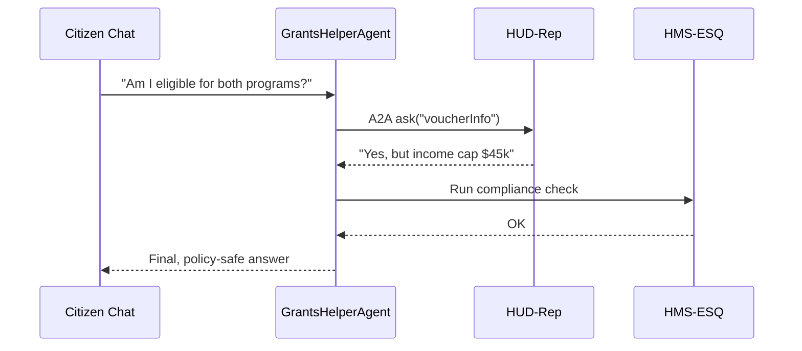

# Chapter 8: AI Representative Agent Framework (HMS-AGT / HMS-A2A)

[← Back to Chapter 7: Operational Monitoring & Reliability Layer (HMS-OPS)](07_operational_monitoring___reliability_layer__hms_ops__.md)

---

## 0. Why Do We Need Digital Civil-Servant Agents?

Picture a citizen, **Alex**, typing this into the all-of-government chat window:

> “I moved from Ohio to Arizona.  
> Am I still eligible for both my veteran housing voucher **and** my state disability parking placard?”

Answering that question touches **three** bureaus (VA, HUD, and Arizona DOT).  
Instead of shuffling Alex between phone menus, we spin up a **representative agent** for each bureau:

* **VA-Rep** – knows veteran programs and VA policy.  
* **HUD-Rep** – understands housing voucher rules.  
* **AZDOT-Rep** – covers state placards.

The **AI Representative Agent Framework (HMS-AGT)** provides the *brain stem* for those agents, while **A2A messaging (HMS-A2A)** lets them consult each other behind the scenes.  
Alex sees one helpful chat; agencies keep their autonomy and policy integrity.

---

## 1. Beginner-Friendly Breakdown of Key Ideas

| Concept                | Think of it as…                 | One-sentence meaning |
|------------------------|---------------------------------|----------------------|
| Representative Agent   | A 24/7 digital civil servant    | Chatbot that acts on behalf of a single bureau. |
| Brain Stem             | Human nervous system core       | Built-in modules for ID, policy checks, memory, and messaging. |
| Identity Passport      | Official government badge       | JWT that proves which bureau & clearance level an agent has. |
| Policy Firewall        | Agency counsel sitting nearby   | Runs every draft answer through [Compliance & Legal Reasoner (HMS-ESQ)](11_compliance___legal_reasoner__hms_esq__.md). |
| Memory Vault           | Personal notebook               | Long-term conversation + context, stored in [HMS-DTA](06_data___telemetry_hub__hms_dta__.md). |
| A2A Bus                | Encrypted walkie-talkie         | Pub/Sub channel where agents ask each other for data. |
| Skill Plug-in          | Extra course certificate        | Domain-specific function you add (e.g., “calculate BAH stipend”). |

---

## 2. Your First Agent in <20 Lines

Let’s build **“GrantsHelperAgent”** for the National Endowment for the Arts (NEA).

```js
// grantsHelper.js   (19 lines)
import { createAgent } from '@hms/agt'

export default createAgent({
  name: 'NEA Grants Helper',
  bureau: 'NEA',
  skills: {
    // 1️⃣ tiny domain function
    nextDeadline() {
      return 'July 31, 2024'
    }
  },
  // 2️⃣ natural-language handler
  async onMessage(msg, ctx) {
    if (msg.text.includes('deadline'))
      return `The next grant deadline is ${this.skills.nextDeadline()}.`

    // 3️⃣ ask sister agent when unsure
    const hud = await ctx.a2a.ask('HUD-Rep', 'voucherInfo')
    return `I’m not sure, but HUD says: ${hud.data}`
  }
})
```

Explanation  
1. **skills** – your bureau-specific smarts (here, a single date).  
2. **onMessage** – runs for every citizen utterance.  
3. **ctx.a2a.ask** – one-line cross-agency question (HMS-A2A).

Deploy that file and *boom* — NEA has a helpful digital clerk that already:

* Auths with its **Identity Passport**.  
* Stores chat turns in the **Memory Vault**.  
* Routes policy checks through HMS-ESQ automatically.

---

## 3. Trying It Out (Terminal Demo)

```bash
$ hms-agt chat grantsHelper
👩‍🎨 citizen: When is the deadline?
🤖 agent  : The next grant deadline is July 31, 2024.
```

Under the hood the framework:

1. Authenticates the citizen session.  
2. Logs both messages to HMS-DTA.  
3. Emits `agt.latency=120ms` to HMS-OPS dashboards.

---

## 4. Under the Hood — A Gentle Tour

### 4.1 Sequence Diagram



### 4.2 What Each Step Does

1. **Identity Passport** attached to every message proves AGT is NEA-origin.  
2. **A2A Bus** encrypts and delivers the HUD question.  
3. **Policy Firewall** (HMS-ESQ) scans for forbidden disclosures.  
4. Final answer is logged to HMS-DTA and latency recorded in HMS-OPS.

---

## 5. A Peek at the Framework Code

### 5.1 startAgent.js (simplified – 18 lines)

```js
// lib/startAgent.js
import { createServer } from 'http'
import { storeTurn } from './memory.js'
import { checkPolicy } from './policy.js'
import { a2aBus } from './bus.js'

export function createAgent(cfg) {
  const server = createServer(async (req, res) => {
    const msg = await parse(req)
    const ctx = { a2a: a2aBus, user: req.jwt }

    await storeTurn(cfg.name, msg, 'in')      // Memory Vault
    let reply = await cfg.onMessage(msg, ctx) // Your handler
    reply = await checkPolicy(cfg, reply)     // Firewall

    await storeTurn(cfg.name, reply, 'out')
    res.end(JSON.stringify(reply))
  })
  server.listen(process.env.PORT || 9000)
  return server
}
```

Takeaways  
* Memory & policy hooks are baked in — you didn’t write any of that.  
* Swappable pieces (memory.js, policy.js) keep the main loop readable.

### 5.2 bus.js — One-File A2A (15 lines)

```js
// lib/bus.js
import NATS from 'nats'

const nats = NATS.connect({ servers:'a2a.gov:4222' })

export const a2aBus = {
  ask(target, topic, payload={}) {
    return new Promise(res => {
      const inbox = nats.createInbox()
      nats.subscribe(inbox, (_, msg) => res(JSON.parse(msg)))
      nats.publish(`${target}.${topic}`, JSON.stringify(payload), inbox)
    })
  },
  on(topic, fn) {
    nats.subscribe(`${cfg.name}.${topic}`, (_, msg, reply) =>
      fn(JSON.parse(msg), data => nats.publish(reply, JSON.stringify(data)))
    )
  }
}
```

Minimal yet powerful:

* **ask**: one request-reply pattern.  
* **on**: register a handler (e.g., HUD-Rep exposes `voucherInfo`).

---

## 6. Common “Uh-oh” Moments & Fast Fixes

| Symptom                              | Likely Cause & Fix |
|--------------------------------------|--------------------|
| Agent replies but citizen never sees it | Forgot `await checkPolicy` – HMS-ESQ blocked unsafe text. Review returned error. |
| `A2A timeout 2000 ms` error          | Target agent offline. Verify deployment or fallback to cached answer. |
| Memory shows duplicated turns        | Called `storeTurn` twice in custom code; rely on built-in hooks only. |
| OPS dashboard flatlines              | Missing `ops.init({service: 'your-agent'})`; see [HMS-OPS](07_operational_monitoring___reliability_layer__hms_ops__.md). |

---

## 7. How This Framework Touches Other Layers

```
Citizen ↔ HMS-AGT
        ↙   ↓
   HMS-ESQ  HMS-A2A ↔ Other Agents
        ↓
     HMS-DTA  (conversation history)
        ↓
     HMS-OPS  (health & latency)
```

Everything is **loosely-coupled**:

* Memory stored in [HMS-DTA](06_data___telemetry_hub__hms_dta__.md)  
* Compliance enforced by [HMS-ESQ](11_compliance___legal_reasoner__hms_esq__.md)  
* Metrics streamed to [HMS-OPS](07_operational_monitoring___reliability_layer__hms_ops__.md)

---

## 8. Recap

You now know how to:

1. Create a bureau-specific agent with one tiny file.  
2. Trust the framework for identity, memory, compliance, and health metrics.  
3. Ask other agencies’ agents for help through HMS-A2A.  
4. Debug the most common hiccups.

Your digital civil servants are standing by!  
But who decides *when* each agent should wake up, hand off tasks, or collaborate in a larger workflow?  
That orchestration magic lives in the next chapter:  
[Agent Activity Orchestrator (HMS-ACT)](09_agent_activity_orchestrator__hms_act__.md).

---

---

Generated by [AI Codebase Knowledge Builder](https://github.com/The-Pocket/Tutorial-Codebase-Knowledge)