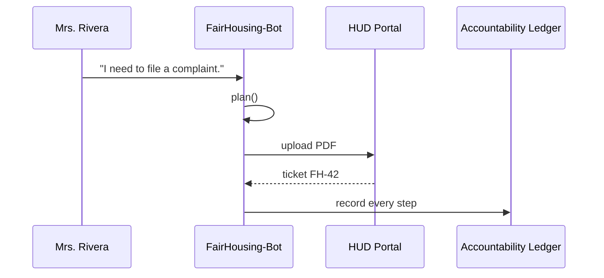

# Chapter 8: AI Representative Agent Framework (HMS-AGT / HMS-AGX)

[← Back to Chapter 7: Financial Clearinghouse (HMS-ACH)](07_financial_clearinghouse__hms_ach__.md)

---

## 1. Why “Digital Civil Servants”?

Picture Mrs. Rivera, a tenant in Cleveland who believes her landlord is discriminating against her family.  
Today she must:

1. Find the correct **HUD Fair-Housing form** (18 pages).  
2. Locate the legal citations that match her case.  
3. Mail or fax the packet, then wait **6-8 weeks** for a first response.

HMS-AGT lets agencies deploy a **Fair-Housing Agent** that:

* Chats with Mrs. Rivera in plain English (or Spanish).  
* Reads the latest HUD regulations in seconds.  
* Drafts a complaint, attaches evidence, and files it **before the coffee cools**.  
* Logs every step in an immutable ledger so auditors see exactly what the agent did and why.

That’s the promise of **AI Representative Agents**—human-level policy work at machine speed, with crystal-clear accountability.

---

## 2. High-Level Overview

```mermaid
flowchart LR
    User((Citizen))
    AGT([Agent Core<br/>HMS-AGT])
    AGX[[AGX Extensions<br/>(optional)]]
    SYS([Other HMS Layers])
    User -- asks --> AGT
    AGT -- may call --> AGX
    AGT -- files forms / calls APIs --> SYS
    AGT -- ledger --> Auditors
```

* **HMS-AGT** = core framework (lifecycle, minimal skills, ledger).  
* **HMS-AGX** = add-on packs (advanced reasoning, voice, RPA, etc.).  
* The agent collaborates with all the systems you met in previous chapters.

---

## 3. Key Concepts (Beginner-Friendly)

| Term | Analogy | What It Means |
|------|---------|---------------|
| Spawn | “Log in for first day” | Instantiate the agent with identity + config. |
| Plan | “Write a to-do list” | Map steps needed to reach the user’s goal. |
| Enact | “Do the tasks” | Execute each step (chat, API call, form upload). |
| Retire | “Clock-out” | Archive state & free compute. |
| Accountability Ledger | Body-cam footage | Immutable log of every action + reason. |
| Skill Pack | Tool-belt | Reusable functions (read-PDF, call HMS-ACH, etc.). |

---

## 4. Quick-Start: “Hello, Agent” in 18 Lines

Create `agent.py`:

```python
# file: agent.py  (18 lines)
import time, json, uuid

class Agent:
    def __init__(self, name, skills):
        self.id = uuid.uuid4().hex
        self.name = name
        self.skills = skills
        self.ledger = []

    # ---------- lifecycle ----------
    def spawn(self):   self._log("SPAWN")
    def plan(self, goal): return ["draft_complaint", "file_pdf"]
    def enact(self, steps, ctx):
        for s in steps:
            result = self.skills[s](ctx)
            self._log("ENACT", step=s, result=result)
    def retire(self):  self._log("RETIRE")

    # ---------- helpers ----------
    def _log(self, phase, **detail):
        entry = {"ts": time.time(), "phase": phase,
                 "agent": self.name, **detail}
        self.ledger.append(entry)
        print("LEDGER:", json.dumps(entry))
```

Explanation  
1. `spawn`, `plan`, `enact`, `retire` follow the lifecycle.  
2. `_log` writes a JSON line to console (real deployments forward to [System Observability & Ops Center](19_system_observability___ops_center__hms_ops__.md)).

---

## 5. Adding Two Tiny Skills (≤ 20 Lines Each)

```python
# file: skills/fair_housing.py
def draft_complaint(ctx):
    return f"Drafted complaint for {ctx['user']} citing 24 CFR §100."

def file_pdf(ctx):
    return "Uploaded PDF to HUD portal (ticket FH-42)."
```

---

## 6. Run the Fair-Housing Agent (15 Lines)

```python
# file: run_fh_agent.py
from agent import Agent
from skills.fair_housing import draft_complaint, file_pdf

skills = {"draft_complaint": draft_complaint,
          "file_pdf": file_pdf}

ag = Agent("FairHousing-Bot-v1", skills)
ag.spawn()
steps = ag.plan(goal="file discrimination complaint")
ag.enact(steps, ctx={"user": "Mrs. Rivera"})
ag.retire()
```

Console snippet (trimmed):

```
LEDGER: {"phase":"SPAWN",...}
LEDGER: {"phase":"ENACT","step":"draft_complaint","result":"Drafted complaint ..."}
LEDGER: {"phase":"ENACT","step":"file_pdf","result":"Uploaded PDF ..."}
LEDGER: {"phase":"RETIRE",...}
```

Mrs. Rivera’s complaint is filed, and auditors already hold a tamper-proof log.

---

## 7. What Happens Behind the Scenes?



---

## 8. Peeking Under the Hood

### 8.1 Lifecycle Dispatcher (HMS-AGT Core)

```python
# file: agt/core.py  (≤ 20 lines)
class Dispatcher:
    def run(self, agent, goal, ctx):
        agent.spawn()
        steps = agent.plan(goal)
        agent.enact(steps, ctx)
        agent.retire()
```

### 8.2 Ledger Adapter

```python
# file: agt/ledger.py
import sqlite3, json

conn = sqlite3.connect("ledger.db")
conn.execute("CREATE TABLE IF NOT EXISTS log(ts, data)")

def write(entry):
    conn.execute("INSERT INTO log VALUES(datetime('now'), ?)",
                 [json.dumps(entry)])
    conn.commit()
```

Swap the simple `print` in `Agent._log` for `ledger.write(entry)` to persist logs.

### 8.3 AGX Extension: OCR Skill (Optional)

```python
# file: agx/ocr.py  (≤ 15 lines)
import pytesseract, pdf2image

def extract_text(pdf_path):
    pages = pdf2image.convert_from_path(pdf_path)
    return "\n".join(pytesseract.image_to_string(p) for p in pages)
```

Agents with **HMS-AGX** installed can read scanned forms without human help.

---

## 9. Guardrails & Integration with Other Layers

* Governance rules from [Governance Layer](01_governance_layer__ai_governance_model__.md) wrap every agent action.  
* Sensitive steps (e.g., sending personal data) pass through [Compliance Guardrail Framework (HMS-ESQ)](05_compliance_guardrail_framework__hms_esq__.md).  
* A human case-worker can still press the **red phone** via [HITL Oversight](02_human_in_the_loop__hitl__oversight_mechanism_.md) to veto or edit the agent’s draft.  
* If the agent authorises a payment, it hands instructions to [HMS-ACH](07_financial_clearinghouse__hms_ach__.md).  
* All actions stream into dashboards inside [System Observability & Ops Center](19_system_observability___ops_center__hms_ops__.md).

---

## 10. Two-Minute Lab

1. Copy the three small files (`agent.py`, `skills/fair_housing.py`, `run_fh_agent.py`).  
2. `python run_fh_agent.py` – watch the ledger print.  
3. Add a new skill:

```python
def send_confirmation(ctx):
    return f"E-mail sent to {ctx['user']} with ticket FH-42."
```

4. Insert `"send_confirmation"` into the `skills` dict, rerun, and see the extra ledger entry.  
5. Open `ledger.db` (if you enabled the SQLite adapter) and confirm every step is stored.

Congratulations—your first digital civil servant is on duty! 🥳

---

## 11. Recap & What’s Next

In this chapter you learned:

1. Why AI agents matter for faster, fairer public services.  
2. The **spawn → plan → enact → retire** lifecycle and the Accountability Ledger.  
3. How to build and run a 40-line Fair-Housing Agent.  
4. Where HMS-AGT ends and optional HMS-AGX extensions begin.

Next we’ll see how agents keep their facts straight by following a shared **Model Context Protocol**.  
Continue to → [Model Context Protocol (HMS-MCP)](09_model_context_protocol__hms_mcp__.md)

---

---

Generated by [AI Codebase Knowledge Builder](https://github.com/The-Pocket/Tutorial-Codebase-Knowledge)