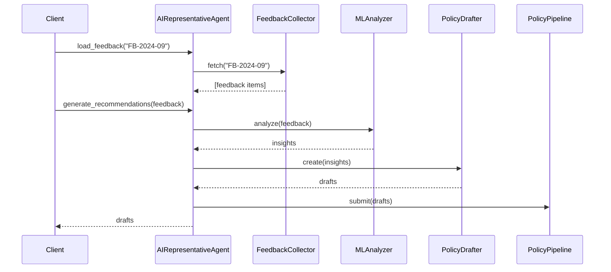

# Chapter 8: AI Representative Agent

Welcome back! In [Chapter 7: Frontend Interface Components](07_frontend_interface_components_.md) we built a reusable UI library for citizens and officials. Now we’ll introduce the **AI Representative Agent**—an autonomous “policy analyst” bot that reads citizen feedback, spots improvement opportunities, and drafts new guidelines, all under human oversight.

## Why an AI Representative Agent?

Imagine a state benefits office collects hundreds of survey responses every week:

- “My application stuck in review for too long.”  
- “I didn’t get a status update.”  

Currently, a team reads each comment and proposes process tweaks. The **AI Representative Agent** automates much of this work:

1. Scans feedback for common complaints.  
2. Generates clear recommendations (e.g., “Add reminder after 48 hours”).  
3. Submits those drafts into the policy pipeline for review or auto-deployment.

This saves time, spots trends early, and still keeps humans in the loop.

---

## Central Use Case

Our state agency wants to speed up application reviews. They run the agent weekly:

```python
# ai_rep_agent_client.py
from ai_rep_agent import AIRepresentativeAgent

agent = AIRepresentativeAgent()

# 1. Load last week's feedback batch
feedback = agent.load_feedback(batch_id="FB-2024-09")

# 2. Generate improvement recommendations
recommendations = agent.generate_recommendations(feedback)

print(recommendations)
# -> [
#      {
#        "id": "RC-1",
#        "title": "Auto-followup after 48h",
#        "details": "Send reminder if no change in 48h"
#      }
#    ]
```

Explanation:
- `load_feedback` pulls survey or log data.
- `generate_recommendations` returns drafted policy updates.

---

## Key Concepts

1. **Autonomous Agent (HMS-A2A)**  
   A software actor with authority to run feedback analysis and draft policies.

2. **Feedback Collector**  
   Gathers raw comments, logs, or survey results.

3. **ML Analyzer**  
   Applies simple machine-learning or keyword analysis to detect trends.

4. **Policy Drafter**  
   Translates insights into structured policy or process drafts.

5. **Oversight Gate**  
   Submits drafts to a review pipeline; humans can approve or reject.

6. **Policy Pipeline**  
   Central queue where all suggested updates await review or automatic deployment.

---

## What Happens Under the Hood?



1. **Fetch feedback** from storage.  
2. **Analyze** for patterns or complaints.  
3. **Draft** recommended process changes.  
4. **Submit** drafts to the policy pipeline.  
5. **Return** draft list to the caller.

---

## Inside the Code

Below is a simplified agent that wires together each part.

### File: ai_rep_agent.py

```python
# ai_rep_agent.py

from feedback import FeedbackCollector
from analyzer import MLAnalyzer
from drafter import PolicyDrafter
from policy_pipeline import PolicyPipeline

class AIRepresentativeAgent:
    def __init__(self):
        self.collector = FeedbackCollector()
        self.analyzer = MLAnalyzer()
        self.drafter  = PolicyDrafter()
        self.pipeline = PolicyPipeline()

    def load_feedback(self, batch_id):
        return self.collector.fetch(batch_id)

    def generate_recommendations(self, feedback):
        insights = self.analyzer.analyze(feedback)
        drafts   = self.drafter.create(insights)
        self.pipeline.submit(drafts)
        return drafts
```

Explanation:  
- We import four helper classes.  
- `load_feedback` returns raw comments.  
- `generate_recommendations` runs analysis, drafting, and submission.

---

### File: feedback.py

```python
# feedback.py

class FeedbackCollector:
    def fetch(self, batch_id):
        # In real life, read from DB or CSV
        return [
          {"id": "F1", "text": "Approval took too long"},
          {"id": "F2", "text": "I got no update"}
        ]
```

Explanation: Returns a list of feedback items for the agent to process.

---

### File: analyzer.py

```python
# analyzer.py

class MLAnalyzer:
    def analyze(self, feedback):
        insights = {}
        for item in feedback:
            if "long" in item["text"]:
                insights["delay_complaints"] = insights.get("delay_complaints", 0) + 1
        return insights
```

Explanation: A toy “ML” that counts delay-related complaints.

---

### File: drafter.py

```python
# drafter.py

class PolicyDrafter:
    def create(self, insights):
        drafts = []
        if insights.get("delay_complaints", 0) > 0:
            drafts.append({
              "id": "RC-1",
              "title": "Auto-followup after 48h",
              "details": "If no status change in 48 hours, send reminder."
            })
        return drafts
```

Explanation: If enough delay complaints exist, draft a reminder policy.

---

### File: policy_pipeline.py

```python
# policy_pipeline.py

class PolicyPipeline:
    def submit(self, drafts):
        # In real life, push to a review system or database
        for d in drafts:
            print(f"Submitted draft {d['id']} for human review")
```

Explanation: Submits each draft into the policy review queue.

---

## Conclusion

In this chapter you learned how the **AI Representative Agent** automates feedback analysis and policy drafting—just like a trained policy analyst but with machine-learning speed. It remains subject to oversight via the policy pipeline. Up next, we’ll see how these recommendations fit into the broader [Process Optimization Workflow](09_process_optimization_workflow_.md).

---

Generated by [AI Codebase Knowledge Builder](https://github.com/The-Pocket/Tutorial-Codebase-Knowledge)