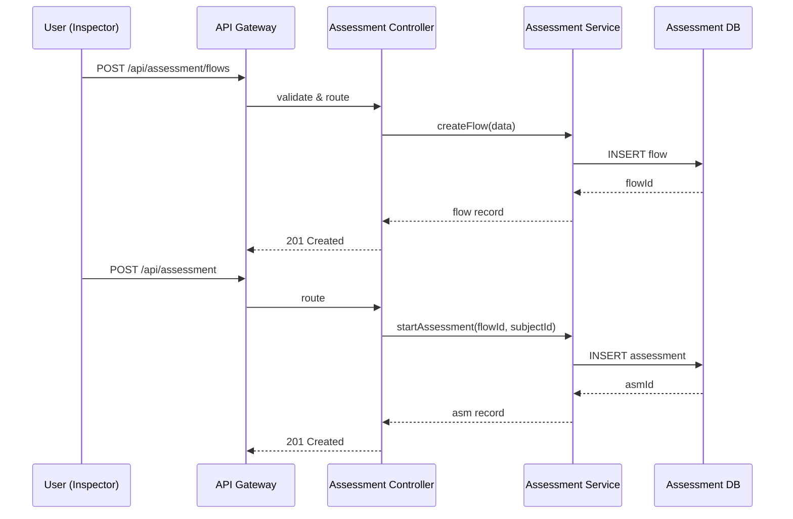

# Chapter 8: Assessment Module

Welcome back! In [Chapter 7: Module System](07_module_system_.md), you learned how to plug new features into HMS-API without touching core code. Now let’s build a real-world example: the **Assessment Module**.

---

## 8.1 Why an Assessment Module?

**Use Case:**  
Imagine a taxation agency needs to run **compliance audits** on small businesses. Inspectors answer a set of questions, each scored, to decide if a business is eligible for a fast-track review or a full audit. Instead of re-writing question flows and scoring logic for each audit type, the Assessment Module gives you a ready toolkit:

- Define any **question flow** (eligibility, risk check, etc.)  
- Plug in **scoring rules** (points, weights)  
- **Track results** and let other modules (like appeals or case management) use them  

> Analogy: Think of the Assessment Module as an appraisal division in a tax office. You drop in a “compliance audit” file, answer questions, and out comes a scorecard and recommendation.

---

## 8.2 Key Concepts

1. **Assessment**  
   A running instance of a questionnaire (e.g., “Business Audit #123”).  
2. **Question Flow**  
   A sequence of questions with possible branching (e.g., “Did they file returns on time?”).  
3. **Scoring Logic**  
   Points or weights assigned to answers; sums up to a final score.  
4. **Result Tracking**  
   Stores each answer, the computed score, and status (`pending`, `completed`).

---

## 8.3 How to Use the Assessment Module

### 8.3.1 Define a Question Flow

First, register your flow:

```http
POST /api/assessment/flows
Content-Type: application/json

{
  "name": "Tax Compliance Audit",
  "questions": [
    { "id": "q1", "text": "Filed returns on time?", "options": [
      {"value": "yes","points": 0},
      {"value": "no","points": 5}
    ]},
    { "id": "q2", "text": "Has outstanding payments?", "options": [
      {"value": "yes","points": 5},
      {"value": "no","points": 0}
    ]}
  ]
}
```

What happens:  
- HMS-API stores the flow.  
- Returns the `flowId` for later use.

### 8.3.2 Start an Assessment

Now create an assessment instance:

```http
POST /api/assessment
Content-Type: application/json

{ "flowId": "flow_123", "subjectId": "biz_456" }
```

Response:

```json
{ "assessmentId": "asm_789", "status": "pending" }
```

### 8.3.3 Submit Answers

```http
POST /api/assessment/asm_789/answers
Content-Type: application/json

{
  "answers": [
    { "questionId": "q1", "value": "no" },
    { "questionId": "q2", "value": "yes" }
  ]
}
```

What happens:  
- Module computes total points (`5 + 5 = 10`).  
- Updates `status` to `completed`.  
- Returns the score:

```json
{ "assessmentId": "asm_789", "score": 10, "status": "completed" }
```

### 8.3.4 Retrieve Results

```http
GET /api/assessment/asm_789
```

Response includes flow details, answers, and final score.

---

## 8.4 What Happens Under the Hood?



---

## 8.5 Internal Implementation

Below is a simplified Node.js view of how files might look.

### File: modules/assessment/models/flowModel.js

```js
// modules/assessment/models/flowModel.js
class Flow {
  constructor(data) { Object.assign(this, data); }
  static async create(record) {
    // pretend DB.insert returns the saved record
    const saved = await db.insert('flows', record);
    return new Flow(saved);
  }
}
module.exports = Flow;
```
This model stores question flows.

### File: modules/assessment/services/assessmentService.js

```js
// modules/assessment/services/assessmentService.js
const Flow = require('../models/flowModel');
async function computeScore(flow, answers) {
  return answers.reduce((sum, a) => {
    const opt = flow.questions.find(q=>q.id===a.questionId)
                   .options.find(o=>o.value===a.value);
    return sum + (opt?.points||0);
  }, 0);
}
module.exports = { computeScore };
```
This service calculates the total score.

### File: modules/assessment/controllers/assessmentController.js

```js
// modules/assessment/controllers/assessmentController.js
const express = require('express');
const { computeScore } = require('../services/assessmentService');
const router = express.Router();

// Submit answers and get score
router.post('/:assessmentId/answers', async (req, res) => {
  // load flow & existing assessment...
  const flow = /* fetch flow from DB */;
  const score = await computeScore(flow, req.body.answers);
  // save results & update status...
  res.json({ assessmentId: req.params.assessmentId, score, status: 'completed' });
});

module.exports = router;
```
This controller handles answer submission.

### File: modules/assessment/index.js

```js
// modules/assessment/index.js
const flowController = require('./controllers/flowController');
const assessmentController = require('./controllers/assessmentController');
module.exports = [
  { route: '/api/assessment/flows', controller: flowController },
  { route: '/api/assessment', controller: assessmentController }
];
```
This index wires your routes into HMS-API.

---

## Conclusion

You’ve seen how the **Assessment Module** lets you define question flows, score answers, and track results—just like a tax agency’s appraisal division. You now have a plug-and-play toolkit for eligibility checks, audits, or any decision support.

Next up: learn how to hook these assessments into AI agents and workflows in [Chapter 9: Agent Integration Framework](09_agent_integration_framework_.md).

---

Generated by [AI Codebase Knowledge Builder](https://github.com/The-Pocket/Tutorial-Codebase-Knowledge)