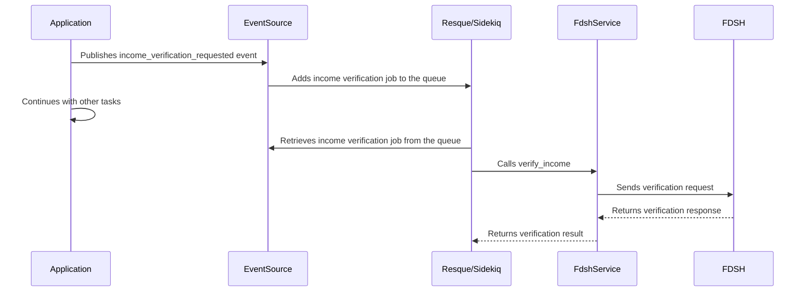

# Chapter 8: Asynchronous Communication (EventSource, Sidekiq/Resque)

In the previous chapter, [FDSH Services](07_fdsh_services.md), we learned how to interact with external systems to verify user information. Now, let's imagine that verifying income with FDSH takes a long time, maybe several seconds.  We don't want to make the user wait while this happens! Our central use case is verifying a user's income in the background without blocking the main application flow. This is where asynchronous communication comes in.

## Asynchronous Communication: Your Application's Background Workers

Asynchronous communication allows your application to perform tasks in the background without blocking the main thread. It's like sending an email – you don't have to wait for it to be delivered before continuing with other tasks.  In our application, we use `EventSource`, `Sidekiq`, and `Resque` to achieve this.

## Key Concepts: EventSource, Sidekiq/Resque

* **EventSource:**  Think of `EventSource` as a message broker. It helps different parts of the application communicate with each other by sending and receiving messages.  It's like a post office – you send a letter (message) through the post office, and it gets delivered to the recipient.
* **Sidekiq/Resque:** These are background job processors. They receive messages from `EventSource` and execute the corresponding tasks in the background.  They are like the mail carriers – they pick up the letters from the post office and deliver them to their destinations.  Our application uses `Resque` in production and `Sidekiq` in other environments.

## Example: Verifying Income Asynchronously

Let's see how we can verify income asynchronously:

```ruby
# app/controllers/users_controller.rb (simplified)
class UsersController < ApplicationController
  def update
    # ... other code ...

    event = event('events.income_verification_requested', { user_id: user.id, income: user.reported_income })
    event.publish

    # ... continue with other tasks ...
  end
end
```

This code publishes an `income_verification_requested` event with the user's ID and income.  The application doesn't wait for the verification to complete and can continue with other tasks.

```ruby
# app/event_source/subscribers/income_verification_subscriber.rb (simplified)
class IncomeVerificationSubscriber < EventSource::Subscriber
  subscribe('events.income_verification_requested')

  def on_income_verification_requested(event)
    user_id = event.data[:user_id]
    income = event.data[:income]

    # Perform income verification in the background
    FdshService.new.verify_income(user_id, income)
  end
end
```

This subscriber listens for the `income_verification_requested` event. When it receives the event, it calls the `verify_income` method of the [FDSH Services](07_fdsh_services.md) in the background.

## How Asynchronous Communication Works Under the Hood



The application publishes an event through `EventSource`. `Resque/Sidekiq` picks up the job and executes it in the background, interacting with the `FdshService` and FDSH.  The application continues processing without waiting for the verification to complete.

## Internal Implementation

`EventSource` is configured in the `config/initializers/event_source.rb` file.  This file sets up the connection to the message broker (RabbitMQ).  `Resque` is configured in the `config/initializers/resque.rb` file and `Sidekiq` is configured in the `config/initializers/sidekiq.rb` file.  The `config.active_job.queue_adapter` setting in the [environments files](environments/production.rb) determines which queue adapter is used.

```ruby
# config/initializers/event_source.rb (simplified)
EventSource.configure do |config|
  # ... configuration details ...
end
```

## Conclusion

In this chapter, we learned how asynchronous communication, using `EventSource`, `Sidekiq`, and `Resque`, allows us to perform time-consuming tasks in the background. We saw how to publish an event and how a subscriber can process that event asynchronously. This improves the responsiveness of our application and provides a better user experience.

Next, we'll explore how to organize our application into smaller, reusable components using [Engines](09_engines.md).


---

Generated by [AI Codebase Knowledge Builder](https://github.com/The-Pocket/Tutorial-Codebase-Knowledge)