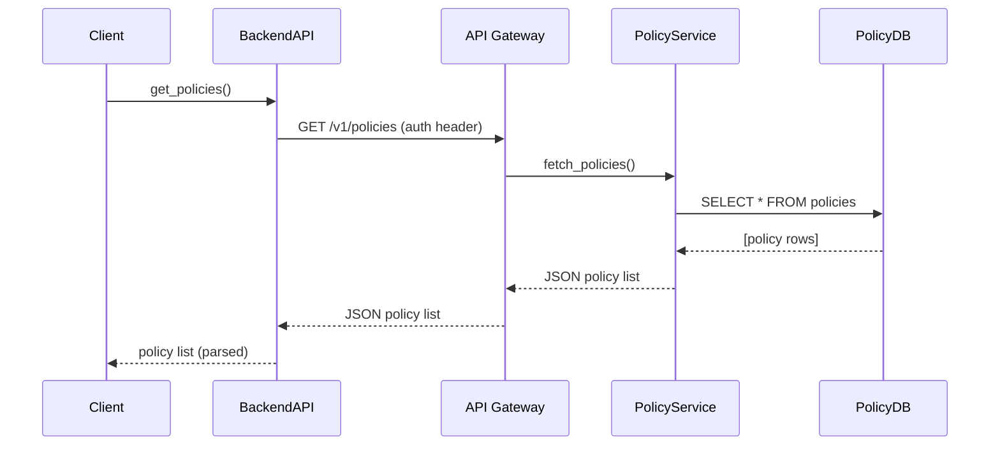

# Chapter 8: Backend API

In the last chapter we broke our backend into small, independent microservices in [Chapter 7: Microservices Architecture](07_microservices_architecture_.md). Now we’ll learn how clients—AI agents, UI components, or external systems—talk to those services through a single, secure **Backend API** (also called HMS-API or HMS-MKT).

---

## Why a Backend API?

Federal IT systems often need a **secure gateway** to exchange data and commands between agencies. Without a clear API, each client would need to know service locations, authentication rules, and data formats. HMS-API solves this by:

- Exposing **RESTful endpoints** for policy management, process updates, and data queries.  
- Handling **authentication**, **versioning**, and **error handling** in one place.  
- Letting AI agents or dashboards call a single client library instead of many raw URLs.

### Central Use Case: Grant Management Dashboard

Imagine the Federal Grants Office needs to:

1. **Fetch** the latest review policies.  
2. **Submit** updates when policy thresholds change.  
3. **Query** real-time metrics on pending applications.

With the Backend API, a single client can perform all three tasks over HTTPS—and let the API gateway route each call to the right microservice.

---

## Key Concepts

1. **API Gateway**  
   A front door that routes requests to the correct service (policy, process, data-store).  

2. **Endpoints**  
   - `/policies` for reading or updating policy rules  
   - `/processes` for starting or updating workflows  
   - `/metrics` for querying dashboards and logs  

3. **Authentication & Security**  
   All calls require a bearer token. The API layer enforces TLS, scopes, and rate limits.  

4. **Versioning**  
   URLs include version segments (e.g., `/v1/policies`) so you can upgrade safely.  

5. **Clients**  
   - AI Agents fetching rules  
   - UI dashboards posting changes  
   - External schedulers syncing data  

---

## Using the Backend API

Here’s a minimal Python example of a grants dashboard calling HMS-API:

```python
from hms_ops.backend_api import BackendAPI

# 1. Initialize client
api = BackendAPI(base_url="https://api.hms.gov/v1", token="YOUR_TOKEN")

# 2. Retrieve all policies
policies = api.get_policies()
print("Loaded policies:", policies)

# 3. Update one policy
update = api.update_policy("policy-123", {"max_amount": 75000})
print("Update result:", update["status"])

# 4. Query metrics on pending applications
metrics = api.get_metrics("pending_applications", params={"date": "2024-06-01"})
print("Pending today:", metrics["count"])
```

Explanation:  
- `get_policies()` → GET `/v1/policies` returns a list of policy objects.  
- `update_policy(id, body)` → PUT `/v1/policies/{id}` sends JSON.  
- `get_metrics(type, params)` → GET `/v1/metrics/{type}` with query parameters.

---

## What Happens Under the Hood

Below is a simplified flow when `get_policies()` is called:



1. **Client** calls the library.  
2. **API Gateway** verifies token and routes to **PolicyService**.  
3. **PolicyService** queries its database.  
4. Data passes back through the gateway to the client.

---

## Internals: Simple Implementation

### File: hms_ops/backend_api/api_client.py

```python
import requests

class BackendAPI:
    def __init__(self, base_url, token):
        self.base_url = base_url
        self.headers = {"Authorization": f"Bearer {token}"}

    def get_policies(self):
        url = f"{self.base_url}/policies"
        resp = requests.get(url, headers=self.headers)
        return resp.json()
```

> This client wraps HTTP calls in easy methods.  

### File: hms_ops/backend_api/services/policy_service.py

```python
# Imagine this runs inside the API Gateway
class PolicyService:
    def fetch_policies(self):
        # Stub: query a database or cache
        return db.query("SELECT * FROM policies")
```

> The gateway invokes `PolicyService.fetch_policies()`, then serializes to JSON.

---

## Analogy & Takeaways

Think of **HMS-API** as a **federal postal sorting facility**:

- All letters (requests) arrive at one secure building.  
- Clerks (gateway) check IDs and route mail to different departments.  
- Departments (microservices) handle the content and send a reply.

Clients never need to know each department’s address—they just use one post office.

---

## Conclusion

You’ve learned how the **Backend API** exposes programmatic endpoints for:

- Policy management  
- Workflow/process updates  
- Real-time data queries  

Next up, we’ll delve into the **[Process & Policy Module](09_process___policy_module_.md)** to see how policy rules and workflows tie together inside HMS-OPS.

---

Generated by [AI Codebase Knowledge Builder](https://github.com/The-Pocket/Tutorial-Codebase-Knowledge)