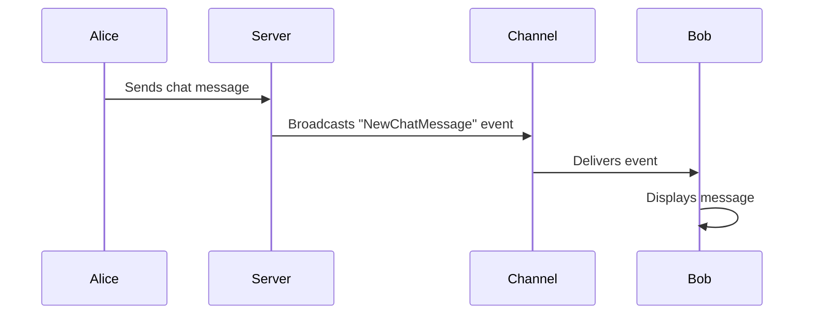

# Chapter 8: Broadcasting

In the previous chapter, [Protocols and Chains](07_protocols_and_chains_.md), we learned how to structure and deliver health programs. Now, let's explore *Broadcasting*, which allows you to send real-time updates and notifications to your users, much like a radio station broadcasting its signal.

## The Use Case: Real-time Chat Notifications

Imagine Alice and Bob are participating in your "Weight Loss in 30 Days" program.  You want to implement a real-time chat feature where they can support each other.  When Alice sends a message, Bob should receive a notification instantly, without having to refresh the page.  Broadcasting makes this possible.

## What Problem Does Broadcasting Solve?

Without broadcasting, Bob would have to constantly refresh the page to see if Alice has sent a new message. This is inefficient and doesn't feel "real-time." Broadcasting allows the server to "push" updates to the client as soon as they happen, creating a much more interactive experience.

## Key Concepts

1. **Channels:** Think of channels as different radio frequencies.  Users can "tune in" to specific channels to receive updates related to those channels.  For example, there might be a channel specifically for chat messages within the "Weight Loss in 30 Days" program.

2. **Events:** Events are the actual messages being broadcast.  When Alice sends a chat message, a "NewChatMessage" event is broadcast on the appropriate channel.

3. **Listeners:** Listeners are the parts of the client application that are "tuned in" to specific channels.  Bob's chat application would be listening to the "Weight Loss in 30 Days" chat channel, so it would receive the "NewChatMessage" event and display the message instantly.

## Real-time Notifications: Step-by-Step

Here's how Broadcasting works for real-time chat notifications:

1. Alice sends a chat message.
2. The server creates a "NewChatMessage" event.
3. The event is broadcast on the "Weight Loss in 30 Days" chat channel.
4. Bob's application, which is listening to this channel, receives the event.
5. Bob's application displays the new message instantly.

## Under the Hood: Code Implementation

Here's a simplified look at how Broadcasting works:



The `routes/channels.php` file defines the channels:

```php
// File: routes/channels.php (simplified)

Broadcast::channel('program-chat.{programId}', function ($user, $programId) {
    // Check if the user is authorized to access this channel
    // ... authorization logic (e.g., check if user is in the program) ...
});
```

**Explanation:**

This code defines a channel named `program-chat.{programId}`.  The `{programId}` part is a placeholder that will be replaced with the actual program ID.  The function checks if the user is authorized to access this channel.

The server-side code broadcasts the event (simplified):

```php
// File: app/Events/NewChatMessage.php (simplified)

// ... other code ...

public function broadcastOn()
{
    return new PrivateChannel('program-chat.' . $this->programId);
}

// ... other code ...
```

**Explanation:**

The `broadcastOn` method specifies the channel on which the event should be broadcast.

The client-side code listens for the event (simplified):

```javascript
// Frontend JavaScript code (simplified)

Echo.private('program-chat.' + programId)
    .listen('NewChatMessage', (e) => {
        // Display the new message
        displayMessage(e.message);
    });
```

**Explanation:**

This code uses Laravel Echo to listen for the `NewChatMessage` event on the specified channel.  When the event is received, the `displayMessage` function is called to display the new message.

## Conclusion

In this chapter, we explored Broadcasting and how it enables real-time communication between the server and client. We saw how channels, events, and listeners work together to deliver real-time updates, using the example of a real-time chat feature.  This concludes our tutorial.  We hope you found it helpful!


---

Generated by [AI Codebase Knowledge Builder](https://github.com/The-Pocket/Tutorial-Codebase-Knowledge)