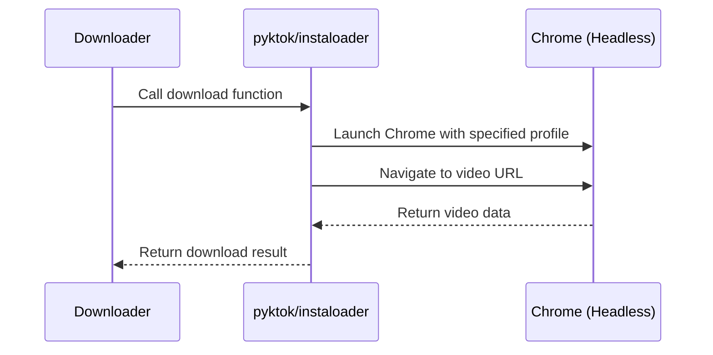

# Chapter 8: Chrome Profile and Headless Mode

In the previous chapter, [S3Uploader](07_s3uploader.md), we learned how to upload downloaded files to Amazon S3 for easy sharing.  Now, let's explore how to manage browser settings and run the browser in the background, which is essential for automated downloading on a server.

## What Problem Does Chrome Profile and Headless Mode Solve?

Imagine you're running the `HMS-UTL` project on a server to automatically download videos. Some platforms, like TikTok and Instagram, require you to be logged in.  How can you manage logins on a server without a physical screen?  That's where Chrome Profile and Headless Mode come in.

## Key Concepts

1. **Chrome Profile:** A Chrome Profile is like saving all your browser settings, bookmarks, extensions, and importantly, login information. It's like having a separate user account within Chrome. This allows `HMS-UTL` to access your saved logins when downloading from platforms that require authentication.

2. **Headless Mode:**  Headless mode is like running Chrome in the background without a visible window.  It's like an invisible browser. This is essential for running automated scripts on a server, as servers typically don't have a graphical user interface.

## Using Chrome Profile and Headless Mode

Here's how `HMS-UTL` uses these concepts:

1. **Create a Chrome Profile:**  You create a Chrome Profile on your local machine, log in to the platforms you need (like TikTok and Instagram), and then copy this profile to your server.

2. **Configure Downloaders:** The `pyktok` and `instaloader` libraries (explained in [pyktok Library](04_pyktok_library.md) and [instaloader Library](06_instaloader_library.md)) are configured to use this profile.  This allows them to access your saved logins when downloading.

3. **Run in Headless Mode:** The downloaders run Chrome in headless mode, so they can operate without a visible browser window.

## Internal Implementation

Here's a simplified sequence diagram showing how Chrome Profile and Headless Mode work together:



The `Downloader` calls the download function in `pyktok` or `instaloader`. These libraries launch Chrome in headless mode, using your saved profile.  They then navigate to the video URL, and Chrome (in the background) returns the video data.  Finally, the libraries return the download result to the `Downloader`.

### Code Example (Conceptual - No actual code change needed):

```python
# --- File: media-downloader/lib/pyktok.py (Conceptual Example) ---
# ... (other code)

def save_tiktok(...):
    # ... (Launch Chrome in headless mode with the specified profile)
    options = webdriver.ChromeOptions()
    options.add_argument("--headless")
    options.add_argument("--user-data-dir=/path/to/your/chrome/profile") # Use your profile
    driver = webdriver.Chrome(options=options)

    # ... (other code)
```

This conceptual code snippet illustrates how the `pyktok` library might launch Chrome in headless mode with a specific profile.  The `--user-data-dir` argument specifies the path to your Chrome profile.  A similar approach is used by `instaloader`.

## Conclusion

In this chapter, we explored Chrome Profile and Headless Mode, essential tools for automated downloading on a server. We learned how they enable managing logins and running the browser in the background. Next, we'll look at [Error Reporting (ErrorSender, ErrorReporter)](09_error_reporting__errorsender__errorreporter_.md), which helps track and manage errors that might occur during the download process.


---

Generated by [AI Codebase Knowledge Builder](https://github.com/The-Pocket/Tutorial-Codebase-Knowledge)