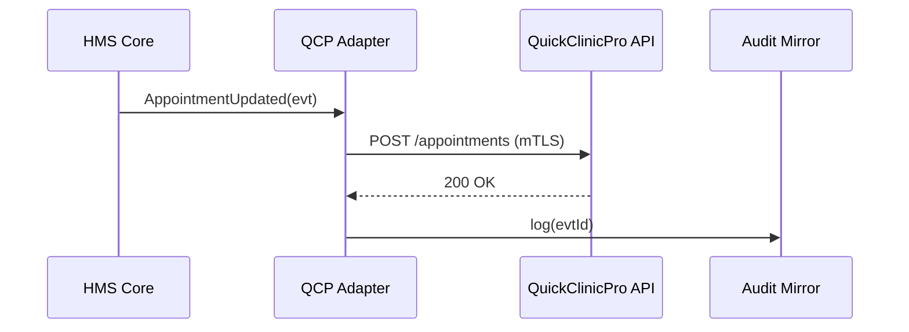

# Chapter 8: External System Adapters & Sync Layer
*(continuing from [Chapter 7: Backend Service Mesh (HMS-SVC / HMS-SYS)](07_backend_service_mesh__hms_svc___hms_sys__.md))*  

---

## 1. Why Do We Need “Bilingual Diplomats”?

Picture the Department of Veterans Affairs (VA).  
Their hospitals already use a commercial scheduling tool called **QuickClinicPro** to book appointments.  
Meanwhile, the new **HMS-EMR** platform stores patient data, generates discharge forms, and runs analytics.

Problems appear immediately:

1. A doctor changes Sgt. Kelly’s appointment **inside HMS-EMR**; QuickClinicPro never hears about it—double-booking chaos.  
2. QuickClinicPro’s API uses its own date formats (`20240610T1430`), while HMS speaks plain ISO (`2024-06-10 14:30`).  
3. Auditors demand a single, provable timeline of all changes—no “he-said / she-said”.

**External System Adapters & Sync Layer** solve these headaches.  
Think of them as **bilingual diplomats** and **news tickers** that:

• Translate data back and forth.  
• Keep both sides in lock-step.  
• Record every change for compliance.

---

## 2. Key Concepts—5 Friendly Bricks

| Brick | Analogy | What It Means |
|-------|---------|--------------|
| Adapter | Diplomat | Converts HMS events into the external system’s dialect (and vice-versa) |
| Mapping Table | Phrasebook | Field‐by‐field translations (`HMS.patientId → QCP.pt_id`) |
| Sync Scheduler | News ticker | Decides how often to push/pull changes (real-time, hourly, nightly) |
| Conflict Resolver | Marriage counselor | Decides whose version wins when both sides changed the same record |
| Audit Mirror | CCTV recorder | Immutable log of every translated change for auditors |

Keep these in mind as we walk through a full example.

---

## 3. Running Example: “Update Sgt. Kelly’s Appointment”

Goal: When a nurse moves the appointment from 2 PM → 4 PM in HMS-EMR, the change instantly appears in QuickClinicPro—and *only once*.

### 3.1 One-Line CLI Install

```bash
hms adapter add quickclinicpro@1.0
```

What happens:

1. Downloads the adapter package.  
2. Registers its mapping table with Governance.  
3. Starts a background sync worker.

### 3.2 Nurse Edits the Appointment (HMS UI)

No code here—just the normal HMS screen.  
The moment she clicks **Save**, HMS emits an **AppointmentUpdated** event.

### 3.3 Adapter in Action (14 lines)

```python
# adapters/qcp/sink.py
from mappings import to_qcp_format, post_qcp

def on_hms_event(evt):
    if evt["type"] != "AppointmentUpdated":
        return

    qcp_payload = to_qcp_format(evt["data"])  # 🗺️ map fields
    post_qcp("/v1/appointments", qcp_payload) # ⏩ push

    audit.write("synced", evt["id"])
```

Explanation  
• `to_qcp_format()` converts ISO datetime & IDs into QCP dialect.  
• `post_qcp()` sends an HTTPS call (mTLS handled by the Service Mesh).  
• The audit line lets GAO replay the sync later.

---

## 4. What Happens Behind the Curtain?



Only four actors—easy to remember.

---

## 5. Mapping Table (Snippet, 10 lines)

```yaml
# adapters/qcp/mappings.yml
HMS_field          : QCP_field
appointmentId      : appt_id
patientId          : pt_id
startTime          : start_ts   # expects 20240610T1600
doctor.staffNumber : provider_no
notes              : comment
```

Governance signs this file so nobody slips in a rogue mapping.

---

## 6. Scheduling the Sync (YAML, 8 lines)

```yaml
# syncs/quickclinic.yml
adapter: quickclinicpro
mode:    push-and-pull
cron:    "*/5 * * * *"   # every 5 minutes
conflict: hms_wins       # policy
```

Beginners’ notes:

• `push-and-pull` means new changes go out instantly, but a 5-minute pull also catches external edits.  
• `hms_wins` resolves collisions in favor of HMS—policy analysts can change this later.

---

## 7. Pull Routine (Node.js, 18 lines)

```js
// adapters/qcp/source.js
import { fetch_since, to_hms_format, publish } from "./utils.js";

export async function pull(since) {
  const rows = await fetch_since("/v1/appointments", since);

  for (const row of rows) {
    const hmsEvt = to_hms_format(row);       // 🔄 reverse mapping
    publish("AppointmentUpdated", hmsEvt);   // into HMS event bus
  }
}
```

Explanation  
• `fetch_since` reads only new records—light on the API quota.  
• `publish()` drops the event onto HMS’s internal bus; from there normal workflows apply.

---

## 8. Conflict Resolution Flow (Text Walk-Through)

1. Adapter pulls an update that clashes with an HMS-side change.  
2. It consults the **conflict policy** (`hms_wins`).  
3. If HMS version wins, the adapter *overwrites* the external record and logs `"overrode_remote"`.  
4. If `remote_wins`, it publishes a compensating event back into HMS so nurses see the external change.  
5. All decisions land in the **Audit Mirror** for later review.

---

## 9. Where Does This Live in the Bigger Picture?

• Adapters run as sidecar pods on the **Backend Service Mesh** so they inherit mTLS, retries, and metrics automatically (see [Chapter 7](07_backend_service_mesh__hms_svc___hms_sys__.md)).  
• They authenticate to external systems using **Service Tokens** issued by [IAM](06_identity___access_management__iam__.md).  
• Mapping tables & conflict policies are versioned in [Governance Portal](02_governance_portal__hms_gov__.md).  
• Sensitive external data (e.g., PHI) passes through the upcoming **Privacy Vault** (next chapter!).

---

## 10. Frequently Asked Beginner Questions

**Q: Do I need to write an adapter from scratch?**  
A: Often no. Check `hms://registry/adapters` first—many common tools (Salesforce, Outlook, State DMV) are pre-built.

**Q: How fast is “real-time”?**  
A: With `push` mode, the event usually reaches the external API in < 2 seconds, limited mostly by network latency.

**Q: What if the external API is down?**  
A: The Sync Layer retries with exponential back-off (default max 15 minutes) and raises an alert through the [Observability Pipeline](14_observability___metrics_pipeline_.md).

**Q: Can I test without hitting the real system?**  
A: Yes. Use `hms adapter mock quickclinicpro` which spins up a stub server and records payloads.

---

## 11. Recap & What’s Next

Today you learned:

• Adapters are **bilingual diplomats** translating HMS events into each external system’s dialect.  
• The **Sync Layer** schedules pushes & pulls, resolves conflicts, and records an audit trail.  
• You added an adapter with *one* CLI command, wrote < 20 lines of glue code, and saw how nurses’ changes reach QuickClinicPro in seconds.  

Next stop: securing the sensitive data that flows through these pipes.  
Jump to [Chapter 9: Data Governance & Privacy Vault](09_data_governance___privacy_vault_.md) to learn how HMS keeps secrets truly secret.

---

Generated by [AI Codebase Knowledge Builder](https://github.com/The-Pocket/Tutorial-Codebase-Knowledge)