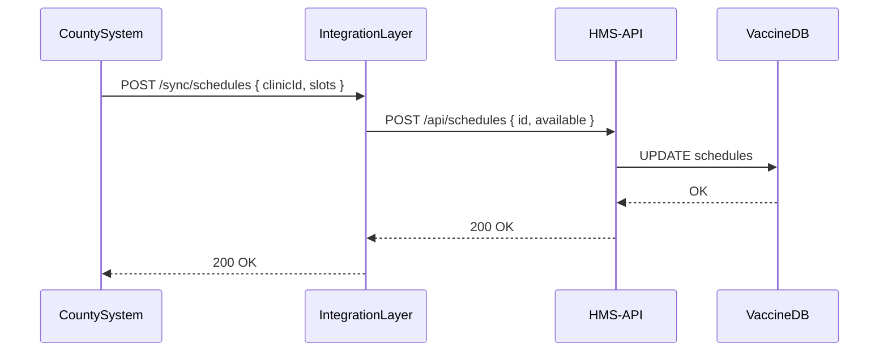

# Chapter 8: External System Integration

In [Chapter 7: Backend API (HMS-API/HMS-MKT)](07_backend_api__hms_api_hms_mkt__.md) we saw how HMS-NFO handles internal requests securely. Now it’s time to connect with outside partners—third-party scheduling apps, data warehouses, federal databases—so updates flow in and out automatically, just like trains on an urban transit network linking multiple cities.

---

## 1. Why External System Integration?

Imagine the National Vaccine Scheduling System must stay in sync with county-level scheduling tools. When County A adds a new clinic time slot, that change should:

- Appear instantly on the central HMS-NFO portal.
- Update the data warehouse for reporting.
- Notify a mobile app so citizens see current availability.

Without integration, staff would manually copy updates—slow, error-prone, and impossible at scale. External System Integration builds the “rails” (connectors) and “stations” (endpoints) so data moves reliably, in real time or on a schedule, without human effort.

---

## 2. Key Concepts

1. **Webhooks (Push)**  
   External systems send HTTP POSTs to us whenever something changes.

2. **Polling Connectors (Pull)**  
   We periodically fetch updates from partners that can’t push.

3. **Data Transformation**  
   Converting partner formats into HMS’s internal shape.

4. **Message Broker (Optional)**  
   A queue (e.g., Kafka) buffers events and guarantees delivery.

5. **Error Handling & Retries**  
   Automatic retries or alerting if an integration fails.

---

## 3. Use Case: Syncing Clinic Schedules

### 3.1 Flow Overview



### 3.2 Exposing a Webhook Endpoint

```js
// src/integration/routes/scheduleSync.js
const express = require('express');
const { handleScheduleSync } = require('../handlers/scheduleSync');
const router = express.Router();

// CountySystem calls this whenever schedules change
router.post('/sync/schedules', handleScheduleSync);

module.exports = router;
```

*Explanation:* We add a POST `/sync/schedules` route in our Integration Layer.

### 3.3 Handling the Sync

```js
// src/integration/handlers/scheduleSync.js
const apiClient = require('../../backend/apiClient');

async function handleScheduleSync(req, res) {
  const { clinicId, slots } = req.body;
  // 1. Transform partner data into our payload
  const payload = { id: clinicId, available: slots };
  // 2. Call HMS-API with a secure token
  await apiClient.post('/schedules', payload, req.user.token);
  // 3. Acknowledge receipt
  res.sendStatus(200);
}

module.exports = { handleScheduleSync };
```

*Explanation:*  
1. Extract `clinicId` and `slots`.  
2. Map them to our internal `payload`.  
3. POST to `/api/schedules` using the [Backend API client](07_backend_api__hms_api_hms_mkt__.md).  
4. Send back 200 OK so the CountySystem knows we got it.

### 3.4 Polling a Data Warehouse

```js
// src/integration/pollers/warehousePoller.js
const warehouseClient = require('../clients/warehouseClient');
const apiClient       = require('../../backend/apiClient');

async function pollWarehouse() {
  const updates = await warehouseClient.fetch('/daily-changes');
  for (const rec of updates) {
    // Directly forward each record
    await apiClient.post('/data-sync', rec, 'system-token');
  }
}

// Run once every 24 hours
setInterval(pollWarehouse, 24 * 60 * 60 * 1000);
```

*Explanation:*  
- We pull from `/daily-changes` each night.  
- Loop through each record, posting to `/data-sync`.  
- `setInterval` schedules the job.

---

## 4. Under the Hood: Step-by-Step

1. **Partner** sends a Webhook or waits for us to poll.  
2. **Integration Layer** receives data, runs validation and transformation.  
3. It calls **HMS-API** with a JWT token.  
4. **HMS-API** routes the request to the right service (e.g., VaccineDB).  
5. The database updates.  
6. Success codes bubble back, confirming the sync.

---

## 5. What We’ve Learned

- **External System Integration** builds “rails” between HMS-NFO and outside systems for real-time (webhooks) or scheduled (polling) data flow.  
- We saw minimal Express routes and handlers to receive and forward data.  
- Transformation and error-handling logic lives in the Integration Layer, making it the single hub for all external connections.

Up next, we’ll handle money: connecting to banking networks for payments in [Chapter 9: Financial Systems (HMS-ACH)](09_financial_systems__hms_ach__.md).

---

Generated by [AI Codebase Knowledge Builder](https://github.com/The-Pocket/Tutorial-Codebase-Knowledge)