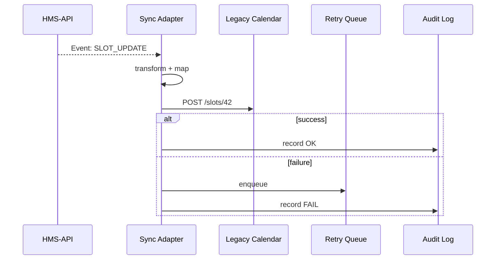

# Chapter 8: External System Sync Adapter
[⬅︎ Back to Chapter&nbsp;7: Microservices Fabric (HMS-SVC)](07_microservices_fabric__hms_svc__.md)

---

## 1. Why do we need a “Sync Adapter”?

Picture the **Millennium Challenge Corporation** (MCC).  
Staff already live in two legacy tools:  

* a **Payroll system** that knows every employee’s work hours  
* a **Scheduling calendar** that citizens use to book visa interviews  

Yesterday the AI Agent (coming in [Chapter 9](09_ai_representative_agent__hms_a2a__.md)) shortened interview slots from **30 min → 20 min** to clear back-logs.  
If someone now opens the old calendar and still sees 30-minute slots, chaos erupts.

**External System Sync Adapter** is the tiny plug-in that:

1. **Listens** to policy or data changes published by HMS-API.  
2. **Transforms** them into the format a legacy tool understands.  
3. **Pushes** the update in real-time (often a simple Webhook).  

No swivel-chair data entry, no out-of-date screens.

---

## 2. Key Concepts (plain English)

| Term | What it means | Analogy |
|------|---------------|---------|
| Change Event | JSON blob emitted by HMS-API (`slot.duration = 20`) | Sticky note from the main desk |
| Adapter | A tiny service that turns an event into an external call | Universal power plug |
| Mapping | Rules that translate HMS fields → legacy fields | Bilingual dictionary |
| Webhook | HTTP POST to the external system | Mail courier drop-off |
| Retry Queue | Holds failed deliveries for re-try | Postal “attempted delivery” bin |

Keep these five words in mind—the rest is wiring.

---

## 3. A 60-second Hands-On Demo

### 3.1 Spin up a fake calendar & the adapter

```bash
git clone hms-demo && cd hms-demo/adapter-demo
docker compose up     # starts: legacy-cal, sync-adapter
```

### 3.2 Fire a change event

```bash
curl -X POST http://localhost:5000/hms/events \
     -H "Content-Type: application/json" \
     -d '{"type":"SLOT_UPDATE","slotId":"az-42","duration":20}'
```

Console output (from adapter):

```
✔ Received SLOT_UPDATE az-42
✔ Mapped → { "id":42,"length":20 }
✔ POSTed to http://legacy-cal:7000/api/slots/42
```

If you open `http://localhost:7000/slots/42` you’ll see the new 20-minute slot—instantly!

---

## 4. What Just Happened? (5-actor view)



Five players, easy to follow.

---

## 5. Using the Adapter in Your Project

### 5.1 Declare a Mapping (YAML, 12 lines)

```yaml
# mappings/calendar.yaml
event: SLOT_UPDATE
target_url: http://legacy-cal:7000/api/slots/{{slotId}}
body:
  id: "{{slotId | int}}"
  length: "{{duration}}"
headers:
  X-HMS-Signature: "{{signature}}"
```

Explanation  
• `{{placeholders}}` pull fields from the HMS event.  
• A tiny Jinja-style engine fills them in at run-time.

### 5.2 Register the Mapping

```bash
curl -X POST http://localhost:5100/config \
     -F "file=@mappings/calendar.yaml"
```

Now every future `SLOT_UPDATE` auto-syncs.

---

## 6. A Peek Inside (Node, ≤ 20 lines each)

### 6.1 Tiny HTTP listener

```js
// src/server.js
import express from 'express';
import { handle } from './handle.js';
const app = express();
app.use(express.json());
app.post('/hms/events', (req, res) => {
  handle(req.body).then(() => res.sendStatus(202));
});
app.listen(5100);
```

Beginners’ notes: one route, parses JSON, hands work to `handle()`.

### 6.2 The handler

```js
// src/handle.js
import { render } from './templ.js';
import axios from 'axios';
import { save } from './log.js';

export async function handle(evt) {
  const map = loadMap(evt.type);           // finds calendar.yaml
  const url  = render(map.target_url, evt);
  const body = render(map.body, evt);
  try {
    await axios.post(url, body, { headers: render(map.headers, evt) });
    save(evt, 'OK');
  } catch (e) {
    enqueue(evt);                          // puts in retry queue
    save(evt, 'FAIL');
  }
}
```

• `render()` swaps placeholders.  
• Failed calls go to `enqueue()` for retry.

### 6.3 Simple retry worker

```js
// src/retry.js
import { dequeue } from './queue.js';
import { handle } from './handle.js';

setInterval(async () => {
  const evt = await dequeue();
  if (evt) await handle(evt);
}, 10000);    // every 10 s
```

---

## 7. Security in Two Lines

The adapter trusts HMS events signed with the IAM public key you met in [Chapter 4](04_access___identity_control__zero_trust_iam__.md).

```js
// src/verify.js
import jwt from 'jsonwebtoken';
export const verify = t => jwt.verify(t, process.env.IAM_JWK);
```

Add `app.use(verifyMiddleware)` at the top, and only valid tokens pass.

---

## 8. Common Pitfalls & How to Dodge Them

| Pitfall | Fix |
|---------|-----|
| Mapping forgotten when policy changes | Store mapping files **with** Protocol versions. |
| Legacy endpoint rate-limits | Add a 429 handler → back-off + queue. |
| Silent failures | Always log both **success** and **fail** to central Audit. |
| Security tokens expire | Rotate tokens nightly; retries refresh before sending. |

---

## 9. Recap & What’s Next

You learned:

✓ Why real-time sync keeps legacy tools honest  
✓ Five core parts: Event → Adapter → Mapping → Webhook → Retry  
✓ Ran a 60-second demo and saw code under 20 lines  
✓ Secured the channel with the same IAM keys from earlier chapters

Next, we’ll meet the **AI Representative Agent (HMS-A2A)**—the smart coworker that can create these events automatically and even chat with citizens.  
[Continue to Chapter&nbsp;9: AI Representative Agent (HMS-A2A)](09_ai_representative_agent__hms_a2a__.md)


---

Generated by [AI Codebase Knowledge Builder](https://github.com/The-Pocket/Tutorial-Codebase-Knowledge)