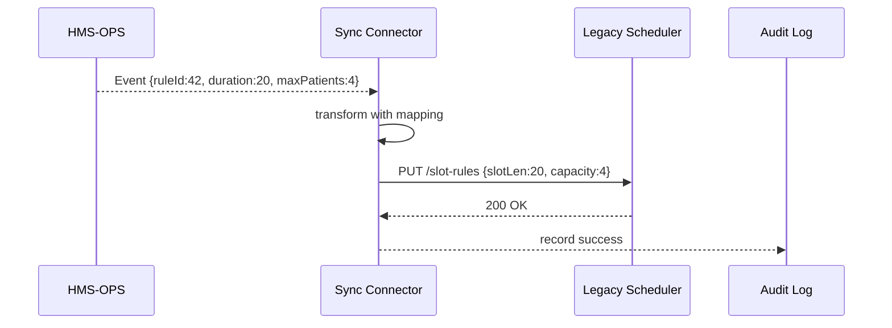

# Chapter 8: External System Sync Connector  

*(continuing from [Cross-Domain Service Mesh](07_cross_domain_service_mesh_.md))*  

---

## 1 · Why Do We Need a “Sync Connector”?

### Two-minute story — “Keeping the Old Clock on Time”

The **Veterans Health Administration (VHA)** still runs a 1990-era scheduler called *VistA*.  
HMS introduces a new rule: *“Tele-health slots can now be 20 minutes instead of 30.”*

1. An HMS admin opens the **Ops Console** and changes the rule.  
2. A veteran instantly sees extra appointment options in the **User Portal**.  
3. **But** the nurse’s desk still prints its daily schedule from *VistA*.  
4. If *VistA* doesn’t learn the new rule quickly, patients will be double-booked and frustration follows.

The **External System Sync Connector** is the universal adaptor that listens for HMS changes and “translates the voltage” so *VistA* (or any legacy system) updates within seconds—no manual CSV uploads, no midnight batch jobs.

---

## 2 · Key Ideas in Plain English

| Term                | Beginner Meaning                                                   |
|---------------------|--------------------------------------------------------------------|
| Change Event        | A little message that says “something just changed in HMS.”        |
| Mapping Rule        | A one-line translation, e.g., `duration=20` ➜ `slotLen=1200` (sec).|
| Sync Pipeline       | Conveyor belt: grab the event → transform → push to target.        |
| Idempotent Update   | “Apply safely even if received twice.” You avoid duplicate records.|
| Connector Runtime   | The tiny program that runs the pipeline; think phone charger block.|

Analogy: the electrical sub-station that turns 10 000 volts from the grid (**HMS**) into 120 V for your house (**legacy app**) without burning your toaster.

---

## 3 · Quick Start — Mirror Appointment Rules to a Legacy API

We will create a connector that pushes any **AppointmentRuleChanged** event to a fictional *VistA* REST endpoint.

### 3.1  Describe the Mapping (8-line YAML)

```yaml
# mappings/appointment-rule-vista.yaml
listen: appointment-rule-changed
target:
  url: https://vista.va.gov/api/slot-rules
  method: PUT
map:
  duration: slotLen          # minutes → minutes
  maxPatients: capacity
idempotencyKey: ruleId       # used for safe re-tries
```

**Explanation**  
1. `listen` says *which* HMS event we care about.  
2. `map` lists field-to-field translations.  
3. `idempotencyKey` prevents double updates if the event is re-delivered.

---

### 3.2  Run the Connector in 10 Lines

```bash
npx hms-sync \
  --mapping mappings/appointment-rule-vista.yaml \
  --token  $HMS_TOKEN
```

**What happens**  
• The runtime opens a WebSocket to HMS-OPS, subscribes to *appointment-rule-changed*, and sleeps.  
• On each event it POSTs the translated JSON to *VistA*.  

You can leave this tiny container running next to the legacy server; no code change inside HMS or *VistA*.

---

## 4 · Under the Hood (High-Level View)



Steps  
1. **Receive** – event travels over the **Cross-Domain Mesh** you met in the last chapter.  
2. **Transform** – simple key rename / unit convert.  
3. **Push** – HTTPS call or even a SOAP envelope; all handled by the connector.  
4. **Log** – outcome is stored for audits (ties to [Telemetry & Feedback Loop](11_telemetry___feedback_loop_.md)).

---

## 5 · Peek Inside the Connector (Tiny Code Tour)

### 5.1  Loader & Subscription (TypeScript, 15 lines)

```ts
// connector/index.ts
import ws from 'ws'; import map from './map.js';
const sock = new ws('wss://hms-ops.gov/events');
sock.on('open', ()=> sock.send(JSON.stringify({ listen: process.env.LISTEN })));
sock.on('message', async (raw)=>{
  const ev = JSON.parse(raw.toString());
  const body = map(ev);                // rename fields
  await fetch(process.env.TARGET_URL, {
    method: 'PUT', headers:{'Idem-Key':ev.ruleId}, body:JSON.stringify(body)
  }).then(r=> console.log('synced', r.status));
});
```

**Explanation**  
• 4 lines set up WebSocket subscription.  
• `map(ev)` applies the YAML rules (next snippet).  
• Result is pushed with an **Idem-Key** header to guarantee safe re-tries.

---

### 5.2  The Tiny Mapper (8 lines)

```js
// connector/map.js
import yaml from 'yaml'; import fs from 'fs';
const cfg = yaml.parse(fs.readFileSync(process.env.MAPPING));
export default (ev) => {
  const out = {};
  for (const [src,dst] of Object.entries(cfg.map))
    out[dst] = ev[src];
  return out;
};
```

**Explanation**  
• Reads the YAML once at boot.  
• Loops through `map` entries and builds the new JSON.  
• Handles unit conversions if extra functions are added later.

---

### 5.3  Automatic Retry (9 lines)

```ts
async function safePush(body, key){
  for (let i=0;i<3;i++){
    const res = await fetch(TARGET,{method:'PUT',headers:{'Idem-Key':key},body});
    if (res.ok) return true;
    await new Promise(r=>setTimeout(r, 2**i*1000)); // back-off
  }
  throw new Error('Legacy API down');
}
```

**Explanation**  
Retries up to 3 times with exponential back-off; duplicates are ignored by the legacy API thanks to the *Idem-Key* header.

---

## 6 · Hands-On: Test Locally in 30 Seconds

```bash
# Mock HMS event stream
npx ws --port 9090 --static events.json
# Mock legacy API
npx http-echo 4100 200 '{}'
# Run connector pointing to mocks
LISTEN=appointment-rule-changed \
TARGET_URL=http://localhost:4100 \
MAPPING=./mappings/appointment-rule-vista.yaml \
node connector/index.js
```

Watch the console: `synced 200` means success.

---

## 7 · Common Pitfalls & Fast Fixes

| Pitfall                                       | Fix |
|-----------------------------------------------|-----|
| Legacy API requires SOAP/XML                  | Add a **second transform step** converting JSON ➜ XML before `safePush`. |
| Duplicate records in target system            | Ensure `idempotencyKey` is unique and sent in the header/body the legacy app checks. |
| Slow VPN causes timeouts                      | Increase connector timeout or switch to async queue inside legacy site. |
| Mapping files scattered across servers        | Store YAML in Git and deploy via the [Policy Versioning & Deployment Pipeline](10_policy_versioning___deployment_pipeline_.md). |

---

## 8 · Recap & Next Steps

You learned how the **External System Sync Connector**:

• Listens for HMS change events.  
• Translates them with **tiny YAML maps**—no code edits.  
• Pushes updates safely to any legacy or third-party system.  
• Logs every sync action for audits and observability.

With data now flowing both ways, we need guardrails to ensure each connector follows agency rules and gets reviewed before going live.  
That governance story starts right now in [Governance Layer (HMS-GOV)](09_governance_layer__hms_gov__.md).

---

---

Generated by [AI Codebase Knowledge Builder](https://github.com/The-Pocket/Tutorial-Codebase-Knowledge)