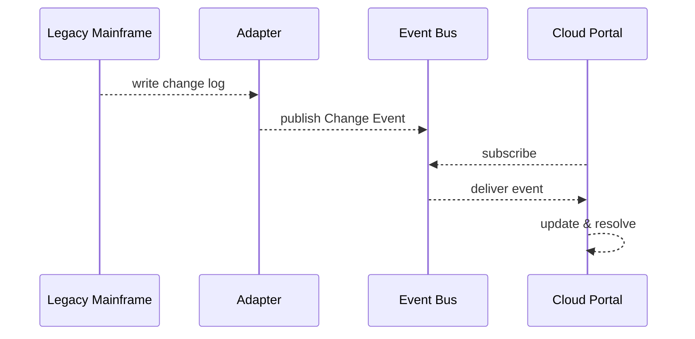

# Chapter 8: External System Sync
*(continuing from [Chapter&nbsp;7: Inter-Agency Data Exchange (HMS-A2A)](07_inter_agency_data_exchange__hms_a2a__.md))*  

---

## 1. Why Do We Need “Sync”?

Picture a veteran who books a medical appointment on **VA.gov** at noon.  
Deep inside the Department of Veterans Affairs, an **IBM z/OS mainframe** from the 1980s is still the official scheduler.  
If the cloud calendar and the mainframe disagree for even a minute, two headaches appear:

1. A doctor can get double-booked (“two sets of books”).  
2. Auditors can’t tell which record is the *truth*.

**External System Sync** is the **instant translator and traffic cop** that keeps legacy and cloud records **mirror-perfect** at all times.

---

## 2. Key Concepts (Plain English)

| Term | Friendly Description |
|------|----------------------|
| Adapter | A tiny plug that speaks both **legacy** and **modern** protocols. |
| Change Event | A short message like “appointment #445 moved to 14:00”. |
| Event Stream | The conveyor belt carrying change events (e.g., Kafka topic). |
| Replay Log | A diary that can **re-play** every event to rebuild state if servers crash. |
| Conflict Resolver | Decides the winner when *two* systems edit the same record. |

---

## 3. Running Example – VA Appointment Sync

Goal: keep **Mainframe** and **Cloud Portal** calendars identical.

### 3.1. Minimal Adapter Code (18 lines)

```python
# file: mainframe_adapter.py
import time, json, requests

LEGACY_LOG = "/var/vista/changes.log"
BUS_URL    = "http://localhost:9092/events"   # stub for Kafka

def tail(filepath):
    """Yield new lines like Unix `tail -f`."""
    with open(filepath) as f:
        f.seek(0, 2)              # jump to end
        while True:
            line = f.readline()
            if line:
                yield line.strip()
            else:
                time.sleep(0.2)

for raw in tail(LEGACY_LOG):
    event = json.loads(raw)               # {'id':445,'op':'move','time':'14:00'}
    requests.post(BUS_URL, json=event)    # fire-and-forget
```

**What it does**  
1. Watches the mainframe’s change file.  
2. Wraps each line as JSON.  
3. Publishes to the event stream.

---

### 3.2. Cloud Consumer (16 lines)

```python
# file: cloud_consumer.py
import httpx, time, json

BUS_URL   = "http://localhost:9092/events"
API_PORTAL = "http://localhost:8000/api/appointments"

def poll():
    r = httpx.get(BUS_URL + "?after=last")   # pretend offset API
    return r.json()                          # list of events

while True:
    for evt in poll():
        if evt["op"] == "move":
            httpx.patch(f"{API_PORTAL}/{evt['id']}",
                         json={"time": evt["time"]})
    time.sleep(1)
```

**What it does**  
• Reads new events from the bus.  
• Calls the cloud API so the portal always reflects mainframe changes.

---

### 3.3. Conflict Resolver Snippet (12 lines)

```python
# file: resolver.py
def resolve(local, incoming):
    """Return the record that wins."""
    if incoming["updated_at"] > local["updated_at"]:
        return incoming
    return local      # keep existing
```

The portal calls `resolve()` whenever *both* sides change the same appointment.

---

## 4. What Happens Behind the Curtain?



1. **Adapter** streams changes out in real time.  
2. **Event Bus** guarantees order & durability by appending to the **Replay Log**.  
3. **Portal** consumes events and updates its DB; on restarts it can **re-play** the log to catch up.

---

## 5. Under-the-Hood Walkthrough (No Heavy Code)

1. **Detect** – Adapters watch *commit logs, database triggers,* or even *screen-scrapes*.  
2. **Normalize** – Each adapter converts the raw change into a tiny, uniform JSON event.  
3. **Publish** – Events go to a topic named after the data domain, e.g., `va.appointments`.  
4. **Consume** – Any subscriber (cloud apps, analytics, ETL) can receive the same truth.  
5. **Replay** – If a service crashes, it requests “events since offset N” and rebuilds its state.

---

## 6. Tiny Peek at the Event Bus Stub (15 lines)

```python
# file: bus.py
from fastapi import FastAPI, Request
app, LOG = FastAPI(), []

@app.post("/events")
async def publish(req: Request):
    LOG.append(await req.json())
    return {"offset": len(LOG)-1}

@app.get("/events")
def read(after: int = 0):
    return LOG[after:]
```

*Real deployments* swap this stub with **Apache Kafka, NATS, or AWS Kinesis**, but the learning flow is identical.

---

## 7. Common Questions

1. **Q: Do we have to edit the mainframe?**  
   A: Usually no. We tail existing audit files or intercept network traffic—minimal risk.

2. **Q: How is data accuracy audited?**  
   A: The **Replay Log** is immutable. Auditors can replay events into a test DB and compare it with production at any time.

3. **Q: What if the mainframe goes offline?**  
   A: The Adapter queues events locally; when connectivity returns, it bulk-publishes with original timestamps, preserving order.

---

## 8. Mini Challenge (Optional)

*Simulate* the mainframe moving an appointment twice:

```bash
echo '{"id":445,"op":"move","time":"15:00"}' >> /var/vista/changes.log
echo '{"id":445,"op":"move","time":"16:00"}' >> /var/vista/changes.log
```

Watch the Cloud Portal log; the final time should be **16:00**, proving order and conflict resolution work.

---

## 9. What We Learned

• **External System Sync** keeps legacy and cloud databases **in lock-step** with adapters and event streams.  
• A short JSON **Change Event** plus an **Event Bus** eliminates “two sets of books” nightmares.  
• Even if servers crash, the **Replay Log** lets you rebuild state perfectly.

Ready to store all those synchronized records in one canonical place?  
Head over to [Chapter&nbsp;9: Central Data Repository (HMS-DTA)](09_central_data_repository__hms_dta__.md).

---

Generated by [AI Codebase Knowledge Builder](https://github.com/The-Pocket/Tutorial-Codebase-Knowledge)