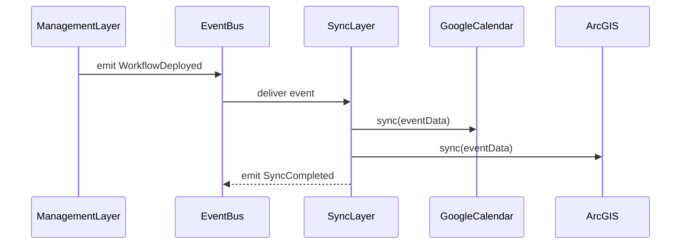

# Chapter 8: External System Synchronization

In [Chapter 7: AI Agent Framework (HMS-A2A)](07_ai_agent_framework__hms_a2a__.md) we saw how AI agents suggest policy changes. Once a new workflow or policy is ready, we need to propagate those changes out to our partner systems—like calendars, GIS planners, and records databases. That’s the job of **External System Synchronization**.

## Why External System Synchronization?

Imagine the Federal Emergency Management Agency (FEMA) updates its disaster‐response training schedule. Partner agencies—state EM offices, GIS mapping services, shared calendars—must all reflect the new dates **immediately**. Without a sync layer, someone would manually call each office, upload spreadsheets or send emails. That’s slow and error‐prone.

With our **Sync Layer**, you:

1. **Publish** an internal policy or schedule change event.  
2. **Automatically** push updates to third‐party calendars, GIS services, and record systems.  
3. **Guarantee** all partners stay in lock‐step.

## Key Concepts

1. **Connectors (Adapters)**  
   Small modules that know how to talk to each external API—Google Calendar, ArcGIS, or a partner’s SOAP endpoint.

2. **Event Bus Subscription**  
   The Sync Layer listens for domain events (e.g. `WorkflowDeployed`, `PolicyUpdated`) on our Event Bus.

3. **Schema Mapping**  
   Translates our internal data model (JSON) into the format each external system expects.

4. **Retry & Idempotency**  
   Ensures that if a push fails, the Sync Layer retries without creating duplicate entries.

5. **Monitoring & Logs**  
   Tracks sync success/failure so administrators can see real‐time status of each external push.

---

## Central Use Case: Syncing a New Workflow

1. An AI agent suggests a new processing workflow and the Management Layer **deploys** it.
2. The Sync Layer hears the `WorkflowDeployed` event.
3. It runs three connectors:
   - Push to **Partner Calendar**  
   - Update **Resource Planner** via GIS API  
   - Sync to **Records Database**  

Let’s walk through how to wire this up.

---

## How to Use the Sync Layer

### 1. Register Connectors

Create a simple config listing each external system and its connector module.

```js
// src/sync/connectors.js
module.exports = [
  { name: 'GoogleCalendar', module: './connectors/googleCalendar' },
  { name: 'ArcGIS',        module: './connectors/arcgisUpdater' },
  { name: 'RecordsDB',     module: './connectors/recordsDbClient' }
];
```
Each connector module implements a `sync(data)` function that returns a promise.

### 2. Listen for Events

```js
// src/sync/index.js
const bus        = require('../eventBus');
const connectors = require('./connectors');

bus.on('WorkflowDeployed', async payload => {
  for (const c of connectors) {
    const adapter = require(c.module);
    await adapter.sync(payload);
  }
});
```
Whenever a `WorkflowDeployed` event fires, we loop through connectors and call `sync`.  

---

## Schema Mapping Example

Our internal event might look like this:

```json
{
  "workflowId": "WF-123",
  "name": "AutoApproveLowRisk",
  "startDate": "2024-07-01"
}
```

A Google Calendar connector maps it to:

```js
// src/sync/connectors/googleCalendar.js
async function sync({ workflowId, name, startDate }) {
  const event = {
    summary: `New Workflow: ${name}`,
    start: { date: startDate },
    description: `ID: ${workflowId}`
  };
  // call Google Calendar API (details omitted)
}
module.exports = { sync };
```
This adapter handles authentication, error handling, and retries.

---

## What Really Happens? (Sequence Diagram)



1. **Orchestrator** deploys the workflow.  
2. **EventBus** forwards `WorkflowDeployed` to the Sync Layer.  
3. **SyncLayer** calls each connector.  
4. After all succeed, it emits a `SyncCompleted` event.

---

## Under the Hood: Retry & Idempotency

Each connector should:

1. **Check** if the external system already has this record (by ID).  
2. **Create** or **Update** accordingly.  
3. **Retry** on network errors up to N times.  

Example with a simple retry wrapper:

```js
// src/sync/utils/retry.js
async function retry(fn, times = 3) {
  for (let i = 1; i <= times; i++) {
    try {
      return await fn();
    } catch (e) {
      if (i === times) throw e;
      await new Promise(r => setTimeout(r, 500));
    }
  }
}
module.exports = retry;
```

Then in your connector:

```js
// src/sync/connectors/recordsDbClient.js
const retry = require('../utils/retry');

async function sync(data) {
  return retry(() =>
    // HTTP PUT /external/records/:id
    fetch(`https://records.gov/api/${data.workflowId}`, { /*...*/ })
  );
}
module.exports = { sync };
```

---

## Summary

In this chapter you learned how **External System Synchronization** keeps all partner systems—calendars, GIS, records databases—in sync whenever a policy or workflow changes. We covered:

- Registering connector modules  
- Listening for internal events ([Management Layer](04_management_layer__service_orchestration__.md))  
- Schema mapping and adapter patterns  
- A retry helper for robust, idempotent pushes  

Next up is our [Core Infrastructure (HMS-SYS)](09_core_infrastructure__hms_sys__.md), where we’ll see how everything runs on a resilient, secure platform.

---

Generated by [AI Codebase Knowledge Builder](https://github.com/The-Pocket/Tutorial-Codebase-Knowledge)