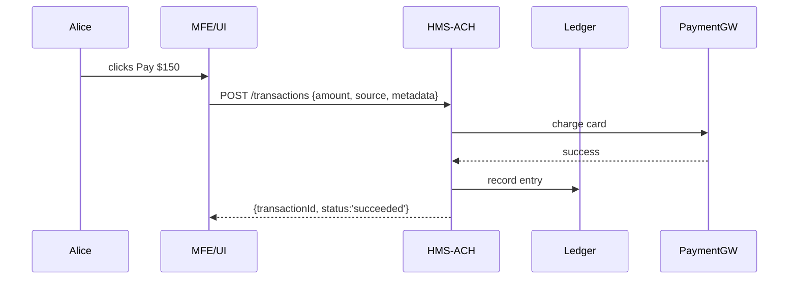

# Chapter 8: Financial & Transaction Engine (HMS-ACH)

Welcome back! In [Chapter 7: External System Synchronization](07_external_system_synchronization_.md) we saw how updates flow to calendars and legacy databases. Now let’s handle money: collecting fees, recording payments, and reconciling budgets with our **Financial & Transaction Engine (HMS-ACH)**.

---

## 1. Motivation & Central Use Case

Imagine a citizen, Alice, applies online for a building permit. After she submits her application (via our [Intent-Driven Navigation Engine](03_intent_driven_navigation_engine_.md)), she needs to pay a \$150 fee. The government finance office must:

1. Accept Alice’s payment securely.  
2. Record the transaction in a central ledger.  
3. Track approvals against the capital budget.  
4. Generate audit‐ready reports for compliance.

**HMS-ACH** is like the cashier’s register and ledger at city hall—it manages all fee collections, refunds, ledger entries, and reconciliations. Let’s learn how to use it.

---

## 2. Key Concepts

1. **Transaction**  
   A single money movement (e.g., Alice pays \$150).  

2. **Ledger Entry**  
   The bookkeeping record that logs transaction details: date, amount, account.  

3. **Payment Gateway**  
   An external service (e.g., credit card processor) that actually charges Alice’s card.  

4. **Reconciliation**  
   The periodic process of matching ledger entries against bank statements and budgets.  

5. **Audit Log**  
   An immutable history of every create/update on transactions for compliance.

---

## 3. Hands-On: Processing a Building Permit Fee

We’ll walk through a minimal example: initialize the ACH client, charge a user, and check status.

### 3.1 Configure the ACH Client

File: hms-ach-client.js (partial)
```js
export class HMSACH {
  constructor({ apiKey }) {
    this.apiKey = apiKey;
    this.baseUrl = 'https://api.hms-ach.gov';
  }
  // further methods below
}
```
> We store the API key and base URL for all requests.

### 3.2 Charge the Permit Fee

File: hms-ach-client.js (continued)
```js
async charge({ amount, currency, source, metadata }) {
  const res = await fetch(`${this.baseUrl}/transactions`, {
    method: 'POST',
    headers: { 'Authorization': this.apiKey, 'Content-Type': 'application/json' },
    body: JSON.stringify({ amount, currency, source, metadata })
  });
  return res.json(); // { transactionId, status: 'pending' }
}
```
> We POST to `/transactions`. `source` could be a card token, and `metadata` includes `permitId`.

### 3.3 Check Transaction Status

```js
async getStatus(transactionId) {
  const res = await fetch(
    `${this.baseUrl}/transactions/${transactionId}`,
    { headers: { 'Authorization': this.apiKey } }
  );
  return res.json(); // { transactionId, status: 'succeeded' }
}
```
> Poll or webhook will tell you when the payment succeeds or fails.

---

## 4. What Happens Under the Hood?

Here’s a simple flow when Alice clicks “Pay”:



1. The UI calls `charge()`.  
2. **HMS-ACH** sends the request to a payment gateway.  
3. On success, **HMS-ACH** writes a ledger entry in its database.  
4. The UI sees the final status and confirms payment to Alice.

---

## 5. Internal Implementation Walkthrough

### 5.1 Non-Code Steps

1. **Client** calls `charge()`.  
2. **ACH Service** validates input and forwards to the **Payment Gateway**.  
3. Gateway returns success or error.  
4. **ACH Service** writes a **Ledger Entry** in its database.  
5. **ACH Service** emits events for reconciliation and audit logging.

### 5.2 Core Module File Structure

```
/hms-ach
  ├── hms-ach-client.js   # client for front-ends
  ├── server.js           # ACH service entry point
  ├── routes/
  │   └── transactions.js # HTTP handlers
  ├── services/
  │   ├── paymentGateway.js  # adapter for external gateway
  │   ├── ledgerService.js   # writes ledger entries
  │   └── auditService.js    # logs every action
  └── db/                    # migrations and models
```

#### Example: routes/transactions.js
```js
const express = require('express');
const { chargeCard } = require('../services/paymentGateway');
const { writeEntry } = require('../services/ledgerService');
const router = express.Router();

router.post('/', async (req, res) => {
  const { amount, currency, source, metadata } = req.body;
  // 1) Charge card
  const result = await chargeCard({ amount, currency, source });
  // 2) Record in ledger
  await writeEntry({ ...result, metadata });
  res.status(201).json({ transactionId: result.id, status: result.status });
});

module.exports = router;
```
> We separate concerns: payment, ledger, and audit.

---

## 6. Summary & Next Steps

In this chapter you learned how **HMS-ACH**:

- Configures a **client** to communicate with the ACH service  
- Processes a **charge**, writing both to an external gateway and an internal ledger  
- Checks **status** for synchronous or asynchronous flows  
- Keeps an **audit trail** and emits events for reconciliation  

Next, we’ll tie it all together with policies, approvals, and oversight in the [Governance Layer](09_governance_layer_.md).

---

Generated by [AI Codebase Knowledge Builder](https://github.com/The-Pocket/Tutorial-Codebase-Knowledge)