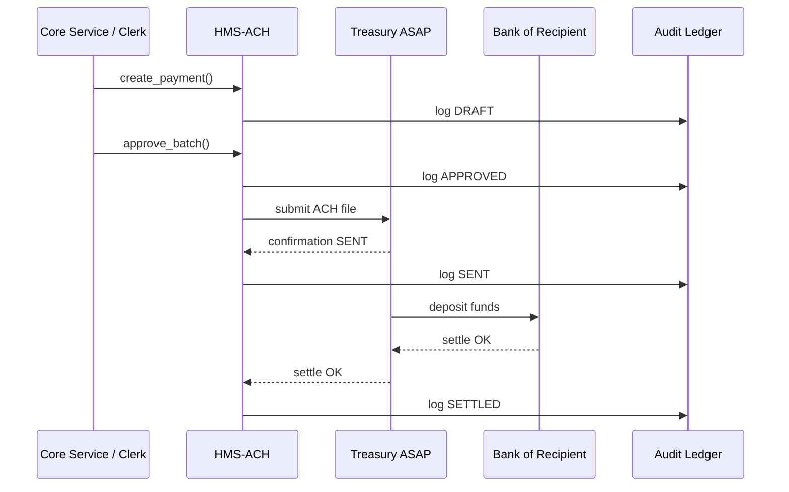

# Chapter 8: Financial Transaction Hub (HMS-ACH)

*(linked from [Central Data Repository (HMS-DTA)](07_central_data_repository__hms_dta__.md))*  

---

## 1. Why Do We Need a “Digital Treasury Cash Window”?

Imagine the **National Endowment for the Arts (NEA)** just approved a $50 000 grant for a rural theater.  
From the citizen’s point of view, the money should *simply appear* in the theater’s bank account.  
Behind the scenes, though, federal dollars must:

1. Travel through **Treasury ASAP** (the U.S. government’s payment rail).  
2. Pass multiple fraud- and error-checks.  
3. Leave a rock-solid audit trail so **GAO** can verify every penny later.

That entire journey is orchestrated by **Financial Transaction Hub (HMS-ACH)**—our platform’s digital cash window and clearinghouse.

---

## 2. Key Concepts (in Plain English)

| Concept | What It Really Means | Analogy |
|---------|---------------------|---------|
| Payment Rail | External network that actually moves funds (e.g., Treasury ASAP, Fedwire). | The highway your money drives on. |
| Segregation of Duties | One person/agent *initiates* a payment, a different one *approves* it. | Two keys needed to unlock a safe. |
| Batch | A group of payments released together. | Friday afternoon envelope of paychecks. |
| Ledger | Immutable list of every debit/credit HMS-ACH ever touched. | A checkbook you can’t erase. |
| Reconciliation | Matching outgoing payments with bank confirmations. | Balancing your bank statement at month-end. |

---

## 3. A 5-Minute Walk-Through  
### Use-Case: “Pay Out a Grant via Treasury ASAP”

We’ll pay that $50 000 theater grant in three **tiny** Python snippets—each ≤20 lines.

#### 3.1  Clerk (Initiator) Logs the Payment Draft

```python
# file: draft_payment.py
import hms_ach_client as ach

session = ach.login("clerk@nea.gov", "pwd")        # role = INITIATOR

draft_id = ach.create_payment(
    session = session,
    amount  = 50_000,
    currency = "USD",
    recipient = {
        "name": "Rural Theater Co.",
        "routing": "021030004",
        "account": "987654321"
    },
    memo = "FY24 Arts Grant #GR-42"
)

print("Draft created:", draft_id)
```

**What happened?**  
The draft is **stored but cannot leave the building** until an approver signs off.

---

#### 3.2  Supervisor (Approver) Releases the Batch

```python
# file: approve_batch.py
session = ach.login("supervisor@nea.gov", "pwd")    # role = APPROVER

batch_id = ach.open_batch([draft_id])               # pick one or many drafts
ach.approve_batch(session, batch_id)

print("Batch", batch_id, "approved & queued for Treasury")
```

Now HMS-ACH will talk to **Treasury ASAP** *automatically*.

---

#### 3.3  Anyone Polls for Settlement Status

```python
# file: check_status.py
from time import sleep
session = ach.login("auditor@nea.gov", "pwd")       # read-only

while True:
    info = ach.get_payment(draft_id, session)
    print(info["state"])          # DRAFT → APPROVED → SENT → SETTLED
    if info["state"] == "SETTLED":
        break
    sleep(30)
```

The script stops when Treasury confirms the money *actually* hit the recipient’s account.

---

## 4. Under the Hood – Journey of One Payment



Only **five participants**—easy to keep in your head.

---

## 5. Peek Inside the Code (All ≤ 20 Lines)

### 5.1  Public API Skeleton (`hms_ach/api.py`)

```python
from fastapi import FastAPI, Depends, HTTPException
from .store import save, update, ledger
from .treasury import send_ach

app = FastAPI()

@app.post("/payments")
def create(req: dict, user = Depends(auth_role("INITIATOR"))):
    pid = save("payments", {**req, "state": "DRAFT"})
    ledger(user, "CREATE", pid)
    return {"id": pid}

@app.post("/batches/{bid}/approve")
def approve(bid: str, user = Depends(auth_role("APPROVER"))):
    drafts = update("payments", {"batch": bid}, {"state": "APPROVED"})
    ach_file = build_ach_file(drafts)
    send_ach(ach_file)
    ledger(user, "APPROVE", bid)
    return {"status": "SENT"}
```

Highlights:  
* **8 functional lines**—everything complicated lives in helpers.  
* Role guard `auth_role("APPROVER")` enforces *segregation of duties* with **one** decorator.

---

### 5.2  Treasury Stub (`hms_ach/treasury.py`)

```python
def send_ach(file):
    # In real life, SFTP or REST to Treasury ASAP.
    print("📤  Sent", len(file["records"]), "records to Treasury")
```

We keep the tutorial friendly; replace with real calls later.

---

## 6. How HMS-ACH Talks to Other Layers

* **[HMS-DTA](07_central_data_repository__hms_dta__.md)** – stores payment records & ledger rows.  
* **[HITL](04_human_in_the_loop_oversight__hitl__.md)** – can pause a batch if fraud-detection agents raise a flag.  
* **[APMT](05_accountability___performance_metrics_tracker_.md)** – ingests settlement times for SLA stats.  
* **[HMS-GOV](01_governance_layer__hms_gov__.md)** – surfaces payment queues in an approver’s dashboard.

---

## 7. Policy File: Who Can Do What? (YAML)

```yaml
# file: ach_roles.yml
roles:
  INITIATOR:
    can_create: true
    can_approve: false
  APPROVER:
    can_create: false
    can_approve: true
```

The decorator earlier simply checks:

```python
def auth_role(required):
    def guard(user = Depends(auth)):
        if not ROLES[user.role][f"can_{required.lower()}"]:
            raise HTTPException(403)
        return user
    return guard
```

One dictionary lookup = full segregation!

---

## 8. Quick Hands-On Lab (5 Minutes)

1. `git clone https://github.com/example/hms-nfo.git`  
2. `python -m hms_ach.mock_server`  
3. Run `python draft_payment.py` → note the ID.  
4. Run `python approve_batch.py` with that ID.  
5. Watch logs: `📤 Sent 1 records to Treasury` then `✅ SETTLED`.

You just moved (simulated) federal money—no red tape, full audit.

---

## 9. Recap & Next Steps

* **HMS-ACH** is the secure **clearinghouse** that moves grants, fees, and refunds.  
* Enforces **two-person control**, batches payments, and writes an **immutable ledger**.  
* Plays nicely with Treasury ASAP today and can add other rails tomorrow.  
* Minimal client calls: `create_payment → approve_batch → get_status`.

Ready to see how *agents* can automate even these payment flows?  
Jump ahead to [Agent Framework (HMS-AGT) & Extensions (HMS-AGX)](09_agent_framework__hms_agt____extensions__hms_agx__.md).

---

Generated by [AI Codebase Knowledge Builder](https://github.com/The-Pocket/Tutorial-Codebase-Knowledge)