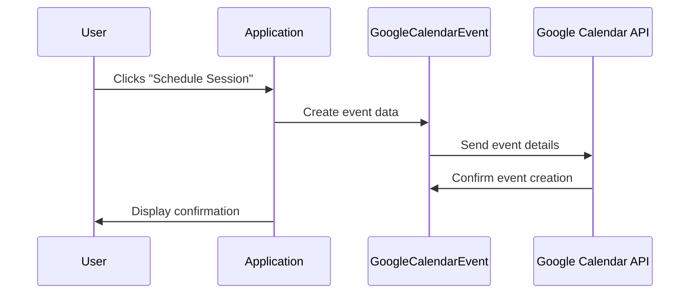

# Chapter 8: Google Calendar Integration

In the previous chapter, [Stripe Payment](07_stripe_payment.md), we learned how to handle payments for [Programs](02_program.md). This chapter introduces Google Calendar Integration, which allows users to connect their Google Calendar to schedule events related to programs, like consultations or follow-ups.  It's like syncing your phone's calendar with your computer.

## Why Integrate with Google Calendar?

Imagine a user enrolled in a "Personal Training Program."  They want to easily schedule their training sessions directly within their existing Google Calendar.  Google Calendar Integration makes this seamless!

## Key Concepts

* **Connection:** Users authorize the application to access their Google Calendar. This is like giving someone a key to your apartment.
* **Synchronization:** Events created within the application, like a training session, are automatically added to the user's Google Calendar.  This is like adding an event to your phone's calendar and it automatically appearing on your computer's calendar.
* **Availability:** The application can check the user's Google Calendar for busy times to avoid scheduling conflicts. This is like checking someone's schedule before proposing a meeting time.

## Using Google Calendar Integration

Let's say a user wants to schedule a training session.  They would click a "Schedule Session" button within the [Program](02_program.md).

```php
// Simplified example of scheduling a session
$googleCalendar = new GoogleCalendarEvent();
$eventData = [
    'date' => '2024-03-15',
    'start_time' => '09:00',
    'end_time' => '10:00',
    'description' => 'Personal Training Session',
];
$call = ScheduleCall::find(1); // Retrieve the related schedule call
$event = $googleCalendar->createEvent($eventData, $call);

// ... handle the returned $event ...
```

This code creates a new `GoogleCalendarEvent` object and prepares the event data. It then calls the `createEvent` method, which handles creating the event in the user's Google Calendar.  The `$call` object provides context about the scheduled event.

## Under the Hood

When a user clicks "Schedule Session," the application interacts with the `GoogleCalendarEvent` model and the Google Calendar API.



### Internal Implementation

The `GoogleCalendarEvent` model (located in `app/Models/Tenant/Schedule/GoogleCalendarEvent.php` and `app/Models/Core/Schedule/GoogleCalendarEvent.php`) handles interactions with the Google Calendar API.

```php
// Inside the GoogleCalendarEvent model (simplified createEvent method)
public function createEvent(array $requestData, ScheduleCall $call)
{
    // ... other code ...

    $event = new \Google_Service_Calendar_Event([
        // ... event details ...
    ]);

    return $this->getService()->events->insert($this->calendar->google_id, $event);
}
```

This simplified code snippet shows how the `createEvent` method uses the Google Calendar service to insert a new event. The `getService` method retrieves an instance of the Google Calendar service, authenticated with the user's credentials.  The `GoogleCalendar` model (located in `app/Models/Tenant/Schedule/GoogleCalendar.php` and `app/Models/Core/Schedule/GoogleCalendar.php`) manages the user's connected calendars. The `PullEventsFromGoogleCalendar` job, tested in `Unit/Jobs/PullEventsFromGoogleCalendarTest.php`, synchronizes events between the application and Google Calendar.

## Conclusion

In this chapter, we explored Google Calendar Integration, which allows users to seamlessly manage program-related events within their Google Calendar.  We learned about its key concepts and how it works under the hood. In the next chapter, we'll learn about the [Codify Wizard](09_codify_wizard.md).


---

Generated by [AI Codebase Knowledge Builder](https://github.com/The-Pocket/Tutorial-Codebase-Knowledge)