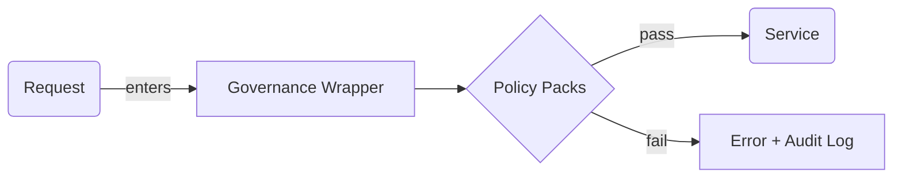
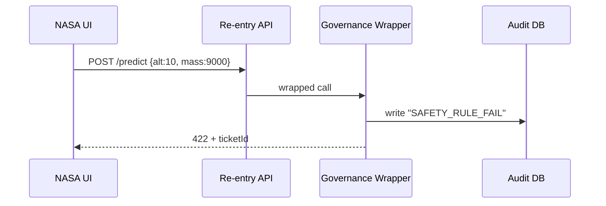

# Chapter 8: Governance Layer (Ethics, Transparency, Safety)

*(just arrived from the red-pen safety net in  
[Human-in-the-Loop Oversight Workflow](07_human_in_the_loop_oversight_workflow_.md))*  

---

## 1 Why a “Governance Layer” at all?

Picture **NASA** getting ready to publish an AI model that predicts re-entry windows for returning spacecraft.

* If the model is wrong, astronauts risk their lives.  
* If the training data leaks, it violates **ITAR** export restrictions.  
* If the decision logic is opaque, Congress will subpoena logs.  

NASA needs an always-on “constitutional court” that asks five quick questions **before anything ships**:

1. Is the model **safe**? (no out-of-range predictions)  
2. Is it **ethical**? (no bias against certain orbit profiles)  
3. Is it **transparent**? (can we explain the output?)  
4. Does it protect **privacy**? (no hidden telemetry IDs)  
5. Is it **truthful**? (no hallucinated heat-shield numbers)

That protective bubble is the **Governance Layer**. Every API call, model inference, and data upload must pass through it.

---

## 2 Key ideas in plain English

| Concept                | Everyday Analogy                                                               |
|------------------------|--------------------------------------------------------------------------------|
| Guardrail Check        | Metal detector at a courthouse entrance                                        |
| Log Artifact           | The receipt the detector prints (“scanned at 09:17 by Officer #12”)            |
| Explainability Ticket  | A sticky note explaining “why the buzzer beeped”                               |
| Policy Pack            | A custom rulebook (HIPAA Pack, ITAR Pack, Ethics Pack…)                       |
| Governance Wrapper     | Plastic security envelope the whole parcel travels in                          |

---

## 3 High-level anatomy (one diagram)



1. A call comes in.  
2. Governance Wrapper runs it through active **Policy Packs**.  
3. On pass → continue. On fail → block and write an audit entry.

---

## 4 Solving our NASA use-case in three baby steps

### Step 1 – Add a wrapper to the model endpoint

```js
// api/reentry/predict.js   (18 lines)
import { withGovernance } from '../lib/governance.js'
import model from '../models/reentry.js'

export default withGovernance({
  packs: ['SAFETY', 'ETHICS', 'TRANSPARENCY'],
  handler: async (req, res) => {
    const result = await model.predict(req.body)
    res.json(result)
  }
})
```

**What this does**  
* `withGovernance` intercepts the request.  
* Runs three chosen packs.  
* Only then calls the real `handler`.

### Step 2 – Declare the rules (one per pack)

```js
// governance/packs/SAFETY.js   (9 lines)
export default {
  name: 'SAFETY',
  rules: [
    (ctx) => ctx.input.altitude > 80 && ctx.input.altitude < 600,
    (ctx) => ctx.output.time_minutes > 0
  ]
}
```

Explanation  
* Two mini rules: altitude must be realistic; prediction time must be positive.  
* Each rule returns `true`/`false`. False triggers a block.

### Step 3 – Ship an explainability ticket if blocked

```js
// lib/governance.js  (simplified 20 lines)
export function withGovernance({ packs, handler }){
  return async (req, res) => {
    const ctx = { input: req.body }
    for (const p of packs){
      const pack = await import(`../governance/packs/${p}.js`)
      for (const rule of pack.default.rules){
        if (!rule(ctx)){
          logFail(req, p, rule.name)       // ②
          return res.status(422).json({
            error:`${p} rule failed`,
            ticket: ctx.ticketId            // ③
          })
        }
      }
    }
    const result = await handler(req, res)  // ← ①
    logPass(req)
    return result
  }
}
```

Explanation (🔍):

1. `handler` runs **only** if every rule passes.  
2. `logFail` records user, timestamp, rule name in the **Governance Log** table.  
3. `ticketId` helps auditors fetch the failure details later.

---

## 5 What actually happens? (step-by-step)



* The request never touches the AI model because **SAFETY** pack vetoed it.  
* Auditor can later query `ticketId` in the **Audit DB** to see the exact payload.

---

## 6 Under the hood files (all below 20 lines)

### 6.1 Where tickets live

```sql
-- migrations/2024_create_governance_log.sql
CREATE TABLE governance_log (
  id SERIAL PRIMARY KEY,
  timestamp TIMESTAMPTZ DEFAULT now(),
  user_id TEXT,
  pack TEXT,
  rule TEXT,
  payload JSONB
);
```

### 6.2 Utility to write a log

```js
// lib/logFail.js  (10 lines)
import db from './db.js'
export const logFail = (req, pack, rule) =>
  db('governance_log').insert({
    user_id: req.user?.id ?? 'anonymous',
    pack, rule,
    payload: req.body
  })
```

### 6.3 Simple transparency endpoint

```js
// api/governance/ticket/:id.js  (14 lines)
router.get('/ticket/:id', async (req, res)=>{
  const row = await db('governance_log').where({ id:req.params.id }).first()
  if (!row) return res.status(404).end()
  res.json(row)
})
```

*External auditors* (with the proper RBAC role) can call this to understand any blocked request.  

---

## 7 Connecting to other chapters

* Guardrail passes/fails are surfaced on the **Policy Dashboard** as red/yellow indicators (see [Policy Dashboard (Admin HQ)](02_policy_dashboard__admin_hq__.md)).  
* HITL reviewers can click a **ticket link** inside their task detail page (see [Human-in-the-Loop Oversight Workflow](07_human_in_the_loop_oversight_workflow_.md)).  
* During deployment, the **Process Proposal Pipeline** halts if any Governance check fails (see [Process Proposal Pipeline](06_process_proposal_pipeline_.md)).

---

## 8 Mini exercise 🏋️

1. Add a **PRIVACY** pack with one rule: `"ctx.input.user_email` must be redacted".  
2. Wrap the `POST /predict` endpoint with `['SAFETY', 'ETHICS', 'PRIVACY']`.  
3. Send a test payload containing an email—verify it gets rejected and logged.

*(Solution in `exercises/08`.)*

---

## 9 Common questions

**Q: Does every rule have to be code?**  
A: No. You can store JSON logic in a table and use a 5-line interpreter. Code rules are just the fastest way to start.

**Q: How do Policy Packs map to federal laws?**  
A: We ship starter packs: `HIPAA`, `FISMA`, `ITAR`, `Ethics`, etc. Agencies toggle packs on/off in the **Admin HQ** UI; the wrapper reads the list at runtime.

**Q: Won’t this slow down APIs?**  
A: Each check is an in-memory function; total overhead is usually under **2 ms**. For heavyweight checks (e.g., bias tests) we run them asynchronously and flag the next request if issues are found.

---

## 10 What you learned

You now know how the **Governance Layer**:

* Sits in front of every model, dataset, and decision.  
* Enforces **ethics, safety, transparency, truth, and privacy** with tiny “Policy Packs”.  
* Generates human-friendly tickets and immutable audit logs.  

Next we’ll ride along as a successfully governed request continues its journey through the  
[Backend API Gateway (HMS-API / HMS-MKT)](09_backend_api_gateway__hms_api___hms_mkt__.md).

---

Generated by [AI Codebase Knowledge Builder](https://github.com/The-Pocket/Tutorial-Codebase-Knowledge)