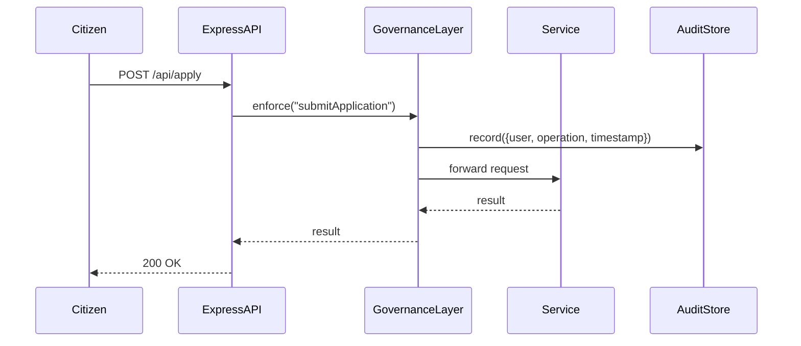

# Chapter 8: Governance Layer

Now that we’ve added a human review step in [Chapter 7: Human-in-the-Loop (HITL) Control](07_human_in_the_loop__hitl__control_.md), it’s time to enforce agency-wide policies automatically. The **Governance Layer** sits at the top of our architecture—like a federal ethics board—ensuring every service, AI agent, and portal follows the same security, compliance, and policy rules.

---

## 1. Why a Governance Layer?

Imagine the Military Postal Service Agency (MPSA) must guarantee that every message:

  • Is sent only by cleared personnel  
  • Does not leak personally identifiable information (PII)  
  • Is logged for a FISMA audit  

Without a central gatekeeper, each module would reimplement checks—leading to gaps or inconsistencies. The Governance Layer solves this by:

  • Centralizing **policy definitions**  
  • Enforcing rules before any action  
  • Recording an **audit trail** for compliance reviews  

---

## 2. Key Concepts

1. **Policy Store**  
   A JSON or database of named rules (who can do what).

2. **Enforcement Middleware**  
   Hooks into each service/API call to check policies.

3. **Operations**  
   Named actions (e.g., `submitApplication`, `approvePermit`).

4. **Allowed Roles**  
   Lists of user roles permitted for each operation.

5. **Audit Logging**  
   Immutable records of every decision (approved or denied).

---

## 3. How to Use the Governance Layer

Below is a minimal example showing how to plug in the Governance Layer to an Express.js service.

### 3.1 Define Your Policies

```json
// policies.json
{
  "submitApplication": { "allowedRoles": ["citizen", "clerk"] },
  "approvePermit":      { "allowedRoles": ["supervisor"] }
}
```
This file says which roles may perform each operation.

### 3.2 Plug in the Middleware

```js
// src/server.js
import express from 'express'
import { Governance } from 'hms-mkt/governance'
import policies from './policies.json'

const app = express()
const gov = new Governance({ policies })

// 1) attach gov helpers to every request
app.use(gov.middleware())

// 2) enforce per-route policy
app.post(
  '/api/apply',
  gov.enforce('submitApplication'),
  (req, res) => res.send('Application submitted')
)

app.post(
  '/api/approve',
  gov.enforce('approvePermit'),
  (req, res) => res.send('Permit approved')
)

app.listen(3000)
```
Here, `gov.enforce('operationName')` blocks unauthorized roles and logs each call.

---

## 4. Under the Hood: What Happens Step-by-Step



1. Express receives the request.  
2. Governance Layer checks `policies.submitApplication`.  
3. If allowed, it logs the event in `AuditStore`.  
4. Forwards the call to the real handler.  
5. Returns the result to the client.

---

## 5. Inside the Governance Layer

Here’s a simplified look at the core code.

### 5.1 Main Class

```js
// src/governance/Governance.js
export class Governance {
  constructor({ policies }) {
    this.policies = policies
  }

  middleware() {
    return (req, res, next) => {
      // make gov available to handlers
      req.gov = this
      next()
    }
  }

  enforce(operation) {
    return (req, res, next) => {
      const role = req.user.role
      const rule = this.policies[operation] || {}
      if (!rule.allowedRoles.includes(role)) {
        return res.status(403).json({ error: 'Forbidden' })
      }
      AuditStore.record({ user: req.user.id, operation })
      next()
    }
  }
}
```

- `middleware()` attaches `req.gov`.  
- `enforce()` checks the policy, logs it, and either calls `next()` or returns a 403.

---

## 6. Analogy: The Federal Ethics Board

Think of the Governance Layer as an agency’s Ethics Board:

  • **Sets the rules** once, for all departments.  
  • **Reviews every action** automatically.  
  • **Keeps minutes** (audit logs) of who did what, when.

No division can bypass it—and there’s a clear record for any oversight hearing.

---

## 7. Summary & Next Steps

You’ve seen how the **Governance Layer**:

  - Centralizes policy definitions  
  - Enforces roles & operations via middleware  
  - Logs every decision for compliance  

Next, we’ll build the [Admin/Gov Portal](09_admin_gov_portal_.md) where staff can manage users, view audit logs, and update policies in real time.

---

Generated by [AI Codebase Knowledge Builder](https://github.com/The-Pocket/Tutorial-Codebase-Knowledge)