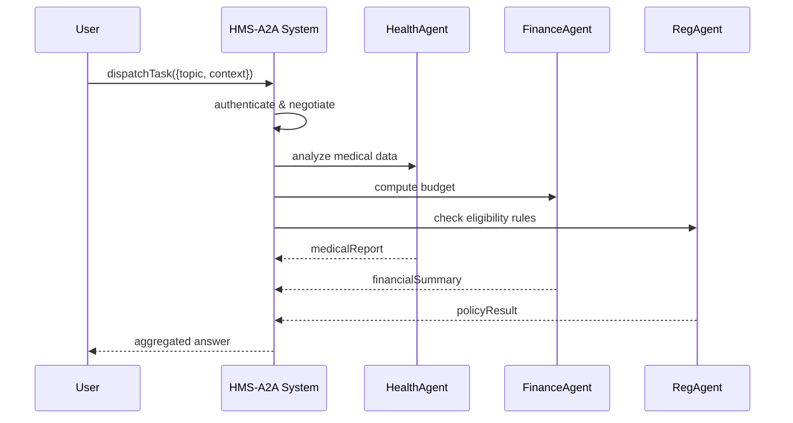

# Chapter 8: HMS-A2A (Agent-to-Agent System)

In [Chapter 7: HMS-CDF (Legislative Engine)](07_hms_cdf__legislative_engine__.md) we saw how laws are drafted, voted on, and published automatically. Now let’s explore **HMS-A2A**, the glue that lets multiple AI agents collaborate—just like an interagency task force—so complex, cross-domain issues get solved end-to-end.

---

## 1. Motivation & Central Use Case

**Problem:** A citizen’s question often spans healthcare, finance, and regulation. No single AI can master all domains. If a user asks “Am I eligible for No Poverty benefits given my medical expenses?”, we need a healthcare expert, a financial calculator, and a regulatory checker to work together.

**Use Case Example:**  
1. A user submits a query about “No Poverty” benefits and ongoing medical bills.  
2. **HMS-A2A** authenticates and connects three agents:  
   - **HealthAgent** examines medical expense details.  
   - **FinanceAgent** calculates income-to-expense ratio.  
   - **RegAgent** checks government eligibility rules.  
3. **HMS-A2A** aggregates their answers into:
   > “You qualify if your monthly income minus medical expenses is below $1,200. Under Policy no-poverty-2024, you meet the criteria.”

This is like the federal government forming a task force, assigning specialists, and then publishing a joint report in minutes.

---

## 2. Key Concepts

1. **Agent**  
   An AI service specialized in one domain (healthcare, finance, regulation).
2. **Authentication**  
   Verifying each agent’s identity and permissions before they join the task.
3. **Capability Negotiation**  
   Asking agents what they can do (e.g., “estimate expenses” vs. “check policy”).
4. **Context Sharing**  
   Passing the same user data through each agent so they “see” the full picture.
5. **Routing & Hand‐Off**  
   Splitting the main request into sub‐requests for each agent, then consolidating results.
6. **Aggregation**  
   Combining multiple agent replies into one coherent answer.

---

## 3. Using HMS-A2A to Solve Our Use Case

### 3.1 Register Agents

```js
// src/a2a/registry.js
import A2A from 'hms-a2a'

const a2a = new A2A()

// Register specialized agents
a2a.registerAgent('health',   HealthAgent)   // handles medical data
a2a.registerAgent('finance',  FinanceAgent)  // calculates budgets
a2a.registerAgent('regulation', RegAgent)    // checks policies

export default a2a
```
*We create an A2A instance and register each domain agent by name.*

### 3.2 Dispatch a Cross‐Domain Task

```js
// src/app.js
import a2a from './a2a/registry'

async function checkNoPovertyEligibility(userData) {
  const result = await a2a.dispatchTask({
    topic: 'No Poverty Eligibility',
    context: userData
  })
  console.log('Unified Answer:', result.answer)
}
```
*`dispatchTask` authenticates, negotiates, and routes sub‐requests, then returns a single `answer`.*

---

## 4. What Happens Under the Hood



1. **authenticate & negotiate:** verify agent permissions.  
2. **analyze / compute / check:** send each piece of context to the right agent.  
3. **aggregate:** merge replies into one response.

---

## 5. Internal Implementation

### 5.1 File Structure

```
hms-a2a/
├── src/
│   ├── registry.js       # agent registration + dispatch logic
│   ├── router.js         # routes tasks to agents
│   ├── auth.js           # agent authentication
│   ├── negotiate.js      # capability negotiation
│   └── aggregator.js     # response merging
```

### 5.2 Registry & Dispatch

```js
// src/a2a/registry.js
import { authenticate }  from './auth'
import { negotiate }     from './negotiate'
import { routeTask }     from './router'
import { aggregate }     from './aggregator'

export default class A2A {
  constructor() { this.agents = {} }
  registerAgent(name, impl) { this.agents[name] = impl }
  async dispatchTask({ topic, context }) {
    await authenticate(this.agents)      // verify agents
    const plan = await negotiate(topic)  // decide which agent does what
    const replies = await routeTask(plan, context, this.agents)
    return aggregate(replies)            // combine into one answer
  }
}
```
*Dispatch calls four steps: auth, negotiation, routing, and aggregation.*

### 5.3 Routing Sub‐Requests

```js
// src/a2a/router.js
export async function routeTask(plan, context, agents) {
  const tasks = plan.map(async ({ role, agent }) => {
    // call agent with its slice of the context
    return agents[agent].handle(context, role)
  })
  return Promise.all(tasks)
}
```
*Given a plan like `[ {role:'medicalReport',agent:'health'}, ... ]`, we call each agent’s `handle()`.*

### 5.4 Aggregating Responses

```js
// src/a2a/aggregator.js
export function aggregate(replies) {
  // replies = [ {role, data}, ... ]
  const answer = replies
    .map(r => `${r.role}: ${r.data.summary}`)
    .join('\n')
  return { answer }
}
```
*We turn each agent’s summary into a combined text answer.*

---

## 6. Conclusion & Next Steps

You’ve learned how **HMS-A2A** forms an AI task force:

- Registers and authenticates multiple agents  
- Negotiates who does what based on “topic”  
- Routes context to specialized agents  
- Aggregates their replies into a unified answer  

Next, we’ll dive deeper into how individual **AI Agent** implementations work in [Chapter 9: AI Agent](09_ai_agent_.md). Enjoy building your interagency AI team!

---

Generated by [AI Codebase Knowledge Builder](https://github.com/The-Pocket/Tutorial-Codebase-Knowledge)