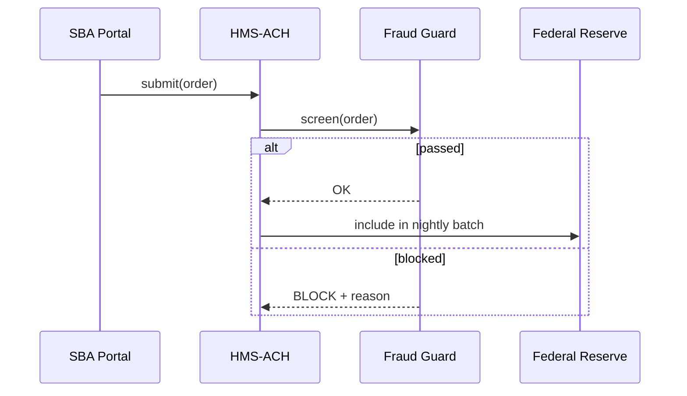

# Chapter 8: HMS-ACH (Financial Transaction Core)
*[← Back to Chapter&nbsp;7: HMS-ESQ (Legal Compliance Intelligence)](07_hms_esq__legal_compliance_intelligence__.md)*  

---

## 1. Why Do We Need HMS-ACH?

Imagine the **Small Business Administration (SBA)** just approved a $5,000 relief grant for “Anna’s Bakery.”  
At first glance, moving money looks easy:

1. “Debit Treasury, credit Anna’s bank.”  
2. Done… right?

Real life is messier:

* Treasury must **batch** thousands of grants into one nightly file for the Federal Reserve.  
* Payments need a **fraud check** (e.g., is this the third grant for the same EIN?).  
* Finance staff must later **reconcile** “What we sent” vs. “What the bank cleared.”  
* Congress may audit a specific penny five years from now.

**HMS-ACH** is the **in-house clearinghouse** that automates all of this so every penny is traceable—from *intent* to *bank statement*.

---

## 2. Key Concepts (Plain English)

| Term                | Friendly Analogy            | One-Sentence Meaning |
|---------------------|-----------------------------|----------------------|
| Payment Order       | Signed check                | Single instruction: “Pay \$5,000 to Anna.” |
| Batch File          | Bundle of envelopes         | Group of orders shipped to the Federal Reserve in one go. |
| Ledger              | Checkbook register          | Immutable record of all debits/credits (double-entry). |
| Fraud Guard         | Airport TSA                 | Runs rules like “one grant per EIN per program.” |
| Reconciliation Job  | End-of-day cash balance     | Matches cleared items against bank statements. |
| Audit Trail         | CCTV footage                | Who created, approved, altered, or canceled each payment. |
| Settlement Window   | The bank’s business hours   | Time slot when ACH files are accepted and returned. |

---

## 3. The 5-Minute “Hello-ACH”

Goal:  
1) Create a \$5,000 grant payment.  
2) Pass it through Fraud Guard.  
3) Export tonight’s batch file.

```python
# file: hello_ach.py  (≤ 20 lines)
from hms_ach import PaymentOrder, AchCore

core = AchCore(program="SBA-Relief")

# 1. Draft the payment order
order = PaymentOrder(
    payee_name   = "Anna's Bakery",
    payee_bank   = "021000021",       # routing
    payee_acct   = "987654321",
    amount_usd   = 5000.00,
    purpose      = "COVID-19 Relief Grant",
    ein          = "12-3456789"
)

# 2. Submit (Fraud Guard runs automatically)
result = core.submit(order)
print(result.status)           # → "ACCEPTED" or "BLOCKED"

# 3. End-of-day: generate batch file
core.export_batch("out/SBA_2024-03-26.ach")
```

What will happen?  
* If **Fraud Guard** sees Anna already got a grant, `status = "BLOCKED"` and nothing leaves Treasury.  
* Otherwise the order is written to the **Ledger**, queued into today’s **Batch File**, and an **Audit Trail** entry is stored.

---

## 4. Step-by-Step Under the Hood



*Only five moving parts*—but they guarantee money moves **once and only once**, with proof.

---

## 5. A Quick Reconciliation Example

The next morning Treasury receives a *return file* from the Fed.

```python
# file: reconcile.py  (≤ 12 lines)
from hms_ach import Reconciler

Reconciler.run(
    batch_file   = "out/SBA_2024-03-26.ach",
    return_file  = "in/FED_2024-03-27.ret"
)
```

Outputs to console:

```
✓ 142 payments cleared
✗ 3 returned  (reason: “Invalid account”)
Ledger updated, alerts sent to finance@treasury.gov
```

Returned items are automatically re-queued or flagged for human review.

---

## 6. Peeking Inside the Codebase

### 6.1 Minimal Ledger Entry

```python
# file: ach/ledger.py
class Entry:
    def __init__(self, order_id, debit_acct, credit_acct, amount):
        self.id      = order_id
        self.debit   = debit_acct
        self.credit  = credit_acct
        self.amount  = amount
        self.ts      = now()
```

Every payment becomes **two rows**: one debit, one credit—classic double-entry bookkeeping.

### 6.2 A Tiny Fraud Rule (YAML)

```yaml
# file: rules/grant_frequency.yaml
- id: one_per_ein
  when: "count_orders(ein) >= 1"
  then: "BLOCK: Duplicate grant detected."
```

Non-developers can add rules without touching Python.

### 6.3 Batch Exporter (trimmed)

```python
# file: ach/exporter.py
def export(path):
    rows = queue.pop_all(settlement_window())
    with open(path, "w") as f:
        for r in rows:
            f.write(encode_ach_row(r))
```

Less than ten lines: pull queued orders, encode each as an ACH row, write the file.

---

## 7. Working with Other HMS Layers

* **[HMS-ESQ](07_hms_esq__legal_compliance_intelligence__.md)** – checks every Payment Order for OFAC & sanctions compliance before settlement.  
* **[HMS-DTA](06_hms_dta__data_lake___governance__.md)** – ingests Ledger snapshots nightly for BI dashboards.  
* **[HMS-OMS](12_hms_oms__operational_workflow_manager__.md)** – can trigger a human review task if Fraud Guard blocks a high-value order.  

---

## 8. FAQ & Troubleshooting

| Symptom | Likely Cause | Quick Fix |
|---------|--------------|-----------|
| `status = "BLOCKED"` but payee is new | Rule too strict | Edit YAML rule or add `order.override = True` (requires supervisor JWT). |
| Batch file empty | Missed settlement window | Call `core.export_batch()` **before** 6 PM ET or adjust `settlement_window()`. |
| Returned reason “R03 – No account” | Bad bank info | Finance staff update payee record and re-submit. |
| Audit Trail missing entries | Worker down | Start `python workers/audit_worker.py`. |

---

## 9. What You Learned

You can now:

1. Create a **Payment Order** in just a few lines.  
2. Rely on **Fraud Guard** & **Audit Trail** for safety and accountability.  
3. Produce & reconcile ACH **Batch Files** without manual spreadsheets.  

Next we’ll see how **AI agents** can watch, predict, and even *optimize* these money flows in real time:  
[HMS-AGT / HMS-AGX (Core & Extended AI Agent Framework)](09_hms_agt___hms_agx__core___extended_ai_agent_framework__.md)

---

---

Generated by [AI Codebase Knowledge Builder](https://github.com/The-Pocket/Tutorial-Codebase-Knowledge)