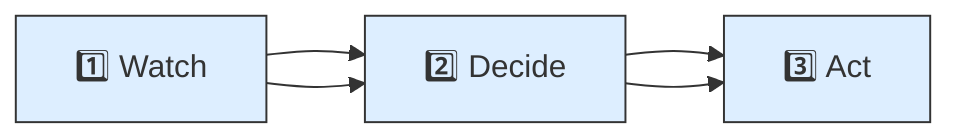
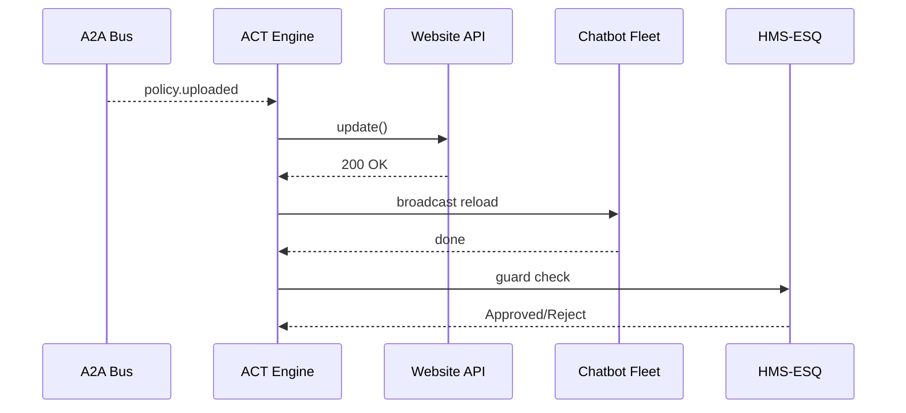

# Chapter 8: HMS-ACT Workflow Orchestrator  

*[← Back to Chapter&nbsp;7: HMS-A2A Inter-Agency Messaging Bus](07_hms_a2a_inter_agency_messaging_bus_.md)*  

---

## 0. Why Do We Need “ACT”? — The Scrambled-Policy Problem  

A policy analyst at **Fair Housing and Equal Opportunity (FHEO)** uses an AI agent to upload a *new anti-discrimination guideline*.  
What must happen next?

1. The PDF is copied to the public web site.  
2. Internal chatbots switch to the new rule set.  
3. Old tickets still finish under the *previous* guideline.  
4. Legal staff sign an acknowledgment.  

If each team writes its own cron jobs, steps trigger out of order, things fall through cracks, and the public sees half-baked rules.  

**HMS-ACT** is the *stage manager*:  
• watches for an event (`policy.uploaded`)  
• fires *exactly* the right next steps, in the right order, with retries and human escalations baked in.  

---

## 1. Key Concepts (Learn These Five Words)

| Term | Everyday Analogy | One-Line Job |
|------|------------------|--------------|
| Event | Doorbell ring | Something just happened (`policy.uploaded`) |
| Trigger | “If doorbell, then…” sticky note | Decides *which* flow starts |
| Step | Dance move | One task (API call, agent action, human approval) |
| Flow | Choreography sheet | Ordered list of steps |
| Guard | Bouncer | Checks policy before a step runs (links to [HMS-ESQ](04_compliance___legal_reasoning__hms_esq__.md)) |

Remember: **Event → Trigger → Flow (many Steps)**, each protected by **Guards**.

---

## 2. 3-Step Mental Model  



1. **Watch** – Subscribe to topics on the [A2A Bus](07_hms_a2a_inter_agency_messaging_bus_.md).  
2. **Decide** – Match triggers (`if topic == policy.uploaded`).  
3. **Act** – Execute the flow, step-by-step, with guards and retries.

---

## 3. “Hello ACT” — Shipping a New Policy in 18 Lines

Below is a minimal workflow file **policy_flow.yaml** followed by a 15-line runner.

### 3.1 YAML Flow  

```yaml
# policy_flow.yaml
flow:
  name: "Publish New Housing Policy"
  watch_topic: "policy.uploaded"
  steps:
    - id: "sync_website"
      run: "svc.website.update"          # backend API
    - id: "reload_chatbots"
      run: "agt.broadcast.reload"        # agents
    - id: "legal_ack"
      run: "human.signoff"
      guard: "esq.review.v1"             # extra ESQ check
```

Plain English  
1. When `policy.uploaded` fires, run three steps in order.  
2. Last step (`legal_ack`) requires an extra ESQ approval before it can complete.

### 3.2 Runner Script  

```python
# run_act_demo.py  (15 lines)
from hms_act import ACT, fire_event
act = ACT("policy_flow.yaml")

# simulate the AI agent uploading a policy
fire_event("policy.uploaded",
           payload={"doc_id": "POL-2024-07"})

act.poll()        # process one cycle
```

Console output (trimmed):

```
▶ Trigger matched: Publish New Housing Policy
✓ sync_website   → OK
✓ reload_chatbots→ OK
⚠ legal_ack      → waiting for ESQ approval
```

A human clicks “Approve” in the oversight console; `ACT` resumes automatically.

---

## 4. What Happens Under the Hood?



Only 5 actors; every arrow is an [MCP](02_model_context_protocol__hms_mcp__.md) envelope.

---

## 5. Tiny Peek at Core Engine Logic (≤18 Lines)

```python
# hms_act/core.py
class ACT:
    def __init__(self, yaml_path):
        self.flow = load_yaml(yaml_path)["flow"]
        BUS.subscribe(self.flow["watch_topic"], self._start)

    def _start(self, event):
        self.ctx = {"event": event, "step": 0}
        self._next_step()

    def _next_step(self):
        steps = self.flow["steps"]
        if self.ctx["step"] >= len(steps):
            return                      # flow finished
        step = steps[self.ctx["step"]]
        if guard := step.get("guard"):
            if not call_tool(guard, {"event": self.ctx["event"]}):
                return                  # wait until approved
        run_tool(step["run"], self.ctx["event"])
        self.ctx["step"] += 1
        self._next_step()
```

Line-by-line  
1. Subscribes to `watch_topic`.  
2. On event, stores context and walks steps recursively.  
3. If a **guard** exists, calls ESQ and pauses until it returns `True`.  
4. `run_tool` can be an API call, an agent broadcast, or a human task stub.

---

## 6. Linking Back to Other Layers

• Events come from [HMS-A2A](07_hms_a2a_inter_agency_messaging_bus_.md).  
• Guards call [HMS-ESQ](04_compliance___legal_reasoning__hms_esq__.md) for legality.  
• Steps may invoke agents defined in [HMS-AGT](05_hms_agt_core_agent_framework_.md) or services in the upcoming [Backend Service Mesh](10_backend_service_mesh__hms_svc___hms_api__.md).  
All coordination lives **here**, inside ACT.

---

## 7. Common Pitfalls (and How ACT Fixes Them)

Problem | Old World | With HMS-ACT
--------|-----------|-------------
Steps run in wrong order | ad-hoc scripts | Declarative flow enforces sequence
Forgotten legal review | Human memory | Guard = automatic ESQ check
Partial failure leaves mess | Hard to debug | ACT retries & records state per step
Hard to see progress | Email chains | Oversight console shows live status

---

## 8. Recap & What’s Next  

In this chapter you:  
• Met the *stage manager* of HMS—**HMS-ACT**.  
• Wrote a 3-step flow that reacts to a `policy.uploaded` event.  
• Learned how events, guards, and steps connect previously covered layers.  

Next we’ll look at where all the *data* these steps shuffle actually lives: the **Data Spine**.  
[Continue to Chapter&nbsp;9: Data Spine (HMS-DTA)](09_data_spine__hms_dta__.md)

---

Generated by [AI Codebase Knowledge Builder](https://github.com/The-Pocket/Tutorial-Codebase-Knowledge)