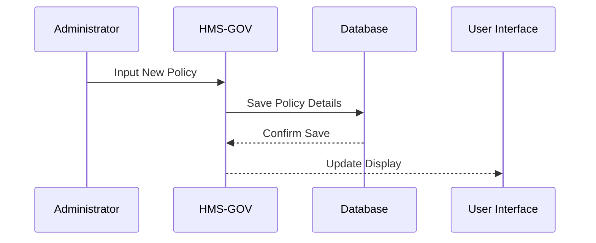

# Chapter 8: HMS-GOV

Welcome to Chapter 8 of our tutorial series on HMS-A2A! Previously, we delved into [HMS-API](07_hms_api_.md) and explored how APIs power systems through data and business logic. Now, we'll focus on `HMS-GOV`, a concept that serves as a command center for administrators to manage and oversee governance protocols effectively.

## Motivation and Use Case

Imagine you're an administrator responsible for setting and enforcing policies across various government programs. You need a comprehensive view and control over these policies to ensure efficient governance. `HMS-GOV` is designed for this very purpose. It acts like a control tower, allowing you to see and adjust governance protocols as needed.

Think of `HMS-GOV` as your dashboard for managing various policies seamlessly, implemented via a Vue.js-based frontend, it ensures accessibility and ease of use for both administrators and politicians.

## Understanding Key Concepts

Let's break down the core ideas behind `HMS-GOV`.

### Key Concept 1: Command Center

Picture this as the nerve center of your governance operations. `HMS-GOV` gives you the bird's eye view of all policies and lets you manage them in real-time, just like how a control tower manages aircrafts.

### Key Concept 2: Policy Management

Imagine this like adjusting knobs on a mixing console. You can fine-tune various settings related to governance programs, ensuring everything operates within the desired parameters.

## How to Use HMS-GOV

To illustrate how `HMS-GOV` can be utilized, let's consider a simple example of setting a new policy.

```javascript
// Example of using HMS-GOV to set a new policy

// Initialize the governance system
const governanceSystem = new HMS_GOV();

// Define a policy
const newPolicy = {
    name: "Community Engagement Policy",
    description: "Encourage participation through local forums.",
    effectiveDate: "2023-01-01"
};

// Set the policy using the governance system
governanceSystem.setPolicy(newPolicy);
```

**Explanation:**

- **Initialization**: We create an instance of `HMS_GOV`, our command center.
- **Define Policy**: We outline the new policy specifics like its name, description, and effective date.
- **Set Policy**: We apply this new policy through the governance system.

## Behind the Scenes

To better understand the internal mechanics, let's visualize the `HMS-GOV` workflow with a sequence diagram.



**Step-by-Step Breakdown:**

1. **Administrator Sets Policy**: You enter a new policy into the system.
2. **Policy Storage**: `HMS-GOV` saves the details to a database.
3. **Confirmation**: The database confirms the save, updating the system.
4. **UI Update**: The user interface reflects changes to show the new policy.

## Internal Implementation

Now, let's take a brief look under the hood of `HMS-GOV` with a simplified example.

```plaintext
// Placeholder for HMS-GOV backend operations
class HMS_GOV {
    setPolicy(policy) {
        // Step 1: Validate the policy details
        // Step 2: Store to database
        // Step 3: Notify user interface
        console.log(`Policy "${policy.name}" set successfully.`);
    }
}
```

**Explanation:**

- **Validation**: The process begins by checking the policy details.
- **Database Interaction**: Policy data is stored securely.
- **UI Notification**: The frontend is updated to reflect the latest information.

---

## Conclusion

In this chapter, we've explored how `HMS-GOV` functions as a command center, enabling administrators to manage policies effectively within a Vue.js-based platform. This tool helps ensure governance protocols are applied consistently and transparently.

You're now equipped to understand how governance is handled with HMS-GOV. Ready to continue your learning journey? Let's head to [HMS-CDF](09_hms_cdf_.md) in the next chapter, where exciting new discoveries await!

---

Generated by [AI Codebase Knowledge Builder](https://github.com/The-Pocket/Tutorial-Codebase-Knowledge)