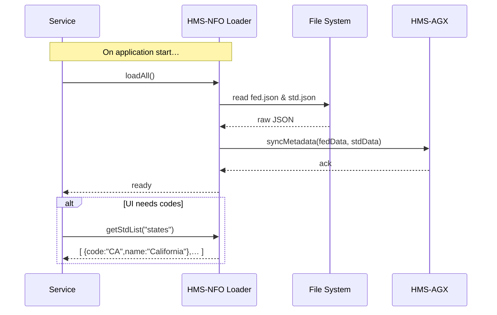

# Chapter 8: HMS-NFO (System-Level Info)

Welcome back! In [Chapter 7: HMS-AGX (Knowledge Graph)](07_hms_agx__knowledge_graph__.md) we learned how to connect programs, decisions, and stakeholders. Now we’ll dive into **HMS-NFO**, our “system archives” of metadata and standards that keep everything consistent—from regulations to code lists.

---

## 1. Motivation: Why System-Level Info Matters

Imagine you’re building a new benefits portal for **Emergency Housing Subsidies**. You need to show:

- Federal regulation citations (e.g. “42 U.S.C. § 1381”)  
- Standard code lists (e.g. income ranges, state codes)  
- Metadata about each field (labels, descriptions, valid values)  

Hard-coding these everywhere leads to mismatches, outdated info, and audit headaches. **HMS-NFO** solves this by being the single, authoritative repository—like a national archives of all system metadata.

**Use Case**  
A front-end fetches the label and allowed values for `applicantIncomeBracket` from HMS-NFO so it can render a dropdown. No more magic strings in code!

---

## 2. Key Concepts

1. **Metadata Repository**  
   A folder of JSON files (e.g. `fed.json`, `std.json`) that describe rules, codes, and field definitions.

2. **fed.json**  
   Federal regulations and citation metadata. Think “the law library.”

3. **std.json**  
   Standard definitions used across modules (e.g. status codes, department lists).

4. **Loader Module**  
   A small library that reads these JSON files at startup and provides easy lookup functions.

5. **Sync to Knowledge Graph**  
   HMS-NFO feeds the loaded metadata into the HMS-AGX graph so AI, analytics, and governance modules can reference it.

---

## 3. Using HMS-NFO to Solve Our Use Case

### 3.1 Configure Your JSON Files

Place your metadata in `config/nfo/`:

```text
config/nfo/
├── fed.json
└── std.json
```

Example `std.json` snippet:
```json
{
  "incomeBrackets": [
    { "code": "A", "label": "0–20,000 USD" },
    { "code": "B", "label": "20,001–50,000 USD" }
  ],
  "states": [
    { "code": "CA", "name": "California" },
    { "code": "TX", "name": "Texas" }
  ]
}
```

### 3.2 Load HMS-NFO at Startup

```js
// modules/hms-nfo/index.js
const fs = require('fs')
const path = require('path')

let fedData = {}, stdData = {}

function loadAll() {
  fedData = JSON.parse(fs.readFileSync(path.join(__dirname,'../config/nfo/fed.json')))
  stdData = JSON.parse(fs.readFileSync(path.join(__dirname,'../config/nfo/std.json')))
}

function getStdList(name) {
  return stdData[name] || []
}

module.exports = { loadAll, getStdList }
```
This reads both files once, storing them in memory.

### 3.3 Fetching Data in Your Service

```js
// services/formService.js
const nfo = require('../modules/hms-nfo')
nfo.loadAll()

// Later in a request:
function getIncomeOptions() {
  return nfo.getStdList('incomeBrackets')
}

// Output:
console.log(getIncomeOptions())
// [ { code: "A", label: "0–20,000 USD" }, ... ]
```
Your UI can now render a consistent dropdown using that array.

---

## 4. Under the Hood: What Happens When You Call HMS-NFO



1. **Service** calls `loadAll()`.  
2. **Loader** reads JSON files from disk.  
3. Metadata is pushed into **HMS-AGX** for graph queries.  
4. Later, `getStdList()` returns the in-memory array.

---

## 5. Internal Implementation Details

### 5.1 File Structure

```
modules/hms-nfo/
├── index.js       # Exports loadAll(), getFedData(), getStdList()
├── sync.js        # (Optional) Push metadata into AGX
└── README.md      # Explains JSON schema
```

### 5.2 Syncing to the Knowledge Graph

```js
// modules/hms-nfo/sync.js
const agx = require('../services/agxClient')

async function syncMetadata(fed, std) {
  // For each federal rule, create a node
  for (let rule of fed.rules) {
    await agx.addNode('FedRule', rule)
  }
  // For each standard list, create nodes and edges
  for (let [list, items] of Object.entries(std)) {
    for (let item of items) {
      await agx.addNode('StdItem', { list, ...item })
      await agx.addEdge(list, item.code, 'HAS_ITEM')
    }
  }
}

module.exports = { syncMetadata }
```
This optional step keeps your knowledge graph in sync with the JSON.

---

## 6. Conclusion

You’ve now seen how **HMS-NFO** acts as the single source of truth for regulations, code lists, and system standards. We covered:

- Organizing `fed.json` and `std.json` in `config/nfo`  
- A tiny **Loader Module** to read and serve metadata  
- How to feed these into the [Knowledge Graph](07_hms_agx__knowledge_graph__.md)  
- A simple sequence of startup and lookup  

Next, we’ll see how agents communicate in [Chapter 9: HMS-A2A (Agent-to-Agent System)](09_hms_a2a__agent_to_agent_system__.md).

---

Generated by [AI Codebase Knowledge Builder](https://github.com/The-Pocket/Tutorial-Codebase-Knowledge)