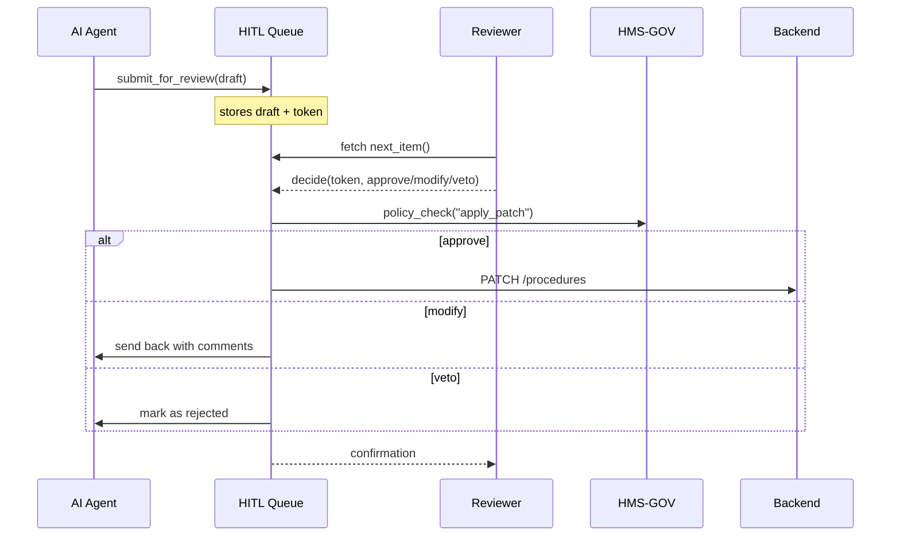

# Chapter 8: Human-In-The-Loop Decision Point  
*(File: 08_human_in_the_loop_decision_point_.md)*  

[← Back to AI Representative Agent](07_ai_representative_agent__hms_a2a__.md)

---

## 1. Why Bother With a Human Gate? – A 60-Second Story

Last week the **AI Representative Agent (HMS-A2A)** read 2,000 citizen complaints and drafted a new **“Fast-Track Juvenile Hearing”** policy (See Chapter 7).  
Great!—but the change would:

* Shift court schedules in 12 districts.  
* Cost \$2 million in overtime.  
* Affect due-process rights.

Before anything so serious becomes *law of the land*, a **human supervisor** must:

1. Read the AI’s patch.  
2. Approve, modify, or veto it.  
3. Leave a short note (“Approved – budget secured” or “Denied – violates statute 12.4”).

That **checkpoint** is the **Human-In-The-Loop (HITL) Decision Point**.  
Think of it as a **Senate committee markup** for every AI proposal.

---

## 2. What Does “HITL” Actually Mean?

| Term                | Plain-English Meaning                                     | Analogy                        |
|---------------------|-----------------------------------------------------------|--------------------------------|
| Review Queue        | Inbox that stores all AI proposals awaiting humans        | Pile of bills on a senator’s desk |
| Decision Token      | Unique ID that ties the proposal, reviewer, and outcome   | Bill number (S.1234)           |
| Approve / Modify / Veto | Possible reviewer actions                             | “Yea”, “Amend”, “Nay” vote     |
| Comment Log         | Free-text reason for the decision                         | Congressional Record           |
| Escalation Timeout  | Auto-escalates if nobody reviews within X hours           | “Pocket veto” prevention       |

---

## 3. Quick-Start: Review a Proposal in 10 Lines

Below we revisit the policy patch created in Chapter 7 and pass it through HITL.

```python
# file: hitl_demo.py
from hms_a2a import ask_agent
from hms_hitl import submit_for_review, decide

# 1️⃣ AI drafts a patch
draft = ask_agent("Cut hearing time to 30 days", ["wait_times"])

# 2️⃣ Send to HITL queue
token = submit_for_review(draft)      # returns decision_token

# 3️⃣ A supervisor (you!) reviews it
decide(token, action="approve", note="Budget verified ✅")
```

What happens:

1. `submit_for_review` stores the proposal in a **Review Queue** and returns a `token` like `HITL-57B2`.
2. `decide` records the human’s choice. If **approved**, the system automatically calls the Backend API to enact the change; otherwise the patch stops here.

---

## 4. Life-Cycle of a Proposal (Bird-Eye View)



Only **five** actors but the steps guarantee *accountability*.

---

## 5. Peeking Under the Hood (≤20 Lines)

File `hms_hitl/engine.py`

```python
import uuid, json, time
from hms_gov import check_permission
from backend import patch_backend   # tiny wrapper around HMS-API

REVIEW_QUEUE = {}          # in-memory dict  {token: draft}

def submit_for_review(draft: dict) -> str:
    token = "HITL-" + uuid.uuid4().hex[:6]
    REVIEW_QUEUE[token] = {"draft": draft, "status": "PENDING"}
    _audit(token, "queued")
    return token

def decide(token: str, action: str, note: str):
    item = REVIEW_QUEUE[token]
    item.update({"status": action.upper(), "note": note,
                 "reviewer": _current_user(), "ts": time.time()})
    _audit(token, action.lower())
    if action == "approve":
        check_permission(role=_current_user_role(),
                         action="apply_patch", resource="a2a")
        patch_backend(item["draft"])
    return "recorded"

def _audit(token, evt):
    open("hitl_audit.log","a").write(json.dumps(
        {"token":token, "event":evt, "ts":time.time()})+"\n")
```

• A **six-line** queue + **six-line** decision function.  
• `_audit` appends every event to an unalterable log for later audits.  
• `check_permission` re-uses the same Governance call from [Chapter 1](01_governance_layer__hms_gov__.md).  

---

## 6. How It Integrates With Other Layers

1. **Governance Layer** – Blocks unauthorized approvals.  
2. **RBAC** – Only roles like `Supervisor` see the Review Portal. (See [RBAC](04_role_based_access_control__rbac__.md))  
3. **Security & Compliance** – All decisions land in the evidence bucket. (See [Security & Compliance Framework](03_security___compliance_framework_.md))  
4. **AI Agent** – Automatically calls `submit_for_review` when `mode="action"` and HITL is enabled.  
5. **Backend API Gateway** – Receives the final PATCH after approval. (Next chapter)

---

## 7. Common Pitfalls & Quick Fixes

| Pitfall                        | Symptom                              | Quick Fix |
|--------------------------------|--------------------------------------|-----------|
| Forgetting `check_permission`  | Unauthorized staff can approve       | Always call it before `patch_backend` |
| Reviewer never sees items      | Queue stays empty                    | Make sure AI sets `mode="action"` or your service calls `submit_for_review` |
| Audit log missing              | Fails compliance checks              | Verify `_audit` is called in **both** `submit_for_review` and `decide` |
| Long backlog                   | Citizens wait                        | Set `ESCALATION_TIMEOUT` to auto-notify higher manager |

---

## 8. Try It Yourself

1. Run the snippet in **Section 3**.  
2. Open `hitl_audit.log` – each line shows `queued`, then `approve`.  
3. Replace `action="approve"` with `"modify"` and add `note="Change deadline to 45 days"`.  
   *Observe:* the system sends the patch **back** to the AI for re-draft.  
4. Change your role in the JWT to `Analyst` (no approval rights).  
   *Expect:* `PermissionError: Governance deny`.

---

## 9. What You Learned

✓ Why **Human-In-The-Loop Decision Points** protect high-stakes actions.  
✓ Key building blocks: Review Queue, Decision Token, Comment Log.  
✓ Minimal Python engine (<20 lines) that enforces approvals + auditing.  
✓ How Governance, RBAC, and Security layers knit together around HITL.

In the next chapter we’ll follow the **approved patch** as it travels through the **Backend API Gateway**, the doorway to every microservice in HMS-EHR.

[Continue to Backend API Gateway (HMS-API)](09_backend_api_gateway__hms_api__.md)

---

Generated by [AI Codebase Knowledge Builder](https://github.com/The-Pocket/Tutorial-Codebase-Knowledge)