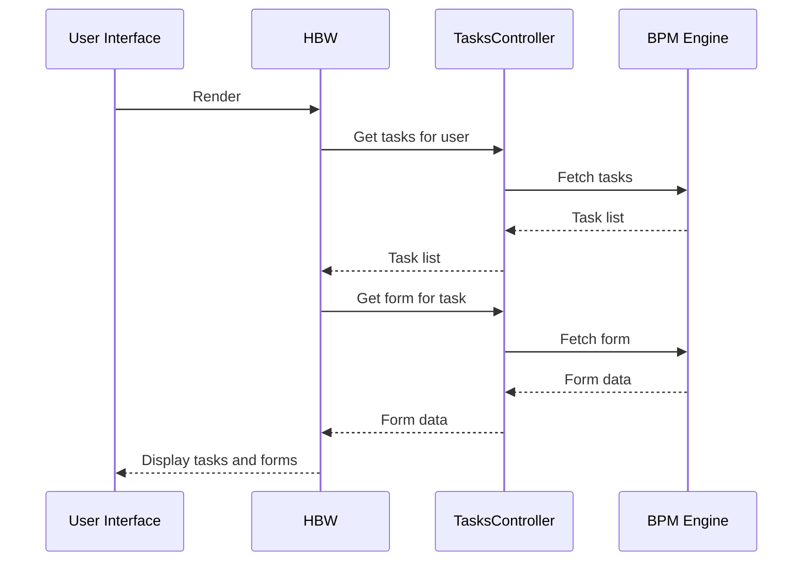

# Chapter 8: Hydra BPM Widget (HBW)

Coming from learning about [Custom Fields](07_custom_fields.md), let's now explore how users actually interact with the [Business Process (BP)](04_business_process__bp_.md) and its [Task](05_task.md)s. Remember Alice's pizza order and the chef's "Prepare Dough" task? How does the chef see and interact with that task?  That's where the Hydra BPM Widget (HBW) comes in.

## What is the Hydra BPM Widget (HBW)?

The HBW is like a control panel for managing [Business Process](04_business_process__bp_.md)es within HMS-OMS.  It's a JavaScript widget that embeds directly into the user interface, providing a way for users to see their assigned tasks, fill out forms, and submit actions. Think of it like the chef's workstation in the kitchen, displaying orders and providing tools to manage them.

## Alice's Pizza: The Chef's Workstation

Let's imagine the chef logs into HMS-OMS.  Thanks to the HBW, they see a list of tasks assigned to them, including "Prepare Dough" for Alice's pizza order.  They can click on the task, see the form with the "Dough Type" field, fill it out, and mark the task as complete, all within the HBW.

## Key Concepts

* **Widget:** A self-contained component that embeds into the user interface.  Think of it like a mini-application within the main application.
* **Tasks:** The HBW displays a list of [Task](05_task.md)s assigned to the current user.
* **Forms:** The HBW renders the forms associated with each task, allowing users to input data.  These forms are defined by the [Custom Fields](07_custom_fields.md) of the [Order Type](03_order_type.md).
* **Actions:**  The HBW allows users to perform actions like submitting a completed task or claiming a task.

## Using the HBW

When a user logs in, the HBW automatically loads and displays their tasks.

```javascript
// app/javascript/packs/application.js (simplified)
$(() => {
  if (!('HBWidget' in window)) {
    return;
  }
  const widget = window.HBWidget;

  widget.render(); // This renders the HBW
});
```

This code checks if the `HBWidget` object is available and then calls the `render()` method to display the widget.

## Under the Hood

When the HBW renders, it communicates with the HMS-OMS backend to fetch the user's tasks and the associated forms.



The `HBW::Widget` class (located in `hbw/app/models/hbw/widget.rb`) handles the interaction with the BPM engine.

```ruby
# hbw/app/models/hbw/widget.rb (simplified)
@tasks = widget.task_list(current_user_identifier, entity_class)
```

This code retrieves the list of tasks for the current user.

The `HBW::TasksController` (located in `hbw/app/controllers/hbw/tasks_controller.rb`) handles the requests from the HBW.

```ruby
# hbw/app/controllers/hbw/tasks_controller.rb (simplified)
def index
  @tasks = widget.task_list(current_user_identifier, entity_class)
end
```

This code retrieves the task list from the BPM engine and returns it to the HBW.

## Conclusion

You've learned about the Hydra BPM Widget (HBW) and how it provides a user interface for interacting with [Business Process](04_business_process__bp_.md)es and [Task](05_task.md)s.  You've seen how it displays tasks, renders forms, and allows users to perform actions. Next, let's explore how we configure the HBW and HMS-OMS using the [Configuration (config)](09_configuration__config_.md) concept. [Next: Configuration (config)](09_configuration__config_.md)


---

Generated by [AI Codebase Knowledge Builder](https://github.com/The-Pocket/Tutorial-Codebase-Knowledge)