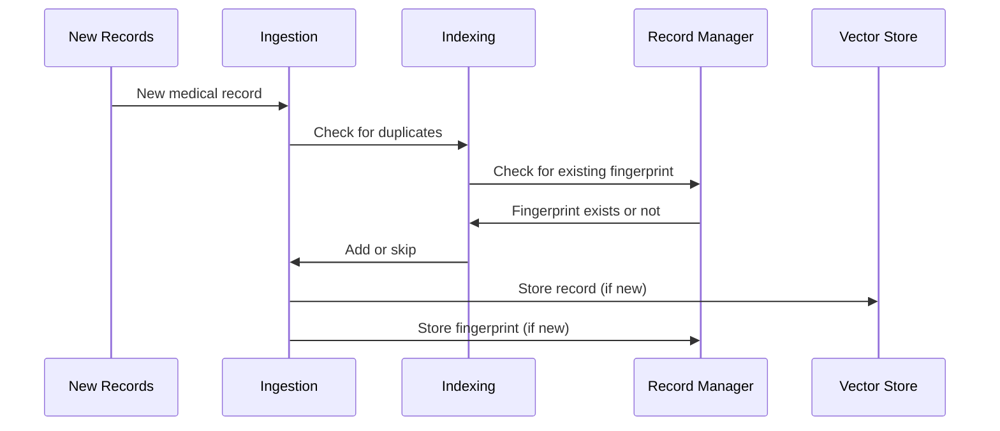

# Chapter 8: Indexing

In the previous chapter, [Ingestion](07_ingestion.md), we learned how to add new medical records to the [Vector Store](06_vector_store.md). Now, let's explore how we can make this process even smarter by avoiding adding duplicate information. This is where *Indexing* comes in.

Imagine you're adding new books to a library. You don't want to accidentally add two copies of the same book.  Indexing is like having a library catalog that tells you which books are already on the shelves.

## What Problem Does Indexing Solve?

Indexing solves the problem of duplicates and improves efficiency during [Ingestion](07_ingestion.md).  Without indexing, the [Vector Store](06_vector_store.md) could end up with multiple copies of the same information, wasting space and slowing down searches.

## How Indexing Works

Think of indexing as a two-step process:

1. **Checking for Duplicates:** Before adding a new record, indexing checks if a similar record already exists in the [Vector Store](06_vector_store.md). It does this by generating a unique "fingerprint" (a hash) for each record.  If a record with the same fingerprint is found, it means the record is already in the system.

2. **Adding New Records:** If the record is new, its embedding (as discussed in [Embeddings](05_embeddings.md)) is calculated and stored in the [Vector Store](06_vector_store.md) along with the record itself. The record's fingerprint is also stored in a separate database called a [Record Manager](09_record_manager.md) to keep track of what's already been indexed.

## Using Indexing in HMS-MED

Let's say we have a new medical record for John Doe. During ingestion with indexing:

1. HMS-MED calculates the fingerprint of the new record.
2. HMS-MED checks the [Record Manager](09_record_manager.md) to see if this fingerprint already exists.
3. If the fingerprint doesn't exist, HMS-MED creates the embedding for the record and stores it in the [Vector Store](06_vector_store.md).  It also stores the fingerprint in the [Record Manager](09_record_manager.md).
4. If the fingerprint already exists, HMS-MED skips adding the record to the [Vector Store](06_vector_store.md), avoiding duplication.

## Internal Implementation

Here's a simplified view of how Indexing works within HMS-MED:



The code for indexing is integrated within the `HMS-EHR/backend/ingest.py` file.  Here's a simplified example:

```python
# ... other code ...

# The 'index' function handles the indexing process.
indexing_stats = index(
    docs_transformed,  # Documents to be indexed
    record_manager,    # The Record Manager
    vectorstore,       # The Vector Store
    cleanup="full",    # Clean up existing records
    source_id_key="source", # Unique identifier for each document
    # ... other parameters ...
)

# ... more code ...
```

The `index` function checks the `record_manager` for existing fingerprints before adding new documents to the `vectorstore`. The `record_manager` is initialized earlier in the code, typically using a SQL database.  The `cleanup="full"` argument ensures that any outdated records are removed from the [Vector Store](06_vector_store.md). The `_scripts/clear_index.py` script demonstrates how to clear the entire index, which can be useful for testing.  More details on configuring different [Vector Stores](06_vector_store.md) and [Record Managers](09_record_manager.md) can be found in the `MODIFY.md` file.

## Conclusion

Indexing helps keep the [Vector Store](06_vector_store.md) clean and efficient by preventing duplicates and speeding up the [Ingestion](07_ingestion.md) process. It's like having a smart librarian that keeps the library organized. Now, let's learn more about the [Record Manager](09_record_manager.md) that helps with this process: [Record Manager](09_record_manager.md).


---

Generated by [AI Codebase Knowledge Builder](https://github.com/The-Pocket/Tutorial-Codebase-Knowledge)