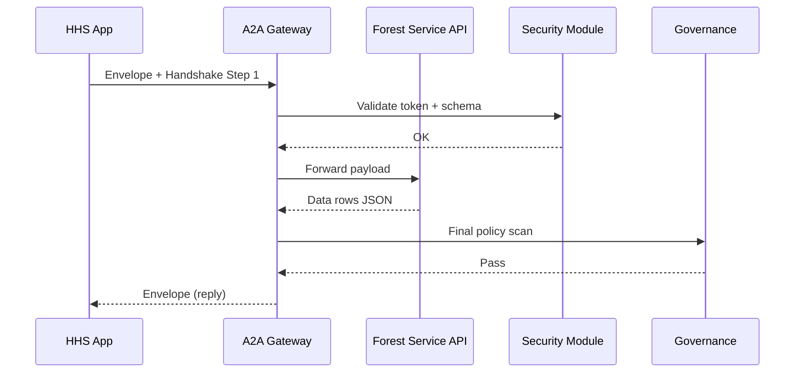

# Chapter 8: Inter-Agency Communication Protocol (HMS-A2A)

*[← Back to Chapter&nbsp;7: Human-in-the-Loop Oversight (HITL)](07_human_in_the_loop_oversight__hitl__.md)*  

---

## 1 — Why do agencies need a “diplomatic pouch”?

Picture this true-to-life scene:

1. The **U.S. Forest Service** detects a severe wildfire.  
2. A **Health & Human Services (HHS)** hospital network must warn asthma patients within 30 minutes.  
3. The hospital’s system needs *fresh smoke-plume data*—fast and without leaking any protected health info.

If every team wrote custom HTTPS calls with ad-hoc JSON, we would get:

* Mis-matched field names (`latLong` vs `location`),  
* Risky shortcuts (plain-text tokens in URLs),  
* Hours spent in “Who do I email for an API key?” loops.

**HMS-A2A** is the **secure diplomatic pouch**: one envelope format, one handshake, one registry of approved channels. Any two U.S. agencies can exchange data or requests without re-inventing security or field names.

---

## 2 — Five Key Concepts (plain-English cheat-sheet)

| Concept | Beginner-friendly rule | Analogy |
|---------|-----------------------|---------|
| Envelope | Canonical JSON wrapper for every message. | The pouch itself. |
| Handshake | 3-step token exchange that proves “I’m really HHS v1.2”. | Showing passports at the border. |
| Channel | A named, pre-approved route (e.g., “Fire.Weather.V1”). | A locked courier bag labeled “Weather”. |
| Registry | Public list of channels, schemas, and owners. | Diplomatic bag ledger. |
| Policy Guard | Automatic governance scan on *both* ends. | Airport X-ray for the pouch. |

Learn these five words and A2A will feel familiar.

---

## 3 — Hands-On: Request wildfire data in **16 lines**

> Goal: HHS app pulls “SmokePlume” data from Forest Service in one command.

```python
# File: demo_smoke.py
from hms_a2a import Envelope, send

# 1) Build the envelope (sender, channel, payload)
env = Envelope(
    sender = "HHS.HospitalNet",
    channel= "Fire.SmokePlume.V1",
    payload= {"bbox": [-124.3, 41.1, -120.0, 45.0]}  # Oregon box
)

# 2) Send & get the reply
reply = send(env)

# 3) Show result (trim to 1st record)
print(reply.payload["plumes"][0])
```

Possible console output:

```
{'lat': 43.21, 'lon': -122.9, 'height_m': 3500, 'density': 'high'}
```

What happened?

1. The code built a **standard envelope**—no custom JSON keys.  
2. `send()` auto-ran the **handshake** (mutual auth + encryption).  
3. Forest Service replied with the same envelope format—ready to parse.

---

## 4 — Step-by-Step Under the Hood



Just **five actors**—easy to reason about and audit.

---

## 5 — Tiny Internal Code Peeks (all <20 lines)

### 5.1 Envelope class (10 lines)

```python
# hms_a2a/envelope.py
import time, uuid

class Envelope(dict):
    def __init__(self, sender, channel, payload):
        super().__init__(
            id=str(uuid.uuid4()),
            ts=time.time(),
            sender=sender,
            channel=channel,
            payload=payload
        )
```

A glorified dictionary with `id` and timestamp auto-filled.

### 5.2 Handshake helper (12 lines)

```python
# hms_a2a/handshake.py
import os, jwt, requests

SECRET = os.getenv("A2A_SECRET")      # per-agency key

def token(sender):
    return jwt.encode({"sub": sender}, SECRET, algorithm="HS256")

def auth_headers(sender):
    return {"Authorization": "A2A " + token(sender)}
```

Generates a signed JWT—no more hard-coded API keys in URLs.

### 5.3 Gateway router (15 lines, simplified)

```python
# hms_a2a/gateway.py
from governance import vet
from registry  import resolve

def route(env):
    if not vet(env):            # Chapter 1 policy scan
        raise Exception("Governance block")
    target = resolve(env["channel"])   # lookup URL
    hdrs   = auth_headers(env["sender"])
    resp   = requests.post(target, json=env, headers=hdrs, timeout=10)
    return resp.json()          # always an Envelope
```

• Calls the **Governance Layer** first.  
• Resolves channel → URL via the **Registry**.  
• Returns a compliant envelope every time.

---

## 6 — Where HMS-A2A plugs into other layers

* Agents built with [Agent Framework (HMS-AGT)](05_agent_framework__hms_agt__.md) use `hms_a2a.send()` instead of raw `requests`.  
* **Workflows** in [HMS-ACT](06_agent_orchestration___workflow_engine__hms_act__.md) treat inter-agency steps as standard tasks: `type: a2a`.  
* **Security & Compliance (HMS-ESQ)** provides the JWT secrets and encryption policies.  
* The **Operations Suite (HMS-OPS)** stores every envelope’s hash for audit trails.  
* Schemas for each `channel` live in the **Data Repository (HMS-DTA)** and are versioned.

---

## 7 — Frequently Asked Questions

**Q1: Can a state agency use A2A?**  
Yes—register its domain (`STATE.OR.Health`) in the Registry and obtain a shared secret from HMS-ESQ.

**Q2: What about binary files (e.g., satellite TIFF)?**  
Send a *pointer* in `payload` (S3 URL + checksum). Large blobs move over secure object storage, not inside the envelope.

**Q3: How does throttling work?**  
Each channel has a `rate_limit` entry in the Registry. The Gateway rejects over-quota calls with `429` so agencies remain courteous neighbors.

---

## 8 — Try it Yourself (2-minute exercise)

1. Install the mini-SDK:

   ```bash
   pip install hms-a2a-lite
   ```

2. Export a secret for local tests:

   ```bash
   export A2A_SECRET="local-demo-key"
   ```

3. Run the sample script:

   ```bash
   python demo_smoke.py
   ```

4. Change `channel` to an *unknown* value; observe how the Governance Layer blocks the call with a clear error.

---

## 9 — What you learned

* HMS-A2A is the **diplomatic pouch** that lets any agency speak to any other agency—securely and predictably.  
* One **Envelope**, one **Handshake**, and a **Registry** replace countless one-off integrations.  
* Governance, security, ops, and data layers hook in automatically—no extra work for beginners.

Ready to see how the **receiving** agency turns that data into REST or database calls?  
Jump to [Chapter 9: Backend Service Layer (HMS-SVC)](09_backend_service_layer__hms_svc__.md).

---

Generated by [AI Codebase Knowledge Builder](https://github.com/The-Pocket/Tutorial-Codebase-Knowledge)