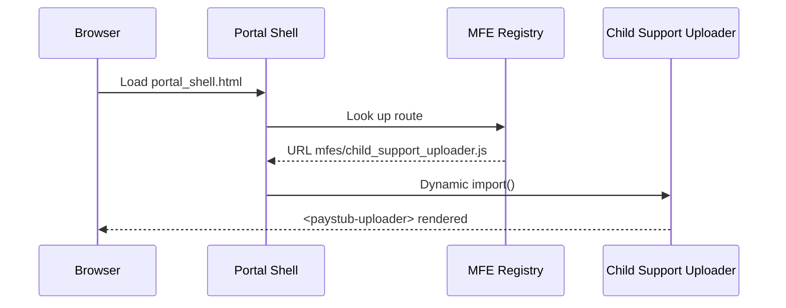

# Chapter 8: Interface Layer – Micro-Frontends (HMS-MFE)

*Coming right after the review screens we built in [Human-in-the-Loop (HITL) Oversight](07_human_in_the_loop__hitl__oversight_.md).*

---

## 1. Why Do We Need HMS-MFE?

Picture a normal Monday in a state e-government portal:

* A parent opens the **Child-Support** dashboard to upload pay stubs.  
* Their partner clicks over to the **Water-Bureau** tab to set up autopay.  
* Meanwhile a clerk from the **Housing Authority** reviews applications.

All three screens live at `my.state.gov`, yet each is owned by a **different agency team**, with its own deploy cycle, color palette, and budget.  
If one team ships a redesign, *nobody* wants the entire site to go down or force every other team to redeploy.

HMS-MFE solves this by turning the UI into **Lego-like pieces (micro-frontends)**:

1. Each piece (form, wizard, dashboard) ships as an independent JavaScript bundle.  
2. A lightweight **“shell”** slots them into the page—no rebuild of the whole site.  
3. Shared **design tokens** keep fonts, colors, and spacing consistent.  
4. Built-in accessibility checks ensure every piece passes Section 508 rules.

---

## 2. Central Use-Case: “Upload Pay Stub” Without Breaking the Water Bureau

Goal: Release a new drag-and-drop **Child-Support Pay-Stub Uploader** tonight, while the **Water-Bureau** autopay form keeps running untouched.

We’ll:

1. Build a tiny uploader micro-frontend.  
2. Register it with the shell.  
3. Watch it go live without redeploying other parts of the portal.

---

## 3. Key Concepts (Plain English)

| Term | Beginner-Friendly Meaning |
|------|--------------------------|
| Shell | A small host page that loads micro-frontends on demand (think “empty Lego base-plate”). |
| Micro-Frontend (MFE) | A self-contained JavaScript + HTML bundle providing one feature. |
| Design Token | A named value (like `--color-primary: #0048c4`) reused everywhere for instant theme swaps. |
| Accessibility Guard | An automatic linter that blocks code with missing labels or low-contrast text. |
| Slot | A placeholder in the shell where an MFE can appear (like a Lego stud). |

---

## 4. Building the Pay-Stub Uploader (≤ 20 Lines)

`child_support_uploader.js`

```javascript
// A super-simple Web Component
class PayStubUploader extends HTMLElement {
  connectedCallback() {
    this.innerHTML = `
      <h2>Upload Pay Stub</h2>
      <input type="file" id="file" aria-label="Pay Stub"/>
      <button id="btn">Submit</button>
      <p id="msg"></p>`;
    this.querySelector("#btn").onclick = () => {
      this.querySelector("#msg").textContent = "✅ Uploaded!";
    };
  }
}
customElements.define("paystub-uploader", PayStubUploader);
```

What it does  
1. Registers `<paystub-uploader>` as a **custom HTML tag**.  
2. Shows a file input; clicking **Submit** fakes an upload.

Total: 17 lines, no frameworks needed.

---

## 5. Plugging It Into the Shell

`portal_shell.html` (excerpt)

```html
<!doctype html>
<html>
<head>
  <title>my.state.gov</title>
  <link rel="stylesheet" href="tokens.css"><!-- shared design tokens -->
</head>
<body>
  <header>State Services Portal</header>

  <!-- Slot where an agency can inject its MFE -->
  <div id="slot-main"></div>

  <script>
    // Simple router: #/child-support loads the uploader
    const routes = {
      "#/child-support": () => import("./mfes/child_support_uploader.js"),
      "#/water":         () => import("./mfes/water_autopay.js") // untouched
    };
    function load() { routes[location.hash]?.().then(()=>
         document.getElementById("slot-main")
                 .innerHTML = "<paystub-uploader></paystub-uploader>"); }
    window.addEventListener("hashchange", load);
    load();                 // initial load
  </script>
</body>
</html>
```

Explanation  
1. `import()` pulls the needed bundle **on demand**.  
2. Only the Child-Support hash route downloads `child_support_uploader.js`; Water-Bureau code never changes.  
3. The shell file itself doesn’t redeploy when we publish a new `child_support_uploader.js`.

---

## 6. Design Tokens in Action

`tokens.css`

```css
:root {
  --color-primary: #0048c4;       /* Navy Blue */
  --radius-small: 4px;
}

h2 { color: var(--color-primary); }
button { border-radius: var(--radius-small); }
```

Any agency can ship new components; they’ll inherit these tokens automatically—instant consistency.

---

## 7. Accessibility Guard (CLI, 12 Lines)

`scripts/a11y_check.js`

```javascript
#!/usr/bin/env node
import fs from 'fs';
const html = fs.readFileSync(process.argv[2], 'utf8');
if(!html.includes('aria-label')) {
  console.error("❌  Missing aria-label – upload blocked.");
  process.exit(1);
}
console.log("✅  Accessibility check passed.");
```

Teams run:

```bash
node scripts/a11y_check.js mfes/child_support_uploader.js
```

Blocker guarantees every micro-frontend ships with basic accessibility attributes.

---

## 8. How It Works Under the Hood (Step-by-Step)



Four actors—easy to follow.

---

## 9. Internal File Layout

```
hms-mfe/
 ├─ portal_shell.html
 ├─ tokens.css
 ├─ mfes/
 │   ├─ child_support_uploader.js
 │   └─ water_autopay.js
 └─ scripts/
     └─ a11y_check.js
```

Each agency owns a folder inside `mfes/` and deploys only its files.

---

## 10. Hands-On Mini-Lab

1. Clone sample repo & run a static server:

```bash
npx serve .
```

2. Visit `http://localhost:3000/#/child-support` – drag-and-drop uploader appears.  
3. Visit `#/water` – Water-Bureau form still loads its old code.  
4. Change `--color-primary` in `tokens.css` to green and refresh—*both* MFEs adopt the new color instantly.

---

## 11. Where Other HMS Layers Fit

| Layer | Interaction with HMS-MFE |
|-------|--------------------------|
| [Backend API Gateway](10_backend_api_gateway_.md) | MFEs call backend services uniformly (`/api/...`). |
| [HITL Oversight](07_human_in_the_loop__hitl__oversight_.md) | The review screen we built earlier will become an MFE slot. |
| [Monitoring & Observability](14_monitoring___observability__hms_ops__.md) | Each MFE emits its own performance metrics to the OPS layer. |
| [Marketplace of Capabilities](09_marketplace_of_capabilities__hms_mkt__.md) | MFEs publish “capability cards” here so other teams can reuse them. |

---

## 12. FAQ

**Q: Do I need React or Angular to build an MFE?**  
No. Any framework (or none) works as long as the bundle registers a custom element or exports a single render function.

**Q: How are design tokens shared across agencies?**  
`tokens.css` is served from a CDN path like `/assets/tokens/v1.css`; MFEs reference it in their header or rely on the shell to inject it.

**Q: Can MFEs talk to each other?**  
Yes—via custom browser events or shared state libraries, but policy checks in [Governance Layer (HMS-GOV)](01_governance_layer__hms_gov__.md) still gate sensitive data.

---

## 13. What You Learned

* **Micro-frontends** let each agency ship UI updates without waiting on others.  
* A **shell** dynamically imports bundles into **slots**.  
* **Design tokens** and **accessibility guards** enforce one-government look & feel.  
* The whole setup can be reproduced with a few files and <20 lines of code each.

Next we’ll publish these UI pieces—and backend skills—to a shared **agency app store** in  
[Marketplace of Capabilities (HMS-MKT)](09_marketplace_of_capabilities__hms_mkt__.md).

---

Generated by [AI Codebase Knowledge Builder](https://github.com/The-Pocket/Tutorial-Codebase-Knowledge)