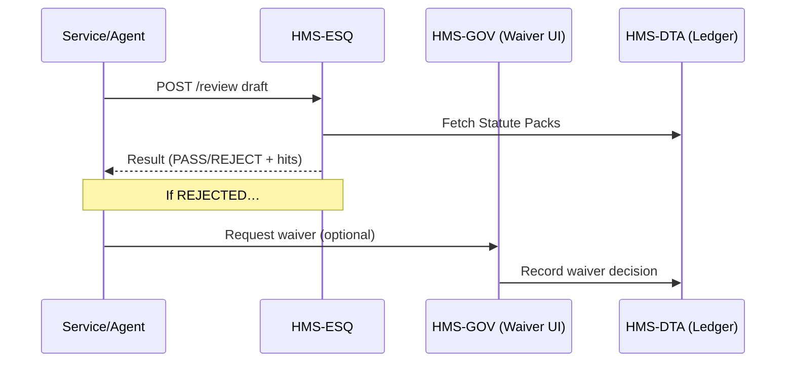

# Chapter 8: Legal & Compliance Module (HMS-ESQ)

*[Jump back to Chapter 7: Central Data Repository (HMS-DTA)](07_central_data_repository__hms_dta__.md)*  

---

## 1 Why Do We Need HMS-ESQ?

Imagine the Department of Labor wants to publish an AI-generated **“Overtime Wage Calculator.”**

Before that new code can go live, federal rules demand that it:

1. Meets **Section 508** accessibility.  
2. Respects **Privacy Act** guidance (no SSNs in logs!).  
3. Shows wage rates rounded according to **29 CFR § 778.109**.

If any one rule is missed, the agency could face lawsuits or a GAO audit.

HMS-ESQ is the in-house counsel that never sleeps.  
It scans every **draft policy, code change, or citizen-facing page** and shouts:

> “⚠️  Section 508 keyboard navigation missing on the wage input field!”

Only when HMS-ESQ gives the green light does the change move forward in the pipeline managed by [HMS-ACT](06_agent_orchestration_engine__hms_act__.md).

---

## 2 Key Concepts in Plain English

| Term | Analogy |
|------|---------|
| **Statute Pack** | A shelf of law books turned into machine-readable rules. |
| **Compliance Gate** | A metal detector—everything passes through before entering production. |
| **Rule Hit** | The beeping sound when the detector finds a forbidden object. |
| **Waiver** | A signed exception slip (“We have 90 days to fix alt-text”). |
| **Legal Ledger** | The courtroom stenographer—immutable record of every scan and waiver. |

---

## 3 3-Minute Hands-On Tour

We’ll send a **draft web form** to HMS-ESQ and see what laws it flags.

### 3.1 Submit for Review

```python
# esq_demo.py  (≤18 lines)
import httpx, json

draft = {
  "id": "overtime-form-v2",
  "type": "WEB_FORM",
  "fields": [
    {"name": "hoursWorked", "label": "Hours",      "keyboardTab": True},
    {"name": "ssn",         "label": "SSN",        "mask": False}  # oops
  ]
}

r = httpx.post("https://api.hms/esq/review", json=draft).json()
print(json.dumps(r, indent=2))
```

Expected output (abridged):

```json
{
  "status": "REJECTED",
  "hits": [
    { "rule": "PRIVACY_ACT_PII_MASK", "field": "ssn", "message": "SSN must be masked." },
    { "rule": "SEC508_KEYBOARD",      "field": null, "message": "Missing skip-to-main link." }
  ]
}
```

Explanation  
1. We POST a JSON description of the form.  
2. HMS-ESQ returns `status: REJECTED` plus a list of **rule hits**.  
3. No human or agent can deploy this form until every hit is fixed *or* a waiver is granted.

---

## 4 What Happens Behind the Curtain?



Step-by-step (human-readable):

1. Caller (could be [HMS-ACT](06_agent_orchestration_engine__hms_act__.md) during a plan) sends the draft to ESQ.  
2. ESQ loads relevant **Statute Packs** from HMS-DTA.  
3. Rules run; ESQ returns **PASS** or **REJECT** with explanations.  
4. If rejected, a waiver can be filed in [HMS-GOV](01_governance_layer___admin_portal__hms_gov__.md).  
5. Every scan and every waiver is immutably written to the **Legal Ledger** table in HMS-DTA.

---

## 5 Peeking Inside HMS-ESQ

### 5.1 Tiny Rule Pack (YAML, 10 lines)

```yaml
# packs/privacy.yaml
id: PRIVACY_ACT_PII_MASK
description: "PII fields must be masked at rest & transit."
appliesTo: WEB_FORM
check: |
  any(f.name in ["ssn","dob"] and not f.mask for f in draft.fields)
severity: HIGH
```

### 5.2 Micro Rule Engine (Node.js, 15 lines)

```js
// lib/runRules.js
async function run(draft) {
  const packs = await loadPacks(draft.type);   // from DTA
  const hits  = [];
  for (const rule of packs) {
    const pass = eval(rule.check);             // tiny DSL
    if (pass) hits.push({
      rule: rule.id,
      message: rule.description,
      field:   (draft.fields || []).find(f => /ssn|dob/.test(f.name))?.name
    });
  }
  return hits;
}
module.exports = { run };
```

Explanation  
• `loadPacks` pulls YAML rules tagged for `draft.type`.  
• Each rule’s `check` is a one-line boolean expression evaluated against the draft.  
• Any rule returning `true` becomes a **hit**.

### 5.3 Legal Ledger Schema (SQL, 6 lines)

```sql
CREATE TABLE esq_scans (
  id        SERIAL,
  draft_id  TEXT,
  result    TEXT,      -- PASS / REJECT
  hits      JSONB,
  ts        TIMESTAMP DEFAULT now()
);
```

Every scan is permanently logged—perfect for FOIA requests or IG audits.

---

## 6 Using HMS-ESQ from Other Layers

| Layer | Typical Call |
|-------|--------------|
| [HMS-AGX](02_ai_representative_agent__hms_agx__.md) | `POST /esq/review` before sending a draft to humans. |
| [HITL](03_human_in_the_loop__hitl__oversight_.md)   | Shows legal hits inline so reviewers can comment. |
| [HMS-ACT](06_agent_orchestration_engine__hms_act__.md) | Inserts a **legal_check** task in orchestration plans. |
| [HMS-OPS](12_operational_monitoring___logging__hms_ops__.md) | Streams scan metrics (pass rate, avg. hits) to dashboards. |

---

## 7 Frequently Asked Questions

**Q: Can I add agency-specific rules (e.g., OSHA)?**  
Yes. Drop a YAML file in your agency’s Statute Pack folder; ESQ auto-loads it on the next scan.

**Q: How are conflicting rules resolved?**  
Each rule carries a `severity` (LOW/MEDIUM/HIGH/CRITICAL). A single CRITICAL hit always forces rejection unless the waiver originates from a user with `role=GeneralCounsel`.

**Q: Does ESQ modify drafts?**  
Never. ESQ is read-only; it points out issues but does not fix them. Agents like AGX can listen to the hits and auto-suggest corrections.

---

## 8 What You Learned

• HMS-ESQ acts as the **always-on legal counsel**, scanning every change against machine-readable statutes.  
• You submitted a 15-line draft and saw ESQ flag Privacy Act and Section 508 violations.  
• Under the hood, simple YAML rule packs plus a micro-rule-engine do the heavy lifting.  
• All scans and waivers are logged in HMS-DTA for rock-solid auditability.

Ready to see how the platform encodes **democratic principles** (like public comment periods and majority votes) directly into software?  
Continue to [Codified Democracy Foundation Engine (HMS-CDF)](09_codified_democracy_foundation_engine__hms_cdf__.md).

---

Generated by [AI Codebase Knowledge Builder](https://github.com/The-Pocket/Tutorial-Codebase-Knowledge)