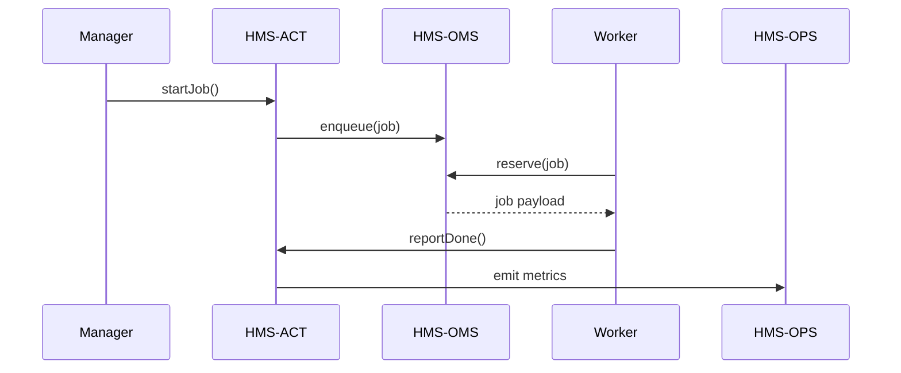

# Chapter 8: Management Layer (HMS-ACT, HMS-OMS, HMS-OPS)

*Continuation of [Policy & Process Model (HMS-CDF)](07_policy___process_model__hms_cdf__.md)*  

---

## 1. Why Do We Need a Management Layer?

### 60-Second Story — “Today at the Federal Farm Fund Center”

Every morning **Nora**, an operations manager at USDA, must push 3,000 farm-grant applications through:

1. **Validate forms**  
2. **Assign inspectors**  
3. **Send status texts**  
4. **Watch server load** so nothing crashes during harvest season

If each step lived in a different corner of the tech stack, Nora would juggle ten dashboards and a pot of coffee.  
The **Management Layer** is her single operations floor:

* **HMS-ACT** – the dispatcher: “Form #219 → Inspector Queue A.”  
* **HMS-OMS** – the queue clerk: stores and re-orders every task.  
* **HMS-OPS** – the health nurse: raises a hand when servers sweat.

Result: Nora clicks **Run Daily Cycle**, then watches green lights instead of chasing fires.

---

## 2. Key Concepts in Plain English

| Term | Friendly Explanation |
|------|----------------------|
| **Job** | A bundle of work, e.g., “Process Farm Form #219.” |
| **Workflow** | Ordered steps inside a job (validate → inspect → notify). |
| **Queue** | A waiting line for jobs; managed by HMS-OMS. |
| **Worker** | A service or agent that grabs a job from the queue. |
| **SLA** | How fast a job *must* finish (Service-Level Agreement). |
| **Metric** | A number OPS watches (queue length, CPU %, failures). |

Analogy:  
Imagine a **city 311 center**: calls arrive (jobs), get queued, dispatchers send crews, and big wall screens show truck GPS and open tickets. HMS-ACT/OMS/OPS is the digital twin of that room.

---

## 3. Quick-Start: Launching a Job

Below we schedule a single *farm-grant* job with a **10-minute SLA**.

```javascript
// launchJob.js  (17 lines)
import { ActClient } from '@hms-act/client';
import { getToken } from '@hms-auth/client';   // badge from Chapter 2

async function run() {
  const token = await getToken({ actor: 'nora@usda.gov' });

  const res = await ActClient.startJob({
    headers: { Authorization: `Bearer ${token}` },
    jobType: 'farm:grant:v1',
    payload: { appId: 219 },
    slaMinutes: 10
  });

  console.log('🚜 Job ticket:', res.jobId);
}

run();
```

What happens?

1. HMS-ACT validates Nora’s badge.  
2. Creates a **job record** with SLA = 10 min.  
3. Pushes the job into the **`farm-grant` queue** inside HMS-OMS.

---

### 3.1 Peeking at the Queue

```javascript
// checkQueue.js  (9 lines)
import { OmsClient } from '@hms-oms/client';

const q = await OmsClient.peek('farm-grant');
console.table(q.jobs.slice(0,3));
```

Sample output:

```
┌────┬─────────┬─────────────┐
│ id │ status  │ slaExpires  │
├────┼─────────┼─────────────┤
│219 │ waiting │ 10:07:55    │
└────┴─────────┴─────────────┘
```

---

### 3.2 Watching Health in Real Time

```javascript
// liveMetrics.js  (12 lines)
import { OpsClient } from '@hms-ops/client';

OpsClient.stream('farm-grant', metric => {
  console.log('📊', metric.name, metric.value);
});
```

Console might print:

```
📊 queue.length 42
📊 worker.successRate 99.2
📊 cpu.percent 61
```

---

## 4. Under the Hood – A Five-Actor Journey



---

## 5. Internal Implementation Peek

### 5.1 Job Record (8 lines)

```json
{
  "id": "job-219",
  "type": "farm:grant:v1",
  "status": "waiting",
  "sla": "2024-06-10T10:07:55Z",
  "payload": { "appId": 219 }
}
```

Stored in `oms.jobs` table.

### 5.2 Simplified Worker Loop (18 lines)

```javascript
// worker.js
import { reserve } from '@hms-oms/queue';

async function loop() {
  const job = await reserve('farm-grant');
  if (!job) return setTimeout(loop, 1000);

  try {
    await process(job.payload);      // pretend work here
    await job.report('done');
  } catch (err) {
    await job.report('fail', err);
  }
  loop();
}

loop();
```

1. `reserve` locks one job.  
2. `report('done')` notifies HMS-ACT → HMS-OPS updates metrics.

### 5.3 SLA Breach Alert (14 lines)

```javascript
// ops/alert.js
import { onMetric } from '@hms-ops/stream';
import { sendSMS } from '@hms-ops/notify';

onMetric('queue.waitTime', ({ value }) => {
  if (value > 600) {                 // >10-min backlog
    sendSMS('+1-555-OPS', '⚠️ Farm queue breaching SLA!');
  }
});
```

Simple rule: if average wait exceeds 10 minutes, text the on-call phone.

---

## 6. Tweaking an SLA at Runtime

```javascript
// updateSLA.js  (11 lines)
import { ActClient } from '@hms-act/client';

await ActClient.setSLA({
  queue: 'farm-grant',
  minutes: 5          // tighter deadline
});
console.log('✅ SLA updated to 5 min');
```

All future jobs inherit the new SLA; OPS instantly begins monitoring against 5 minutes.

---

## 7. Directory Peek

```
hms-management/
 ├─ act/          // orchestration engine (next chapter!)
 ├─ oms/          // queue + locking
 ├─ ops/          // metrics & alerting
 ├─ clients/      // tiny JS SDKs shown above
 └─ README.md
```

---

## 8. How Management Connects to Other Layers

* **Workflows** come from the compiled models in [Policy & Process Model (HMS-CDF)](07_policy___process_model__hms_cdf__.md).  
* **Workers** are often AI agents introduced in [AI Representative Agent (HMS-AGT)](03_ai_representative_agent__hms_agt__.md).  
* **Auth badges** for managers & workers rely on [Role & Identity Management](02_role___identity_management__accounts___authorization__.md).  
* **Alerts & logs** flow to [Monitoring & Telemetry Stack (HMS-OPS)](12_monitoring___telemetry_stack__hms_ops__.md) for long-term storage.

---

## 9. Recap

You now know:

1. **Why** HMS-ACT, HMS-OMS, and HMS-OPS exist: to dispatch, queue, and observe everyday government work.  
2. How to **launch a job**, **peek at a queue**, and **stream metrics** in a few lines of code.  
3. The step-by-step life of a job from Nora’s click to a worker’s report.  
4. How SLAs and alerts keep managers ahead of trouble.

Next we’ll zoom into the beating heart of this layer—the orchestration logic inside **HMS-ACT** itself.  
Continue to [HMS-ACT Orchestration Engine](09_hms_act_orchestration_engine_.md).

---

Generated by [AI Codebase Knowledge Builder](https://github.com/The-Pocket/Tutorial-Codebase-Knowledge)