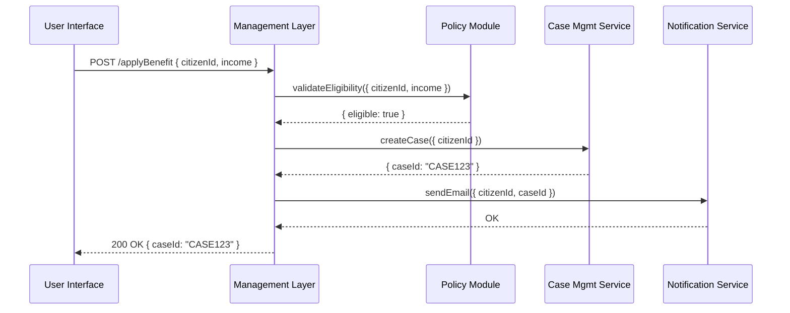

# Chapter 8: Management Layer

Welcome back! In [Chapter 7: AI Governance Engine](07_ai_governance_engine_.md), we learned how to vet every AI decision against policies and log the checks. Now it’s time to see how those decisions—and all other system actions—get **orchestrated** and **routed** end to end in our **Management Layer**.

---

## Why a Management Layer?

Imagine the U.S. Department of Labor runs a new unemployment-benefits program. A citizen submits an application, and we need to:

1. Check eligibility rules (Governance & Policy)  
2. Assign a case worker (Case Management)  
3. Allocate funds (Financial Service)  
4. Notify the applicant (Notifications)  

Without an orchestrator, each component talks to every other component in a tangled mess. The **Management Layer** is like a city’s administrative office—it knows who does what, when, and how to pass data between departments.

---

## Key Concepts

1. **Workflow Orchestrator**  
   Defines multi-step processes (eligibility → assignment → allocation → notification).

2. **Data Router**  
   Sends each request or response to the right service based on content.

3. **Service Coordinator**  
   Monitors progress and handles retries or failures.

---

## A Citizen’s Benefit Application: Step by Step

Here’s what happens when Jane Doe applies for benefits:



1. **UI** sends the application to the **Management Layer**.  
2. **Mgmt** calls the **Policy Module** to check eligibility.  
3. If eligible, **Mgmt** tells **Case Mgmt** to open a case.  
4. Once the case is created, **Mgmt** asks **Notification** to email the citizen.  
5. Finally, **Mgmt** replies to the **UI** with the new case ID.

---

## Using the Management Layer

### 1. Define a Workflow

We describe our steps in a simple JavaScript object:

```js
// src/management/workflows/applyBenefit.js
module.exports = {
  name: 'applyBenefit',
  steps: [
    { service: 'Policy', action: 'validateEligibility' },
    { service: 'CaseSvc', action: 'createCase' },
    { service: 'Notify', action: 'sendEmail' }
  ]
}
```

Explanation:  
- `name` is the workflow ID.  
- `steps` is the ordered list of service calls.

### 2. Trigger the Workflow

A route handler kicks off the process:

```js
// src/management/routes.js
const express = require('express');
const router = express.Router();
const { runWorkflow } = require('./workflowService');

router.post('/applyBenefit', async (req, res) => {
  const result = await runWorkflow('applyBenefit', req.body);
  res.json(result);
});

module.exports = router;
```

Explanation:  
- We accept the request body (`citizenId`, `income`).  
- `runWorkflow` executes each step in sequence, handling data routing.  
- We return the final result, including `caseId`.

---

## Inside the Workflow Service

### Overview (Non-code)

1. **Load** the workflow definition by name.  
2. **Loop** through each step:  
   a. Identify the target service (e.g., Policy Module).  
   b. Call its action with current data.  
   c. Merge any returned data into the context.  
3. **Return** the accumulated result or an error if a step fails.

### Code Walkthrough

```js
// src/management/workflowService.js
const workflows = require('./workflows/applyBenefit');
const clients = require('./serviceClients'); // HTTP wrappers

async function runWorkflow(name, input) {
  let context = { ...input };
  for (const step of workflows.steps) {
    // Call each service via a generic client
    const response = await clients[step.service][step.action](context);
    Object.assign(context, response); // merge new data
  }
  return context;
}

module.exports = { runWorkflow };
```

Explanation:  
- `clients` holds functions like `Policy.validateEligibility()` or `CaseSvc.createCase()`.  
- We pass the same `context` through all steps, so later steps see earlier results.

---

## Service Clients (Simplified)

Here’s how we might wrap the Policy Module API:

```js
// src/management/serviceClients.js
const fetch = require('node-fetch');

module.exports = {
  Policy: {
    async validateEligibility(ctx) {
      const res = await fetch('http://policy/policies/eligibility', {
        method:'POST', body: JSON.stringify(ctx), headers:{'Content-Type':'application/json'}
      });
      return res.json(); // e.g. { eligible: true }
    }
  },
  CaseSvc: {
    async createCase(ctx) {
      // sends ctx.citizenId
      return { caseId: 'CASE123' }; // simplified stub
    }
  },
  Notify: {
    async sendEmail(ctx) {
      // sends ctx.citizenId, ctx.caseId
      return { notified: true };
    }
  }
};
```

Explanation:  
- Each client has methods that call external services.  
- They return JSON objects we merge into the workflow `context`.

---

## Summary

In this chapter you learned how to:

- Use the **Management Layer** as an orchestration hub for multi-step processes.  
- Define workflows declaratively (`name` + `steps`).  
- Implement a simple `runWorkflow` service that loops through steps, calls service clients, and aggregates results.  
- See a full example of routing a citizen’s benefit application across Policy, Case, and Notification services.

Next up: let’s explore how these orchestrated calls expose data via our [Backend API Service](09_backend_api_service_.md).

---

Generated by [AI Codebase Knowledge Builder](https://github.com/The-Pocket/Tutorial-Codebase-Knowledge)