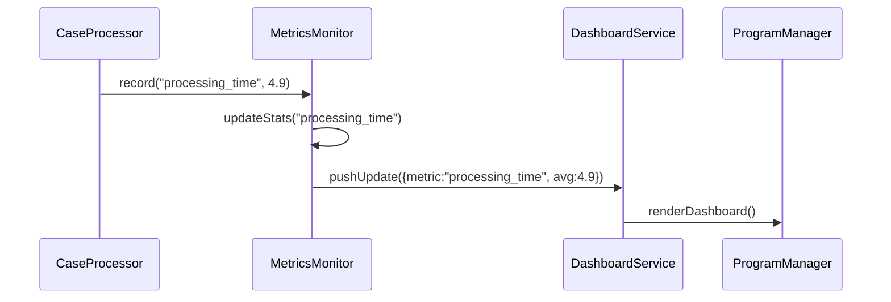

# Chapter 8: Metrics & Outcome Monitoring

Welcome back! In [Chapter 7: Intent-Driven Navigation](07_intent_driven_navigation_.md), we learned how to guide users step-by-step through forms based on their goals. Now we’ll close the loop by measuring how well those flows work in the real world. This is **Metrics & Outcome Monitoring**.

---

## 1. Why Do We Need Metrics & Outcome Monitoring?

Use Case  
Imagine the U.S. Citizenship and Immigration Services (USCIS) rolls out an AI-powered recommendation for citizenship applications. They want to know:

- Are application processing times dropping?  
- Do applicants report better satisfaction?  
- Are case conflicts being resolved faster?

Without a monitoring system, you’re flying blind. You need a **public dashboard**—like a city’s crime statistics board—to verify that your optimizations actually deliver value and to spot regressions early.

---

## 2. Key Concepts

1. **Key Performance Indicators (KPIs)**  
   Numeric measures (e.g., average processing time, survey satisfaction scores).

2. **Continuous Feedback Loop**  
   Automatically collect metrics, visualize trends, and trigger alerts.

3. **Outcome Dashboard**  
   A real-time display of your KPIs for program managers and stakeholders.

4. **Alerts & Regression Detection**  
   Notify teams when a KPI slips below a threshold (e.g., processing time rises).

5. **Tuning Recommendations**  
   Use the monitored data to refine AI suggestions or process rules.

---

## 3. How to Use MetricsMonitor

Here’s a minimal example showing how to set up monitoring for three KPIs:

```python
# File: example_metrics.py
from hms_etl.monitoring import MetricsMonitor

monitor = MetricsMonitor()

# Register KPIs
monitor.register_metric("processing_time")
monitor.register_metric("satisfaction_score")
monitor.register_metric("conflict_resolution_rate")

# Record some sample data
monitor.record("processing_time", 5.2)        # days
monitor.record("satisfaction_score", 4.7)     # out of 5
monitor.record("conflict_resolution_rate", 0.85)  # 85%

# Generate a dashboard summary
dashboard = monitor.get_dashboard()
print(dashboard)
# -> {
#      "processing_time": {"avg": 5.2, "trend": "stable"},
#      "satisfaction_score": {"avg": 4.7, "trend": "up"},
#      ...
#    }
```

Explanation:  
1. We import `MetricsMonitor`.  
2. We register the three KPIs we care about.  
3. We `record()` new data points as cases complete.  
4. We call `get_dashboard()` to get current averages and trend indicators.

---

## 4. Under the Hood: Sequence Diagram

When a case completes, here’s what happens:



1. **CaseProcessor** calls `record()`.  
2. **MetricsMonitor** updates its internal stats.  
3. It pushes an update to the **DashboardService**.  
4. The **ProgramManager** sees the new numbers on their screen.

---

## 5. Inside the Implementation

Let’s peek at a simplified `hms_etl/monitoring.py`:

```python
# File: hms_etl/monitoring.py
class MetricsMonitor:
    def __init__(self):
        self.data = {}   # metric -> list of values

    def register_metric(self, name):
        self.data[name] = []

    def record(self, name, value):
        if name in self.data:
            self.data[name].append(value)

    def get_dashboard(self):
        result = {}
        for name, values in self.data.items():
            avg = sum(values)/len(values) if values else 0
            trend = "up" if len(values)>1 and values[-1]>=values[-2] else "down"
            result[name] = {"avg": round(avg,2), "trend": trend}
        return result
```

Explanation:  
- `data` holds raw value lists for each metric.  
- `record()` appends a new data point.  
- `get_dashboard()` computes a simple average and a basic trend indicator.

---

## 6. Next Steps

You’ve learned how to:

- Define and register KPIs.  
- Continuously record new data.  
- Generate a real-time dashboard with averages and trends.

In the next chapter, we’ll use these metrics to automatically refine processes in our [Process Optimization Engine](09_process_optimization_engine_.md).

---

Generated by [AI Codebase Knowledge Builder](https://github.com/The-Pocket/Tutorial-Codebase-Knowledge)