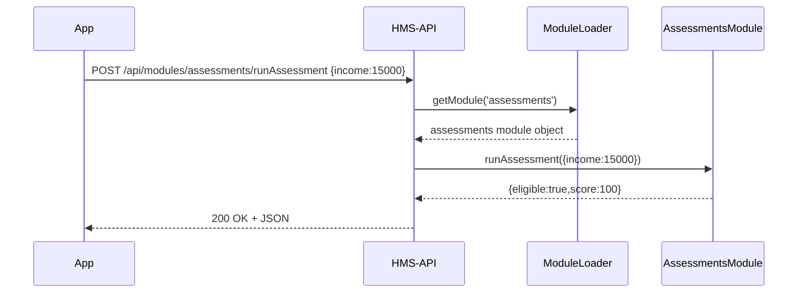
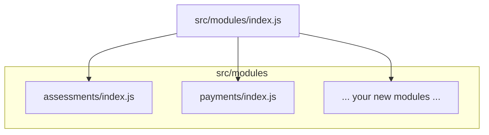

# Chapter 8: Modules Directory (Business Logic)

In [Chapter 7: HMS-API (Backend API)](07_hms_api__backend_api__.md) we built a central Clerk’s Office that routed HTTP requests through Controllers, Services, and Repositories. Now we’ll break our “paperwork” into specialized **bureaus**—each handling one government service—by using a **Modules Directory**. 

Imagine your state runs two services:  
- **Assessments**: Evaluate a citizen’s eligibility for housing aid.  
- **Payments**: Issue benefit payments once approved.  

Rather than stuffing both logics into one big file, we give each its own “department” folder under `modules/`. A simple dispatcher sends each request to the right bureau, which executes its logic and returns results. This keeps code organized, testable, and easy to extend.

---

## 1. Key Concepts

1. **Module**  
   A folder in `src/modules/` (e.g., `assessments/`, `payments/`) containing code for that service.  
2. **Module Interface**  
   Each module exports named functions (e.g., `runAssessment`, `makePayment`).  
3. **Module Loader**  
   At startup, scans `src/modules/` and builds a registry of available modules.  
4. **Dispatcher**  
   A small helper that, given a module name and function name, finds that function in the registry and calls it with payload data.

---

## 2. Using Modules to Solve a Use Case

Use case: A citizen submits an assessment request. The API endpoint should:

1. Extract module name (`assessments`) and action (`runAssessment`) from the route.
2. Dispatch to the `assessments` module.
3. Return the score.

### 2.1 Define an Assessment Module

File: `src/modules/assessments/index.js`
```js
// An example "bureau" that runs eligibility assessments
async function runAssessment(data) {
  // data = { income: 15000, householdSize: 3 }
  const score = data.income < 20000 ? 100 : 50
  return { eligible: score === 100, score }
}

// Export all public functions here
module.exports = { runAssessment }
```
_This module exports one function: `runAssessment`. It returns a simple eligibility result._

### 2.2 Define a Payments Module

File: `src/modules/payments/index.js`
```js
// A simple "financial bureau" for issuing payments
async function makePayment({ citizenId, amount }) {
  // In real code you'd call a bank API
  return { status: 'issued', citizenId, amount, timestamp: Date.now() }
}

module.exports = { makePayment }
```
_The `payments` module handles money transfers._

### 2.3 Load All Modules at Startup

File: `src/modules/index.js`
```js
const fs = require('fs')
const path = require('path')

const modules = {}
// Read each folder under src/modules
fs.readdirSync(__dirname).forEach(name => {
  const p = path.join(__dirname, name, 'index.js')
  if (fs.existsSync(p)) {
    modules[name] = require(p)
  }
})

function getModule(name) {
  return modules[name]
}

module.exports = { getModule }
```
_We scan `src/modules/`, require each folder’s `index.js`, and store it in a registry._

### 2.4 Dispatch Requests in the API

In your controller, you can now call any module:

```js
// src/api/controllers/moduleController.js
const { getModule } = require('../../modules')

async function handleModule(req, res, next) {
  try {
    const { moduleName, action } = req.params    // e.g., "assessments", "runAssessment"
    const module = getModule(moduleName)
    if (!module || typeof module[action] !== 'function') {
      return res.status(404).send('Module or action not found')
    }
    const result = await module[action](req.body)
    res.json(result)
  } catch (err) {
    next(err)
  }
}

module.exports = { handleModule }
```
_This generic controller reads `moduleName` and `action` from the URL, looks up the function, and runs it._

### 2.5 Wire the Route

```js
// src/api/routes/modules.js
const express = require('express')
const { handleModule } = require('../controllers/moduleController')
const router = express.Router()

// POST /api/modules/:moduleName/:action
router.post('/:moduleName/:action', handleModule)

module.exports = router
```
_Any new module you drop into `src/modules/` automatically becomes available at  
`POST /api/modules/{moduleName}/{action}`._

---

## 3. Internal Request Flow

Here’s what happens when a citizen’s app calls  
`POST /api/modules/assessments/runAssessment`:



1. **API** receives the HTTP request.  
2. **ModuleLoader** finds the `assessments` module.  
3. **API** calls `runAssessment` on that module.  
4. The module returns a result, which the API sends back.

---

## 4. Visualizing the Modules Folder


_The central `index.js` in `src/modules/` links to each module folder._

---

## 5. Benefits & Next Steps

- **Separation of Concerns**: Each “bureau” owns its logic.  
- **Discoverability**: New modules auto-registered—no extra config.  
- **Maintainability**: Small folders with focused code.  

You’ve now learned how to organize your business logic into a clean, modular directory. Next up, we’ll build the **Admin Frontend** that talks to these modules through the HMS-API.

Continue to [Chapter 9: HMS-GOV (Admin Frontend)](09_hms_gov__admin_frontend__.md).

---

Generated by [AI Codebase Knowledge Builder](https://github.com/The-Pocket/Tutorial-Codebase-Knowledge)