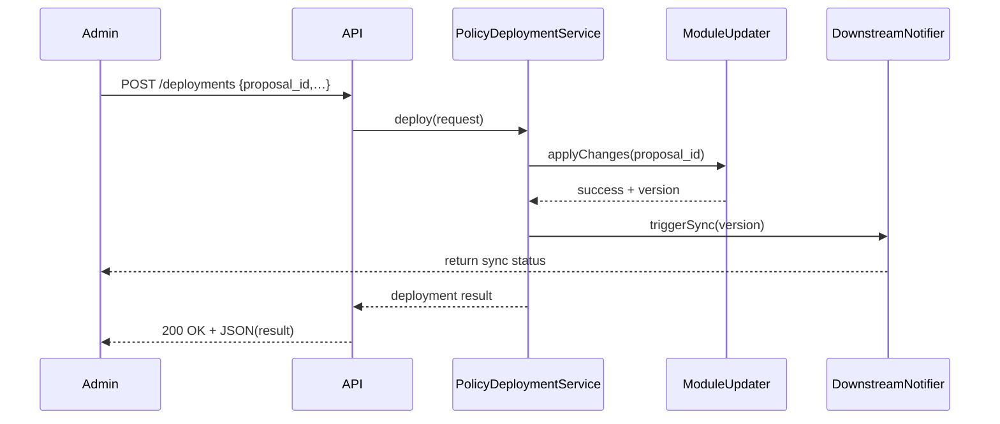

# Chapter 8: Policy Deployment

Welcome back! Now that a real person has reviewed and **approved** a Process Proposal in [Chapter 7: Human Decision Maker](07_human_decision_maker_.md), it’s time to **deploy** that new policy into HMS-API. Think of this like **signing a new regulation into law**—once it’s official, all relevant modules must update, and downstream systems need to pick up the new rules.

## Why Policy Deployment Matters

Central Use Case  
The U.S. Department of Transportation just approved a new rule for the “Electric Bus Grant” Program: applications must include an emissions report. That change lives in a Process Proposal. **Policy Deployment** takes that approved proposal and:

1. Updates the relevant code modules (e.g., eligibility checks)  
2. Records a new version in the audit log  
3. Triggers downstream services (e.g., notification to the web frontend, data warehouse)

Without deployment, the system would still run the old rules—citizens would never see the new requirement.

## Key Concepts

1. PolicyDeploymentRequest  
   A simple object carrying the `proposal_id`, who deployed it (`deployer_id`), and an `effective_date`.

2. Module Updater  
   A component that applies the approved changes to core modules (eligibility, workflow, notifications).

3. Audit & Version  
   Every deployment gets a version number and a timestamp. You can always roll back to a previous version if needed.

4. Downstream Sync Trigger  
   After modules update, HMS-API broadcasts events or webhooks so external systems (frontend, data pipelines) stay in sync.

## Using Policy Deployment

Here’s how you deploy an approved proposal in code. This snippet uses a small service with a friendly API.

```php
use App\Services\PolicyDeploymentService;

// 1. Request deployment for a specific, approved proposal
$result = PolicyDeploymentService::deploy([
  'proposal_id'   => $proposal->id,          // from Chapter 7
  'deployer_id'   => $manager->user_id,      // who approved it
  'effective_date'=> '2024-07-01',           // when it goes live
]);

// 2. Check the result
echo $result->status;    // "deployed"
echo $result->version;   // e.g. "v3.0"
```

Explanation:  
- We call `deploy()` with a minimal array.  
- The service returns a small object with deployment `status` and `version`.

## What Happens Under the Hood



1. **Admin** calls the deployment endpoint.  
2. **PolicyDeploymentService** loads the approved proposal and invokes **ModuleUpdater**.  
3. **ModuleUpdater** patches code modules and returns a new version.  
4. The service notifies downstream systems via **DownstreamNotifier**.  
5. A final result is returned to the caller.

## Inside the Implementation

### 1. PolicyDeploymentService

File: `app/Services/PolicyDeploymentService.php`

```php
<?php
namespace App\Services;

use App\Managers\ModuleUpdater;
use App\Managers\DownstreamNotifier;

class PolicyDeploymentService
{
    public static function deploy(array $req)
    {
        // 1. Load proposal and confirm status = approved
        // 2. Apply changes
        $version = ModuleUpdater::applyChanges($req['proposal_id']);
        // 3. Notify downstream systems
        DownstreamNotifier::send($version);
        // 4. Record audit entry (omitted)
        return (object)[
          'status'  => 'deployed',
          'version' => $version,
        ];
    }
}
```

### 2. ModuleUpdater

File: `app/Managers/ModuleUpdater.php`

```php
<?php
namespace App\Managers;

class ModuleUpdater
{
    public static function applyChanges(int $proposalId)
    {
        // Pseudo:
        // - Fetch approved proposal details
        // - Update eligibility rules, workflow steps, etc.
        // - Increment version number, e.g. "v3.0"
        return 'v3.0';
    }
}
```

### 3. DownstreamNotifier

File: `app/Managers/DownstreamNotifier.php`

```php
<?php
namespace App\Managers;

class DownstreamNotifier
{
    public static function send(string $version)
    {
        // Pseudo: publish event or webhook:
        // POST to /sync?version=v3.0
    }
}
```

These classes keep deployment logic organized:
- **PolicyDeploymentService** orchestrates the flow.  
- **ModuleUpdater** applies changes.  
- **DownstreamNotifier** ensures everyone else sees the update.

## Real-World Analogy

Imagine Congress passes a law. Once the President signs it:
1. The **Office of Law Revision** updates the official statutes.  
2. The **Federal Register** issues the new text (versioned).  
3. Agencies and judicial systems sync their rulebooks.  

**Policy Deployment** in HMS-API works the same way for digital rules.

## Conclusion

In this chapter you learned how HMS-API:

- Takes an **approved** Process Proposal and turns it into live rules.  
- Updates core modules, tracks a new version, and notifies downstream systems.  
- Uses a simple, clear service API (`PolicyDeploymentService::deploy()`).

Up next, we’ll explore [Chapter 9: Governance Module](09_governance_module_.md) to see how policies and roles govern who can call these deployment APIs.

---

Generated by [AI Codebase Knowledge Builder](https://github.com/The-Pocket/Tutorial-Codebase-Knowledge)