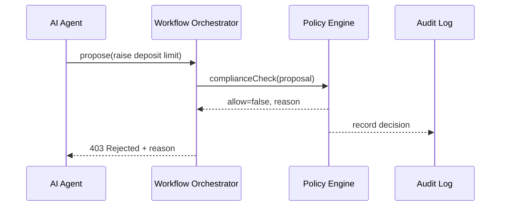

# Chapter 8: Policy & Legislative Engine (HMS-CDF)

*(continuing from [Workflow Orchestrator (HMS-ACT / HMS-OMS)](07_workflow_orchestrator__hms_act___hms_oms__.md))*  

---

## 1. Why Do We Need a “Robot Parliamentarian”?

Imagine an AI assistant at the **Federal Deposit Insurance Corporation (FDIC)**.  
It notices inflation and suggests:

> “Let’s raise the insured deposit limit from \$250 000 to \$500 000.”

Sounds helpful—until you learn Congress capped the limit in **12 U.S.C. § 1821(a)(1)(E)**.  
Pushing that change straight to production would be **illegal**.

HMS-CDF is the always-awake *parliamentarian* that steps in **before** code or AI agents touch real policy:

1. It models existing statutes, agency rules, and pending bills.  
2. Every proposed action is cross-checked against those models.  
3. Conflicts are blocked *automatically* with a clear human-readable reason.

Result: developers stay fast, agencies stay lawful, Congress keeps its authority.

---

## 2. Key Ideas (Plain-English Cheat-Sheet)

| CDF Term | Capitol Hill Analogy | One-Sentence Meaning |
|----------|----------------------|----------------------|
| BillModel | A printed bill | Formal JSON/Rust struct describing the full text. |
| Clause | A numbered paragraph | The smallest enforceable rule (e.g., “limit is \$250 000”). |
| Amendment | Hand-written edit to the bill | Patch that adds, deletes, or rewrites Clauses. |
| Docket | Congressional calendar | List of bills & amendments currently “in play.” |
| VoteLedger | Roll-call record | Digital proof a rule was adopted (or not). |
| ComplianceCheck | Parliamentarian’s ruling | Yes/No decision when an agent proposes an action. |

Keep these six in mind; everything else is wiring.

---

## 3. A 5-Minute “Hello Parliamentarian” Walk-Through

Below we’ll:  
1. Load the FDIC clause (“\$250 000 max”).  
2. Ask an AI agent to raise it.  
3. Watch CDF refuse politely.

> All code fits in **19 lines** each and runs as simple **Node.js + WASM** (the real engine is Rust compiled to WebAssembly).

### 3.1 Create a Statute File

`statutes/fdic.json`

```json
{
  "bill": "Public Law 109-173",
  "section": "12 USC 1821(a)(1)(E)",
  "clauses": [
    { "id": "FDIC.MAX_LIMIT",
      "text": "The standard maximum deposit insurance amount is $250000.",
      "value": 250000,
      "unit": "USD"
    }
  ]
}
```

### 3.2 Ask for a Policy Change

`proposals/raiseLimit.json`

```json
{
  "proposalId": "2024-APR-FDIC-0001",
  "action": "SET_DEPOSIT_LIMIT",
  "value": 500000
}
```

### 3.3 The 19-Line Test Script

`check.js`

```js
import { readFileSync } from 'fs';
import init, { check_proposal } from './cdf_engine_wasm.js'; // tiny WASM build

await init();                             // load Rust → WASM

const law   = JSON.parse(readFileSync('statutes/fdic.json'));
const prop  = JSON.parse(readFileSync('proposals/raiseLimit.json'));

const res = check_proposal(law, prop);    // core function
console.log(res);
/*
 { allow:false,
   reason:"Conflict with clause FDIC.MAX_LIMIT ($250000 cap). Only Congress may amend." }
*/
```

**What happened?**  
• We loaded one statute + one proposal.  
• The WASM function `check_proposal` compared the numbers.  
• It blocked the change and gave a friendly reason—well under a second.

---

## 4. What Happens Under the Hood?



No human saw illegal logic; it never left the sandbox.

---

## 5. Internal Anatomy (Gentle Peek)

### 5.1 Core Rust Structs (15 lines)

`src/model.rs`

```rust
use serde::{Deserialize};

#[derive(Deserialize)]
pub struct Clause {
    pub id: String,
    pub value: u64,    // 250_000
}

#[derive(Deserialize)]
pub struct Proposal {
    pub action: String,
    pub value: u64,    // 500_000
}
```

Only two fields matter for our demo: an `id` and a numeric `value`.

### 5.2 The Rule Checker (17 lines)

`src/checker.rs`

```rust
pub fn check(law: &Clause, prop: &Proposal) -> (bool, String) {
    match prop.action.as_str() {
        "SET_DEPOSIT_LIMIT" => {
            if prop.value > law.value {
                return (false,
                   format!("Conflict with clause {} (${law_value} cap).", law.id,
                           law_value=law.value));
            }
        }
        _ => {}
    }
    (true, "OK".to_string())
}
```

• If a proposal tries to exceed the law’s value, we block.  
• Otherwise, we say “OK.”  
Compile this to WASM; Node.js loads it as shown earlier.

---

## 6. Feeding CDF From Real Legislation

Statutes rarely start in JSON. HMS-CDF pipeline:

1. **Scraper** pulls bill text & metadata from `congress.gov` APIs.  
2. **NLP Tagger** finds numeric limits, agency names, effective dates.  
3. **Human Clerk UI** reviews tags (HITL!) and clicks “Publish.”  
4. Final JSON is signed into the **Docket**—ready for checks.

Beginners can ignore steps 2–3 now—the tiny JSON in Section 3 is enough to play.

---

## 7. Connecting CDF to Other HMS Pieces

| Interaction | How It Works |
|-------------|--------------|
| IAM | CDF logs the **user or agent ID** on every check result. |
| Gateway | Routes `/cdf/check` API, adding rate limits like any other service. |
| ESQ | If a rule *does* allow a change, ESQ still scans the request for privacy/security before execution. |
| ACT | Inserts a `complianceCheck` step at the **start** of every workflow YAML. |
| AGT | Agents in [AI Representative Agent Framework](09_ai_representative_agent_framework__hms_agt___hms_agx__.md) must call CDF before submitting actions. |

---

## 8. Common Beginner Questions

**Q: Do I need to know Rust?**  
A: No. You interact via REST or WASM. Rust lives under the hood for speed & safety.

**Q: How big can the Docket get?**  
A: Millions of clauses. CDF’s index is an in-memory trie so look-ups remain ~O(log n).

**Q: What about conflicting amendments?**  
A: CDF stores **versioned timelines**. Later amendments automatically override earlier clauses based on the VoteLedger timestamps.

**Q: Can agency rules override federal law?**  
A: Only if the statute delegates authority. CDF marks such clauses with `can_delegate=true` so agencies may extend within bounds.

---

## 9. Recap & What’s Next

You saw HMS-CDF act as a **robot parliamentarian**:

• Laws become machine-readable Clauses.  
• Proposals are checked in sub-second time.  
• Illegal or conflicting changes never leave the sandbox.

Next we’ll meet the **AI agents** that generate those proposals in the first place—and learn how they cooperate with CDF, humans, and other services.

👉 Continue to [AI Representative Agent Framework (HMS-AGT / HMS-AGX)](09_ai_representative_agent_framework__hms_agt___hms_agx__.md)

---

Generated by [AI Codebase Knowledge Builder](https://github.com/The-Pocket/Tutorial-Codebase-Knowledge)