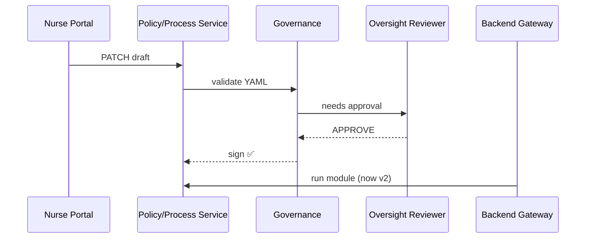

# Chapter 8: Policy / Process Module  
*(the single-source rulebook that apps, AIs, and humans all agree on)*  

[← Back to Chapter 7: Human-in-the-Loop (HITL) Oversight](07_human_in_the_loop__hitl__oversight_.md)

---

## 1. Why Another Layer of “Rules”?

Meet **Elijah**, a community nurse at a rural clinic in Nebraska.  
Every day he:

1. Checks if a patient **qualifies for a travel subsidy** (the rule changes every fiscal year).  
2. Follows a **9-step scheduling procedure** to book tele-cardiology slots funded by the National Heart, Lung, and Blood Institute.  
3. Logs mileage for reimbursement.

Last month the subsidy threshold jumped from 30 miles to 25 miles.  
• Elijah learned about it two weeks late.  
• Patients lost money.  
• Developers hard-coded the new number in three different services.

A **Policy / Process Module (PPM)** fixes this by acting like a *chapter in the Federal Register—but machine-readable*:

* One JSON file says: “If home-to-clinic ≥25 miles, subsidy = $0.54/mile.”  
* All portals, APIs, and the AI Agent fetch that same file.  
* Governance and HITL approve any edit **before** it hits production.

---

## 2. Key Concepts in Plain English

| Concept | What it really is | Analogy |
|---------|------------------|---------|
| **Module** | A JSON/YAML “mini rulebook” that governs ONE workflow (e.g., travel subsidy). | One chapter of law |
| **Version** | Immutable snapshot (v1, v2…) | Edition of a textbook |
| **Draft Patch** | Proposed change waiting for approval | Mark-up copy on a clerk’s desk |
| **Eligibility Function** | Tiny script inside a module returning `true/false` | Bouncer at the door |
| **Procedure Steps** | Ordered list of human or system actions | Recipe card |

Keep these five in mind; everything else is wiring.

---

## 3. Creating Your First Module (10-Minute DIY)

### 3.1 The File (YAML, 18 lines)

```yaml
# /modules/travel-subsidy/v1.yaml
id: TRAVEL_SUBSIDY
version: 1
title: Rural Clinic Travel Subsidy
eligibility:
  script: |
    // distanceInMiles comes from the request body
    return distanceInMiles >= 25;
procedure:
  - id: COLLECT_RECEIPTS
    actor: citizen
    description: Upload fuel or transit receipts
  - id: VERIFY_DISTANCE
    actor: system
    description: Auto-check address vs clinic via GIS API
  - id: ISSUE_PAYMENT
    actor: finance_service
    description: Disburse $0.54 per mile
```

What it means:  
• Single source of truth for both **rule (≥25 miles)** and **3-step process**.  
• Stored in Git or a database table—HMS treats it as *content*, not code.

### 3.2 Registering the Module (8 lines)

```bash
curl -X POST /api/ppm/register \
  -F file=@modules/travel-subsidy/v1.yaml
```

Behind the scenes `POST /register`:

1. Checks YAML syntax.  
2. Stores v1.  
3. Returns a **module key**: `TRAVEL_SUBSIDY#1`.

### 3.3 Consuming the Module in a Widget (15 lines)

```jsx
// /widgets/subsidy-checker/index.js
export default function SubsidyChecker({distance}) {
  const [eligible,setEligible] = useState(null);

  useEffect(()=>{
    fetch("/api/ppm/run/TRAVEL_SUBSIDY",{
      method:"POST",
      body: JSON.stringify({distanceInMiles:distance})
    })
    .then(r=>r.json())
    .then(res=>setEligible(res.ok));
  },[distance]);

  return <b>{eligible ? "✅ Eligible" : "❌ Not eligible"}</b>;
}
```

What happens:  
1. Widget sends miles.  
2. Backend loads the current module version.  
3. Executes the `eligibility.script`.  
4. Returns a boolean; UI shows a big green or red icon—done!

---

## 4. Changing a Rule Without Breaking Anything

### 4.1 Submit a Draft Patch (12 lines)

```bash
curl -X POST /api/ppm/patch/TRAVEL_SUBSIDY \
  -d '{
        "change":"eligibility.script",
        "newValue":"return distanceInMiles >= 20;",
        "note":"Pilot program lowers threshold to 20 miles"
      }'
```

• Creates **Draft #57** with version **1 ➜ 2**.  
• Auto-routes to Governance + HITL queues.

### 4.2 Approval Flow



Result: every subsequent `run/TRAVEL_SUBSIDY` call now uses **distance ≥20 miles**—no code redeploys, no missed memos.

---

## 5. Internal Implementation Peek

### 5.1 Module Runner (Node, 14 lines)

```js
// /services/ppm/runner.js
import vm from "vm";
export async function run(id, input){
  const mod = await db.modules.findLatest(id);  // v2 if approved
  const script = new vm.Script(mod.eligibility.script);
  const sandbox = { ...input, result:null };
  script.runInNewContext(sandbox);
  const ok = sandbox.result ?? sandbox.default ?? sandbox; // tolerate styles
  return { ok, version: mod.version };
}
```

Explanation:  
• Loads latest approved version.  
• Executes the embedded JavaScript in a safe sandbox.  
• Returns `{ok:true/false, version}`.

### 5.2 Draft Lifecycle (10 lines)

```js
// /services/ppm/patch.js
export async function createPatch(id, body){
  const draft = { ...body, status:"PENDING", ts:Date.now() };
  const ticket = await db.patches.insert(draft);
  await notifyGovernance(ticket);   // webhook to HMS-GOV
  return ticket;
}
```

That’s literally it. Governance & HITL services decide the rest.

---

## 6. How This Plugs Into Other Layers

• **Frontend Widgets & Portals** (Chapter 1 & 3) call `/api/ppm/run/*`.  
• **Intent-Driven Navigation** (Chapter 2) chooses a *Journey* whose steps come straight from the **procedure** section in each module.  
• **AI Representative Agent** (Chapter 6) drafts patches automatically.  
• **HITL Oversight** (Chapter 7) approves or rejects patches.  
• **Governance Layer** (Chapter 4) stores design & legal constraints that the module validator enforces.

Whenever you see “rules changed,” think *Update the PPM*, not *Push new code*.

---

## 7. Common Pitfalls & Tips

1. **Multiple conflicting drafts**  
   – Governance enforces *one pending patch per module*; merge or reject duplicates.  
2. **Long-running scripts**  
   – The runner cancels scripts >50 ms; pre-compute heavy logic in a micro-service.  
3. **Hard-coded values in UI**  
   – Always fetch the module; never duplicate numbers in React code.

---

## 8. Try It Yourself in 60 Seconds

```bash
# 1. Start local stack
npm run ppm:dev

# 2. Register sample module
curl -X POST /api/ppm/register -F file=@samples/travel-subsidy-v1.yaml

# 3. Check a patient 28 miles away
curl -X POST /api/ppm/run/TRAVEL_SUBSIDY \
     -d '{"distanceInMiles":28}'   # → {"ok":true}

# 4. Draft lower threshold (HITL approval flow)
curl -X POST /api/ppm/patch/TRAVEL_SUBSIDY -d '{"change":"eligibility.script","newValue":"return distanceInMiles>=15;"}'
```

Open the Admin Portal → HITL queue, approve the patch, rerun **step 3**—the same patient remains eligible; someone 18 miles away now also qualifies.

---

## 9. What You Learned

✔️ A **Policy / Process Module** is a versioned, API-managed rulebook.  
✔️ How to **create**, **run**, **patch**, and **approve** a module in <20-line snippets.  
✔️ The module is the single truth read by portals, services, and AIs alike.

In the next chapter we’ll see how these modules orchestrate real-world actions across payments, scheduling, and system-to-system calls inside the **Management Layer**.

[→ Chapter 9: Management Layer (HMS-SVC, HMS-ACH, HMS-A2A)](09_management_layer__hms_svc__hms_ach__hms_a2a__.md)

---

Generated by [AI Codebase Knowledge Builder](https://github.com/The-Pocket/Tutorial-Codebase-Knowledge)