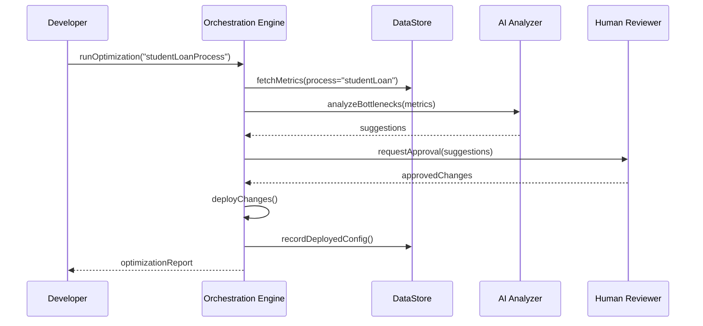

# Chapter 8: Process Optimization Workflow

In the previous chapter, we met the [AI Representative Agent (HMS-A2A)](07_ai_representative_agent__hms_a2a__.md) that suggests policy and process improvements. Now we’ll look at the full **Process Optimization Workflow**—a continuous improvement engine that collects data, runs AI, brings in humans, deploys fixes, and monitors results.

---

## 1. Why a Process Optimization Workflow?

Imagine the **Department of Education** notices that student loan applications are taking too long:

1. Citizens file their loan requests.
2. Back‐office staff manually triage hundreds of forms.
3. Approvals lag, and citizens call customer support in frustration.

A “factory continuous improvement team” would map each step, spot bottlenecks, test fixes, and track results over time. Our **Process Optimization Workflow** does the same in software:

- **Collect** metrics and logs from the application pipeline.  
- **Analyze** with AI to find slow spots or conflicting tasks.  
- **Review** suggested changes by a human expert.  
- **Deploy** new orchestration rules or connectors.  
- **Monitor** performance to see if things got faster.

Beginners see a clear request-to-resolution flow; experts can customize the engine, add new analytics, or plug in extra data sources.

---

## 2. Key Concepts

1. **Orchestration Engine**  
   Coordinates each step: data pull, AI call, human check, deployment, monitoring.

2. **Configurable Steps**  
   A JSON file lists the workflow steps and their order.

3. **Data Connectors**  
   Plugins that fetch logs, metrics, or external data (e.g., database, event bus).

4. **AI Analyzer**  
   Invokes HMS-A2A or custom models to find bottlenecks/conflicts.

5. **Human Review**  
   Sends suggestions to a portal for experts to approve or tweak.

6. **Deployment Module**  
   Applies new orchestration rules or connectors to the live system.

7. **Monitoring Loop**  
   Re-measures metrics to ensure the change actually improved things.

---

## 3. Using the Workflow: A Simple Example

Here’s how an agency developer triggers an optimization run for the `studentLoanProcess`:

```js
import { runOptimization } from './workflowEngine'

async function optimizeLoanProcess() {
  const report = await runOptimization('studentLoanProcess')
  console.log('Optimization Report:', report)
}

optimizeLoanProcess()
```

What happens:

- The engine **collects** recent timing data for each loan step.  
- It **analyzes** that data via AI and returns suggestions.  
- It **pauses** for human approval (if needed).  
- Once approved, it **deploys** updated settings.  
- Finally, it **monitors** to report before-and-after metrics.

Expected `report` output:

```json
{
  "bottlenecks": ["documentUpload"],
  "suggestions": [
    { "step": "documentUpload", "fix": "add parallel OCR scan", "confidence": 0.92 }
  ],
  "status": "deployed",
  "metrics": {
    "before": { "avgTime": 48 },
    "after": { "avgTime": 30 }
  }
}
```

---

## 4. Step-by-Step Flow



1. **Developer** kicks off optimization.  
2. Engine fetches data, asks AI for suggestions.  
3. Human Reviewer approves changes.  
4. Engine deploys new orchestration rules.  
5. The final report comes back to the developer.

---

## 5. Under the Hood: Configuration & Code

### 5.1 Workflow Configuration

File: `workflow/config/orchestration.json`

```json
{
  "studentLoanProcess": {
    "steps": [
      "collectData",
      "analyzeWithAI",
      "humanReview",
      "deployConfig",
      "startMonitoring"
    ]
  }
}
```

> This JSON tells the engine which steps to run, in order, for each process.

### 5.2 Orchestration Engine

File: `workflow/engine.js`

```js
import config from './config/orchestration.json'
import * as steps from './steps/*'

export async function runOptimization(processId) {
  const workflow = config[processId]
  let context = {}
  for (const stepName of workflow.steps) {
    const stepFn = steps[stepName]
    context = await stepFn(context)  // pass data from one step to the next
  }
  return context.report   // final aggregated report
}
```

> We load the configured steps, then call each step function in sequence, building up a shared `context`.

### 5.3 Example Step: collectData

File: `workflow/steps/collectData.js`

```js
import { getMetrics } from '../lib/dataConnectors'

export async function collectData(ctx) {
  const metrics = await getMetrics(ctx.processId)
  return { ...ctx, metrics }
}
```

> This step calls a data connector to fetch timing and log data for the process.

### 5.4 Example Step: analyzeWithAI

File: `workflow/steps/analyzeWithAI.js`

```js
import { requestSuggestions } from '../lib/aiConnector'

export async function analyzeWithAI(ctx) {
  const suggestions = await requestSuggestions({
    area: ctx.processId,
    data: ctx.metrics
  })
  return { ...ctx, suggestions }
}
```

> We invoke the AI service (HMS-A2A) to return an array of improvement suggestions.

---

## 6. Why This Matters

- **Beginners** get a guided, end-to-end example of how to automate process improvements.  
- **Power users** can add new step modules or extend connectors (e.g., pull data from more sources).  
- **Agencies** see a clear audit trail: what changed, who approved it, and whether it improved performance.

---

## Conclusion

You’ve learned how the **Process Optimization Workflow** ties together data collection, AI analysis, human approval, deployment, and monitoring into one continuous­ improvement loop. Next up is how we track and visualize these metrics in the [Metrics & Monitoring](09_metrics___monitoring_.md) chapter.

---

Generated by [AI Codebase Knowledge Builder](https://github.com/The-Pocket/Tutorial-Codebase-Knowledge)