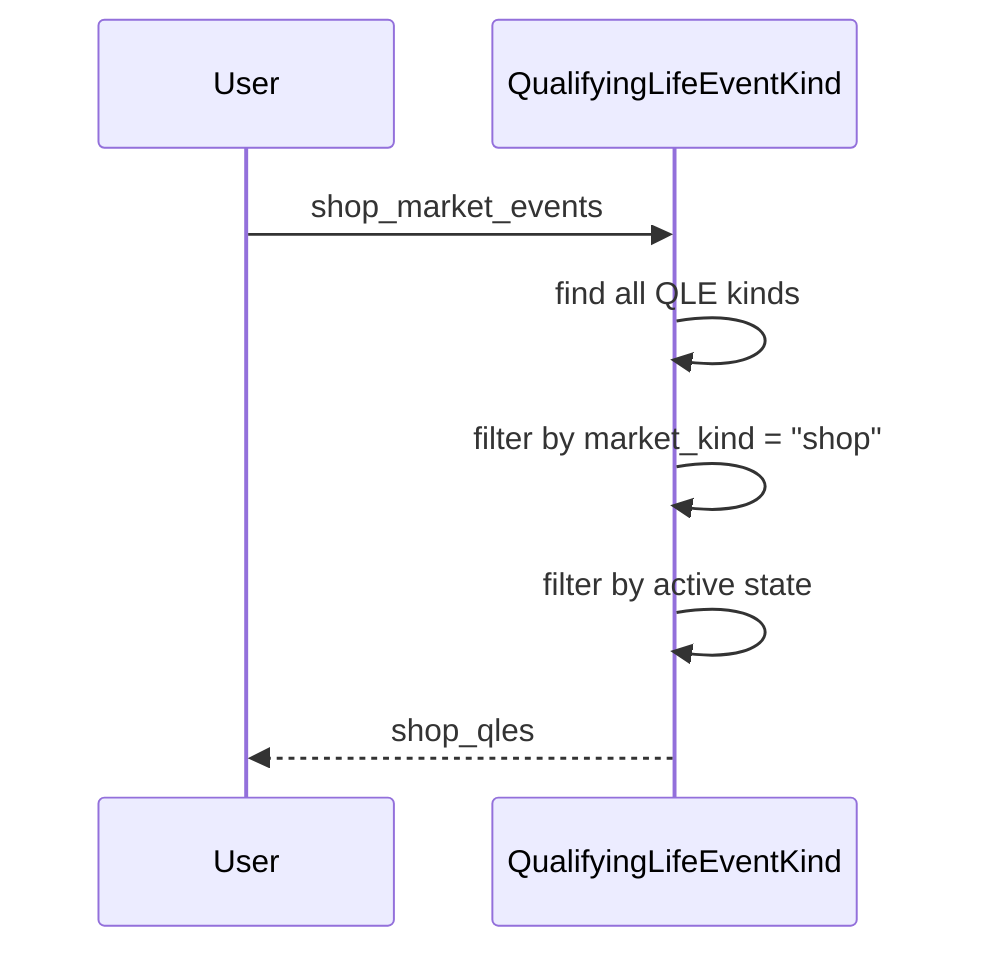

# Chapter 8: QualifyingLifeEventKind

In the previous chapter, [PlanCostDecorator](07_plancostdecorator.md), we learned how to calculate the cost of a health plan.  This chapter introduces the `QualifyingLifeEventKind` concept, which represents a category of life events that allow individuals to enroll in or change health plans outside of open enrollment. Think of it as a list of approved reasons for getting health insurance outside the normal signup window.

## What problem does `QualifyingLifeEventKind` solve?

Imagine Alice gets married after the open enrollment period for her company's health plan has ended.  She wants to add her new spouse, Bob, to her health plan. How does the system know that Alice is allowed to make changes to her plan outside of open enrollment?  The `QualifyingLifeEventKind` model defines "marriage" as a valid reason (a Qualifying Life Event, or QLE) for a Special Enrollment Period (SEP).  This allows Alice to enroll Bob in her plan even though open enrollment is over.

## Key Concepts:

1. **Categories of Life Events:** `QualifyingLifeEventKind` represents categories, not specific instances.  "Marriage" is a `QualifyingLifeEventKind`.  Alice's *specific* marriage is an instance of a [SpecialEnrollmentPeriod](XX_specialenrollmentperiod.md), which references the "Marriage" `QualifyingLifeEventKind`. Think of `QualifyingLifeEventKind` as the template, and [SpecialEnrollmentPeriod](XX_specialenrollmentperiod.md) as the filled-out form.

2. **Market Kind:**  A `QualifyingLifeEventKind` has a `market_kind` attribute, which specifies whether the QLE applies to the SHOP market (employer-sponsored plans), the individual market, or FEHB.  This ensures that the correct QLEs are available for each market.

3. **Effective On Kinds:** The `effective_on_kinds` attribute defines the possible effective dates for coverage based on this QLE.  For example, for a birth, the effective date might be the date of the birth, the first of the following month, or other options.

4. **Time Periods:**  The `pre_event_sep_in_days` and `post_event_sep_in_days` attributes define the time period before and after the qualifying life event during which the individual can enroll in a plan.  Think of this as the window of opportunity to sign up.

## Using the `QualifyingLifeEventKind` model

Let's say we want to find all active QLE kinds for the SHOP market:

```ruby
# ... other code ...

shop_qles = QualifyingLifeEventKind.shop_market_events

shop_qles.each do |qle|
  puts "QLE: #{qle.title}"
  puts "Effective On Kinds: #{qle.effective_on_kinds}"
end

# ... other code ...
```

This code retrieves all active `QualifyingLifeEventKind` objects for the SHOP market and prints their titles and allowed effective on kinds.

## Under the Hood

When you call `QualifyingLifeEventKind.shop_market_events`, the following happens:

1. **Retrieve QLE Kinds:** The system retrieves all `QualifyingLifeEventKind` objects.
2. **Filter by Market Kind:** It filters the QLE kinds to find those with `market_kind` equal to "shop".
3. **Filter by Active State:** It further filters the results to include only those that are currently active.



The code for this is in `qualifying_life_event_kind.rb`:

```ruby
# qualifying_life_event_kind.rb
class QualifyingLifeEventKind
  # ... other code ...

  scope :shop_market_events, -> {
    by_market_kind('shop').and(:is_visible.ne => false).active
  }

  # ... other code ...
end
```

This simplified code snippet shows the `shop_market_events` scope, which combines several scopes to filter by market kind and active status.

## Conclusion

This chapter introduced the `QualifyingLifeEventKind` model, which represents categories of qualifying life events. We learned about its key attributes and how it's used. In the next chapter, we'll explore [WorkflowStateTransition](09_workflowstatetransition.md).


---

Generated by [AI Codebase Knowledge Builder](https://github.com/The-Pocket/Tutorial-Codebase-Knowledge)