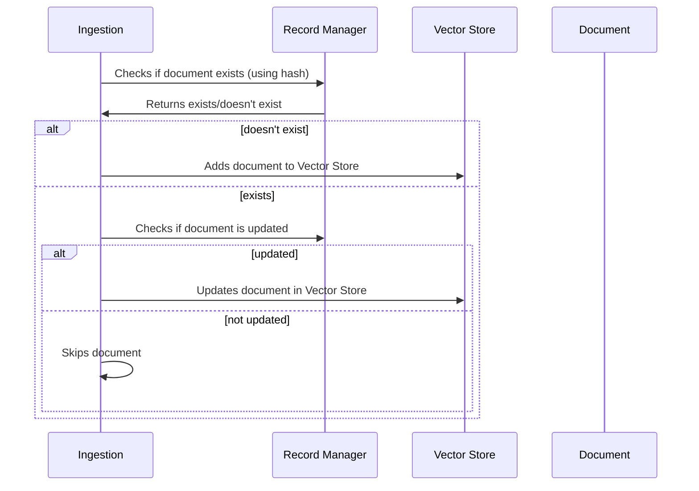

# Chapter 8: Record Manager

In the previous chapter, [LangSmith](07_langsmith_.md), we learned how to monitor and improve our chatbot's performance.  Now, let's explore how we can manage the data used by our chatbot efficiently, especially when dealing with updates and preventing duplicates. This is where the *Record Manager* comes in.

Imagine you're constantly adding new articles to your "meaning library" ([Vector Store](03_vector_store_.md)). You don't want to add the same article twice, as this wastes space and can lead to duplicate results. The Record Manager acts like a librarian's catalog, keeping track of all the "books" (documents) in the library and preventing duplicates.

## What is a Record Manager?

The Record Manager helps with efficient [Ingestion](05_ingestion_.md) into the [Vector Store](03_vector_store_.md). It keeps track of which documents have already been added, preventing duplicates and ensuring that updates are handled correctly.  Think of it as a checklist that the chatbot uses before adding new information to its "meaning library."

## How the Record Manager Works

Let's break down how the Record Manager works with a simple example:

1. **New Document:** You have a new document you want to add to the chatbot's knowledge base.

2. **Check the Catalog:** The Record Manager checks its catalog (database) to see if a document with the same content already exists.  It does this by calculating a unique hash for the document.

3. **Add or Update:** If the document doesn't exist, the Record Manager adds it to the catalog and allows the [Ingestion](05_ingestion_.md) process to continue, adding the document to the [Vector Store](03_vector_store_.md). If the document already exists but has been updated, the Record Manager updates the entry in the catalog and signals that the document in the Vector Store needs to be updated as well.  If the document exists and hasn't been updated, the Record Manager prevents it from being added again.



## Record Manager in Code

```python
# backend/ingest.py (simplified)
from langchain.indexes import index

# ... other code ...

indexing_stats = index(
    docs_transformed, record_manager, vectorstore, cleanup="full"
)

# ... other code ...
```

This simplified code snippet shows how the `index` function uses the `record_manager` to manage documents during ingestion.

## Looking Under the Hood: `index`

When the `index` function is called:

1. **Check for Existing Documents:** The `record_manager` checks if the documents have already been ingested using their unique hashes.

2. **Add or Update:** If a document is new, its hash is added to the `record_manager`'s database, and the document is added to the [Vector Store](03_vector_store_.md). If a document already exists but has been updated, the corresponding record in the `record_manager` is updated, and the document in the Vector Store is also updated.  If the document exists and hasn't changed, it's skipped.

```python
# backend/ingest.py (simplified)
from langchain.indexes import SQLRecordManager

# ... other code ...

record_manager = SQLRecordManager(
    f"weaviate/{WEAVIATE_DOCS_INDEX_NAME}", db_url=RECORD_MANAGER_DB_URL
)
record_manager.create_schema()

# ... other code ...
```

This code snippet shows how an `SQLRecordManager` is initialized.  It uses a SQL database to store the document hashes and metadata.

## Conclusion

The Record Manager is a key component for efficient [Ingestion](05_ingestion_.md), preventing duplicate documents and ensuring that updates are handled correctly in the [Vector Store](03_vector_store_.md). By acting as a catalog for our "meaning library," it keeps the chatbot's knowledge base organized and up-to-date. In the next chapter, [Researcher Graph](09_researcher_graph_.md), we'll explore a more advanced retrieval technique.


---

Generated by [AI Codebase Knowledge Builder](https://github.com/The-Pocket/Tutorial-Codebase-Knowledge)