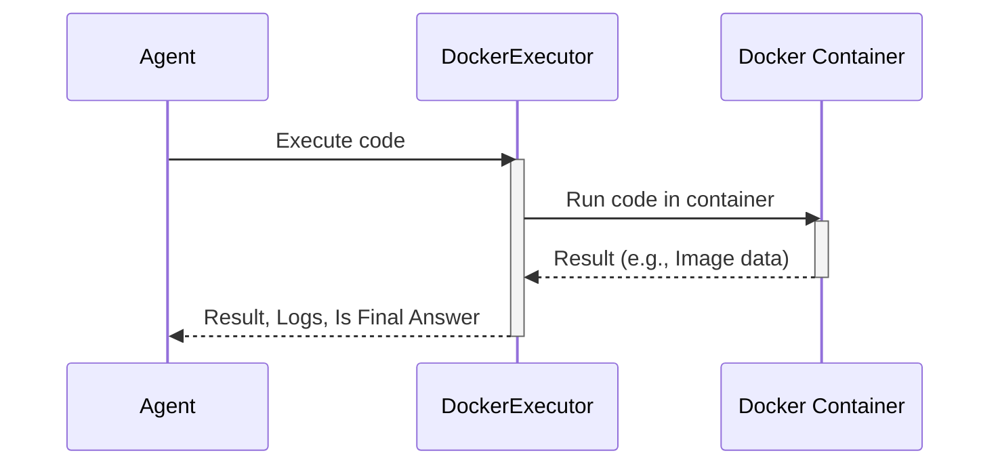

# Chapter 8: Remote Executors

In the previous chapter, [Local Python Executor](07_local_python_executor.md), we learned how to execute Python code directly within our agent using a safe, local environment.  Now, what if we want to execute code in a completely separate environment, perhaps even on a different machine? This is where **Remote Executors** come in.

Imagine our chef agent wants to try a new experimental cooking technique that involves specialized equipment not available in their kitchen. They might decide to use a cloud kitchen that has all the necessary tools. Similarly, a remote executor allows our agent to run code in a different environment, like a cloud server or a specialized container, providing access to resources and libraries not available locally. This also enhances security by isolating potentially risky code execution.

## What are Remote Executors?

Remote executors, like E2B and Docker, are like using a cloud kitchen for executing code. They provide isolated environments for running potentially risky code, enhancing security by preventing direct execution on the user's machine.  They also offer access to a wider range of resources and libraries.

## Using Remote Executors

Let's see a simplified example of using the `DockerExecutor`:

```python
from smolagents import DockerExecutor, AgentLogger
from rich.console import Console
from io import StringIO
import PIL.Image

# Create a DockerExecutor
executor = DockerExecutor(
    additional_imports=["pillow"],
    logger=AgentLogger(LogLevel.INFO, Console(force_terminal=False, file=StringIO())),
)

# Python code to execute
code = """
from PIL import Image
image = Image.new("RGB", (100, 100), color = "red")
final_answer(image)
"""

# Execute the code
result, logs, is_final_answer = executor(code)

# Check the result
assert isinstance(result, PIL.Image.Image)

# Clean up the Docker container
executor.delete()
```

This code creates a `DockerExecutor`, which starts a Docker container with a Python environment.  It then executes a Python snippet that creates a red image using the PIL library. The result is returned as a PIL Image object.  Finally, `executor.delete()` cleans up the Docker container.

## Inside a Remote Executor (Docker Example)

Here's a simplified sequence diagram showing how the `DockerExecutor` works:



1. The [Agent](01_agent.md) sends the code to the `DockerExecutor`.
2. The `DockerExecutor` sends the code to the Docker container for execution.
3. The Docker container executes the code and returns the result.
4. The `DockerExecutor` returns the result, logs, and a final answer flag to the agent.

The `DockerExecutor` class in the `remote_executors.py` file handles the interaction with the Docker container.

```python
# Simplified code from remote_executors.py (DockerExecutor)
class DockerExecutor(RemotePythonExecutor):
    def run_code_raise_errors(self, code, return_final_answer=False):
        # ... (Send code to Docker container using websockets)
        # ... (Receive result from Docker container)
        return result, logs

    def delete(self):
        # ... (Stop and remove the Docker container)
```

The `run_code_raise_errors` method sends the code to the Docker container for execution and receives the result. The `delete` method cleans up the container.

## E2B Executor

`HMS-ACT` also supports `E2BExecutor`, which provides another way to execute code remotely.  It works similarly to the `DockerExecutor` but uses the E2B platform instead of Docker.

```python
from smolagents import E2BExecutor

# Create an E2BExecutor (replace with your actual API key and template ID)
executor = E2BExecutor(additional_imports=[], api_key="YOUR_API_KEY", template="YOUR_TEMPLATE_ID")

# ... (Rest of the code is similar to the DockerExecutor example)
```

## Conclusion

In this chapter, we learned about `Remote Executors` in `smolagents` and how they allow us to execute code in isolated environments like Docker containers or using the E2B platform. We saw examples of using both `DockerExecutor` and `E2BExecutor` and explored their internal implementation. Next, we'll learn about the [MCP Client](09_mcp_client.md) and how it enables communication with a remote model provider.


---

Generated by [AI Codebase Knowledge Builder](https://github.com/The-Pocket/Tutorial-Codebase-Knowledge)