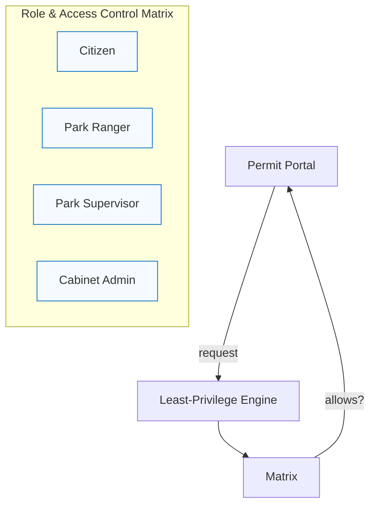
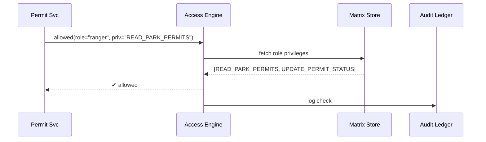

# Chapter 8: Role & Access Control Matrix
*(The “seating chart” of HMS-AGX)*  

*[Jump back to Chapter&nbsp;7: Data Privacy & Consent Vault](07_data_privacy___consent_vault_.md)*  

---

## 1. Why Do We Need Another Chart?

Imagine the **National Park Service (NPS)** launches a new “Back-Country Permit” portal:

| Person logging in | What they should see | What they **must not** see |
|-------------------|----------------------|----------------------------|
| *Citizen* | Their own permit status | Other visitors’ data |
| *Park Ranger* | All permits for **their** park | Payroll records |
| *Park Supervisor* | Ranger work-schedules | Cabinet-level dashboards |
| *Cabinet-Level Admin* | Parks budget across the nation | – |

Hard-coding these rules inside every micro-service is error-prone and impossible to audit.  
The **Role & Access Control Matrix (RACM)** gives us *one* table that Maps:

```
Role  ×  Privilege  →  Allowed? (✔ / ✖)
```

The matrix auto-calculates the **least privilege** each request needs—just like a clearance office decides if you can read “Secret” vs. “Top Secret/SAP”.

---

## 2. Key Concepts (Plain-English Cheat-Sheet)

| Concept | Friendly Analogy |
|---------|------------------|
| Role | Your seat on the org chart (e.g., “Ranger”) |
| Privilege | A key on your key-ring (e.g., “EDIT_PERMIT”) |
| Resource | The door the key opens (e.g., `/permits/42`) |
| Access Level | *How* the door may open: READ / WRITE / ADMIN |
| Matrix | The seating chart that lists every seat + key combo |
| Least-Privilege Engine | A bouncer that only hands you the keys you need today |

---

## 3. One-Minute Mental Model



The **Portal** never checks roles itself—it asks the *Bouncer*.

---

## 4. Hands-On: Defining a Matrix in 3 Steps

### 4.1 Declare Roles & Privileges (YAML, 16 lines)

```yaml
# file: racm.yml
roles:
  citizen:
    inherits: []
    grants:
      - READ_SELF_PERMIT
  ranger:
    inherits: []
    grants:
      - READ_PARK_PERMITS
      - UPDATE_PERMIT_STATUS
  supervisor:
    inherits: [ranger]
    grants:
      - MANAGE_RANGER_SCHEDULE
  cabinet_admin:
    inherits: [supervisor]
    grants:
      - VIEW_NATION_BUDGET
```

Explanation  
• `inherits` lets a role reuse another role’s keys—like the supervisor also being a ranger.  
• Grants are plain strings; keep them short & verb-based.

### 4.2 Compile & Publish

```bash
hms-access compile racm.yml --output matrix.json
hms-access publish matrix.json    # pushes to Service Registry
```

Console:

```
✔ Parsed 4 roles, 7 privileges
✔ Least-privilege graph generated
✔ Matrix signed & broadcast
```

### 4.3 Enforce in Code (Node, 14 lines)

```js
import { access } from "@hms/sdk";

router.get("/permits/:id", async (req, res) => {
  const role = req.headers["x-user-role"];      // e.g., "ranger"
  const permitId = req.params.id;

  // Ask RACM if this role may READ this resource
  const ok = await access.allowed(role, "READ_PARK_PERMITS");
  if (!ok) return res.status(403).send("Forbidden");

  // …fetch & return permit…
});
```

No role logic is scattered through the app—the SDK calls the shared matrix.

---

## 5. Auto-Calculating Least Privilege

Need a *temporary* role that only lasts during wildfire season?

```bash
hms-access derive \
  --base ranger \
  --plus WRITE_EVAC_ALERTS \
  --ttl 90d \
  --name "ranger_wildfire_temp"
```

The engine:

1. Copies `ranger` grants.  
2. Adds `WRITE_EVAC_ALERTS`.  
3. Stamps an expiry date 90 days out.  

This avoids “permission creep” after the emergency ends.

---

## 6. Life of an Access Check (Under the Hood)



Only four hops; average latency < 1 ms (cached).

---

### 6.1 Tiny Peek at Engine Code (Go, 16 lines)

```go
// file: engine/check.go
func Allowed(role, priv string) bool {
    grants := cache.Get(role)           // in-memory, 10 sec TTL
    if grants == nil {
        grants = store.Load(role)       // fall-back to Matrix Store
        cache.Set(role, grants)
    }
    for _, g := range grants {
        if g == priv { return true }
    }
    return false
}
```

Beginner notes  
• **Cache first** for speed.  
• Grants come as a slice of strings; linear scan is fast (<50 items).  

---

## 7. Common Pitfalls & Quick Fixes

| Symptom | Cause | Fix |
|---------|-------|-----|
| “Role not found” | Service started before matrix publish | `hms-access refresh` after deploy |
| Permissions linger after role change | Cached grants old | Reduce cache TTL or call `access.invalidate(role)` |
| Privilege sprawl | Too many ad-hoc grants | Use `inherits` to group common sets |

---

## 8. FAQ

**Q: How does RACM integrate with the [Data Privacy & Consent Vault](07_data_privacy___consent_vault_.md)?**  
The Vault checks *both* the consent token **and** calls `access.allowed` to ensure the caller’s role may request that field.

**Q: Can a single user hold multiple roles?**  
Yes—pass a **role array** in the token; the engine allows if *any* role grants the privilege.

**Q: Is the matrix version-controlled?**  
Every publish is immutable and hashed in the [Auditing & Traceability Ledger](13_auditing___traceability_ledger_.md).

---

## 9. What You Learned

• The **Role & Access Control Matrix** is the single, auditable table of who can do what.  
• YAML + one CLI command is enough to define, compile, and publish roles.  
• Services never implement access logic themselves—they defer to the shared engine.  
• Least-privilege derivations and TTLs prevent permission creep.

Next, let’s see how user-facing apps **display** only the screens their role allows.  
Continue to [Chapter&nbsp;9: Interface Layer (HMS-MFE & Portals)](09_interface_layer__hms_mfe___portals__.md).

---

Generated by [AI Codebase Knowledge Builder](https://github.com/The-Pocket/Tutorial-Codebase-Knowledge)