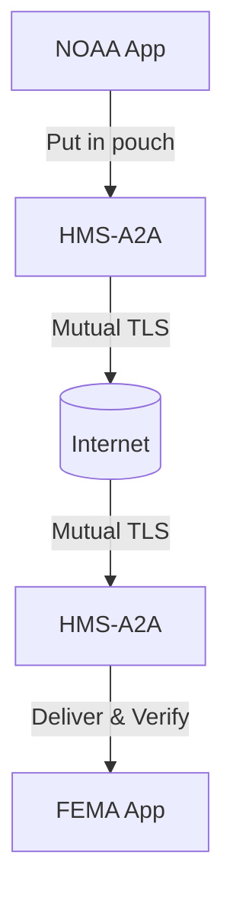
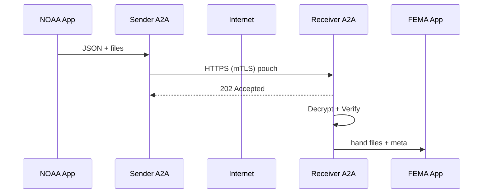

# Chapter 8: Secure Inter-agency Communication Layer (HMS-A2A)

*(Follow-up to [External System Synchronization Connector](07_external_system_synchronization_connector_.md))*  

---

## 1. Why Do We Need a “Digital Diplomatic Pouch”?

Hurricane *Clara* is five hours from landfall.  
The National Oceanic and Atmospheric Administration (**NOAA**) must rush classified storm-track data to the Federal Emergency Management Agency (**FEMA**) so shelters can be opened in the right counties.

*Requirements*  
1. Only FEMA may read the file.  
2. NOAA’s name, time-stamp, and data version must travel with the file.  
3. The link must survive shaky networks and auto-resume if broken.  

Doing that with plain e-mail or FTP is like shipping state secrets in an open postcard.  
**HMS-A2A** solves it by behaving like a *sealed diplomatic pouch*: once packed and stamped, no one except the addressed agency can open it.

---

## 2. High-Level View



One A2A instance lives on **each side** of the wire; they take care of all crypto, retries, and logging.

---

## 3. Key Concepts (Plain English)

| Term                | What It Really Means for Beginners                                       |
|---------------------|---------------------------------------------------------------------------|
| Diplomatic Pouch    | A binary blob containing **one or more files + metadata + signature**.    |
| Envelope            | The short JSON header sitting in front of the pouch (who/when/what).      |
| Provenance Stamp    | SHA-256 hash of the body + sender’s digital signature.                    |
| Mutual TLS Tunnel   | HTTPS connection where **both** sides present certificates.               |
| Agency Keyring      | Tiny vault holding each agency’s public/private keys.                     |

Keep these five ideas in mind; the rest of the code is simply building and checking them.

---

## 4. Packing & Sending a Pouch (Hurricane Example)

Below is the **complete** sender flow—only 16 lines.

```javascript
// noaa-send.js
import { createPouch, sendPouch } from 'hms-a2a-sdk'

async function main() {
  // 1) Put file(s) & meta in the pouch
  const pouch = await createPouch({
    to:    'FEMA',
    from:  'NOAA',
    files: ['tracks.csv'],           // could be many
    meta:  { storm: 'Clara', ver: 42 }
  })

  // 2) Shoot it across the wire
  await sendPouch('https://a2a.fema.gov/inbox', pouch)
  console.log('🎉 Storm data delivered (encrypted & signed)')
}
main()
```

Explanation  
1. `createPouch` zips files, adds an **envelope**, encrypts with FEMA’s public key, then signs with NOAA’s private key.  
2. `sendPouch` opens a **mutual-TLS** HTTPS POST; if the network dies it auto-retries with exponential back-off.  

---

### What Does the Envelope Look Like?

```json
{
  "to": "FEMA",
  "from": "NOAA",
  "timestamp": "2025-09-14T03:12:55Z",
  "algo": "AES256-GCM",
  "sigAlgo": "RSA-PSS",
  "hash": "1e6b3c…",         // SHA-256 of encrypted body
  "attachments": ["tracks.csv"]
}
```

Beginners never touch this—SDK writes it, receiver verifies it.

---

## 5. Receiving & Opening the Pouch

FEMA’s side is symmetrical—13 lines.

```javascript
// fema-receive.js
import { verifyAndOpen } from 'hms-a2a-sdk'

app.post('/inbox', async (req, res) => {
  try {
    const { files, meta } = await verifyAndOpen(req.body)
    processStormData(files[0], meta)  // your domain code
    res.sendStatus(202)
  } catch (e) {
    res.status(400).send('Bad or tampered pouch')
  }
})
```

Explanation  
1. `verifyAndOpen` checks mutual-TLS certificate, signature, and hash.  
2. If OK, the encrypted blob is decrypted with FEMA’s private key and written to `/tmp`.  
3. Domain code takes over.

---

## 6. What Happens Under the Hood? (5 Steps)



Each arrow is atomic, logged, and replayable if interrupted.

---

## 7. Peek Inside the Implementation Files

### 7.1 Pouch Builder (sdk/pouch.js) – 18 Lines

```javascript
import { zip } from './zip.js'
import { encrypt, sign } from './crypto.js'

export async function createPouch({ to, from, files, meta }) {
  const body = await zip(files)              // binary zip
  const cipher = await encrypt(to, body)     // AES under receiver key
  const envelope = {
    to, from, timestamp: new Date().toISOString(),
    algo: cipher.algo, sigAlgo: 'RSA-PSS',
    hash: sha256(cipher.data), attachments: files.map(f=>path.basename(f))
  }
  const signature = sign(from, envelope.hash)
  return { envelope, cipher: cipher.data, signature }
}
```

Plain English: zip → encrypt → hash → sign → return a JS object.

---

### 7.2 Verifier (sdk/verify.js) – 16 Lines

```javascript
import { decrypt, verifySig } from './crypto.js'

export async function verifyAndOpen(pouch) {
  const { envelope, cipher, signature } = pouch

  // 1) Check signature
  verifySig(envelope.from, envelope.hash, signature)

  // 2) Check hash integrity
  if (sha256(cipher) !== envelope.hash) throw 'Hash mismatch'

  // 3) Decrypt
  const zipBuff = await decrypt(envelope.to, cipher)

  // 4) Unzip and hand back
  const files = await unzip(zipBuff)
  return { files, meta: envelope }
}
```

If any check fails, it throws—attack blocked.

---

## 8. Managing the Agency Keyring

1. Each agency owns a **hardware security module (HSM)** that stores its private key.  
2. Public keys are published at `https://agency.gov/.well-known/a2a-key.pem`.  
3. The SDK auto-caches public keys for 24 h.  
4. Key rotation is just “upload a new PEM, publish DNS `key-id` change.”

Beginners rarely touch crypto APIs directly; the SDK hides them.

---

## 9. Frequently Asked Questions

**Q: How big can a pouch be?**  
Up to 2 GB by default (chunked upload). Large satellite imagery is fine.

**Q: What if the receiving agency is offline?**  
`sendPouch` stores the cipher blob in `<user-home>/.a2a/outbox` and retries every 30 s until ACK.

**Q: Is this different from [HMS-GOV](06_hms_gov____government_integration_gateway_.md)?**  
Yes—HMS-GOV translates *formats*. HMS-A2A protects the *wire*. You normally use both together: data is transformed by HMS-GOV, then wrapped in a pouch by HMS-A2A.

**Q: Can citizens use A2A?**  
No. It is strictly for **agency-to-agency** or **system-to-system** traffic. Citizens go through [HMS-API Gateway](02_backend_api_gateway__hms_svc___hms_api__.md).

---

## 10. Hands-On Mini-Lab (Optional)

1. Run a fake receiver:

```bash
node examples/fema-receive.js   # listens on 8443 with self-signed cert
```

2. Send a file:

```bash
node examples/noaa-send.js tracks.csv
```

3. Watch the console:  
   *NOAA* → “🎉 delivered”, *FEMA* → “Decrypted tracks.csv (storm = Clara)”.

Congrats—you just performed a secure inter-agency data push on your laptop.

---

## 11. What You Learned

• HMS-A2A is the **sealed diplomatic pouch** for data between agencies.  
• `createPouch` + `sendPouch` (sender) and `verifyAndOpen` (receiver) are the only APIs most devs need.  
• Under the hood: zip → encrypt → sign → mTLS → decrypt → verify.  
• Keyrings, retries, and audit logs are automatic.  

In the next chapter we’ll see how **money** travels just as safely through the [Financial Transaction Clearinghouse (HMS-ACH)](09_financial_transaction_clearinghouse__hms_ach__.md).

---

Generated by [AI Codebase Knowledge Builder](https://github.com/The-Pocket/Tutorial-Codebase-Knowledge)