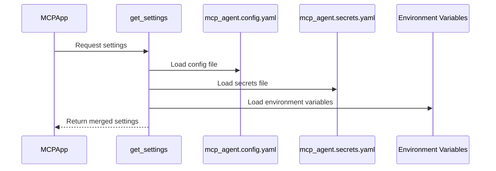

# Chapter 8: Settings

In the previous chapter, [MCPAggregator](07_mcpaggregator.md), we learned how to access multiple [MCP Servers](04_mcp_server.md) simultaneously. Now, let's explore how to configure your `HMS-MCP` application using the `Settings` class.

## What problem does the Settings class solve?

Imagine you're building a complex AI application with multiple agents, workflows, and MCP servers.  You'll need a way to manage various configurations, such as API keys for different LLM providers, server locations, logging settings, and other parameters.  Hardcoding these values directly into your code is not ideal, as it makes your application inflexible and difficult to maintain.  The `Settings` class provides a centralized and organized way to manage all these configurations.  Think of it as the project's budget and schedule that outlines the resources and timeline.

## Key Concepts

The `Settings` class is a Pydantic model that defines the structure and types of your application's configuration.  It allows you to:

1. **Centralize Configuration:** Store all your settings in one place, either in code or in configuration files.
2. **Type Safety:** Define the expected types for each setting, ensuring that your application receives valid configurations.
3. **Configuration from Multiple Sources:** Load settings from environment variables, configuration files, and even programmatically.

## Using the Settings Class

You can use the `Settings` class in two main ways:

1. **Programmatically:** Define your settings directly in your Python code.

```python
from mcp_agent.config import Settings, LoggerSettings

settings = Settings(
    execution_engine="asyncio",
    logger=LoggerSettings(type="file", level="debug"),
)

app = MCPApp(name="my_app", settings=settings)
```

This code creates a `Settings` object with the execution engine set to "asyncio" and the logger configured to write debug messages to a file.  This `Settings` object is then passed to the `MCPApp` constructor.

2. **Configuration Files:** Load settings from YAML files.  Create `mcp_agent.config.yaml` and `mcp_agent.secrets.yaml` (for sensitive information like API keys).

```yaml
# mcp_agent.config.yaml
execution_engine: asyncio
logger:
  type: console
  level: info

# mcp_agent.secrets.yaml
openai:
  api_key: YOUR_OPENAI_API_KEY
```

This configuration sets the execution engine to "asyncio", configures the logger to print info messages to the console, and stores the OpenAI API key in a separate secrets file.  The `MCPApp` automatically loads these files when initialized.

You can also combine both approaches, overriding settings from the configuration files with programmatically defined settings.

## Internal Implementation

The `get_settings` function in `src/mcp_agent/config.py` handles loading settings from different sources.



Here's a simplified look at the `get_settings` function:

```python
from mcp_agent.config import get_settings, Settings

def get_settings(config_path: str | None = None) -> Settings:
    # ... load settings from config file ...
    # ... load settings from secrets file ...
    # ... merge settings ...
    return settings

settings = get_settings() # or get_settings("path/to/config.yaml")
app = MCPApp(settings=settings)
```

The `Settings` class itself is defined using Pydantic, which provides type validation and other useful features.

```python
from typing import Literal
from pydantic import BaseModel

class LoggerSettings(BaseModel):
    type: Literal["none", "console", "file"] = "console"
    level: Literal["debug", "info", "warning", "error"] = "info"

class Settings(BaseModel):
    execution_engine: Literal["asyncio", "temporal"] = "asyncio"
    logger: LoggerSettings | None = LoggerSettings()
    # ... other settings ...
```

## Conclusion

The `Settings` class provides a robust and flexible way to manage your `HMS-MCP` application's configuration.  It allows you to centralize your settings, enforce type safety, and load configurations from multiple sources.  Understanding how to manage settings is crucial for building and deploying complex AI applications. Now that we've covered settings, let's move on to the next chapter, [Context](09_context.md), which explores how to manage global state within your application.


---

Generated by [AI Codebase Knowledge Builder](https://github.com/The-Pocket/Tutorial-Codebase-Knowledge)