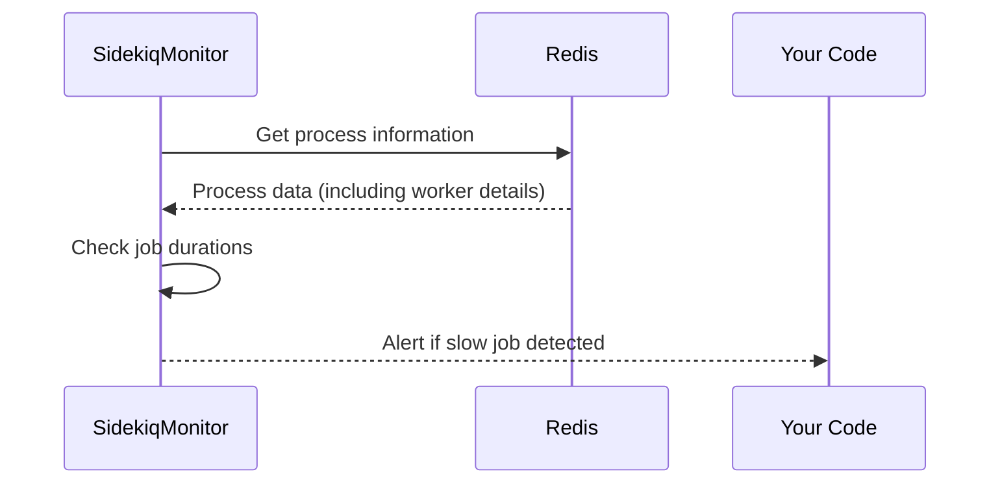

# Chapter 8: SidekiqMonitor (Background Job Monitoring)

Coming from our understanding of how the [Live Mode Manager (Real-time Event Monitoring)](07_live_mode_manager__real_time_event_monitoring__.md) helps us see real-time events, let's focus on monitoring our background jobs.  Imagine you have automated tasks, like sending emails or processing data, running in the background using Sidekiq. How do you know if these jobs are running smoothly, or if they're getting stuck or failing?  That's where `SidekiqMonitor` comes in.

## What is SidekiqMonitor?

`SidekiqMonitor` is like a supervisor for your Sidekiq workers. It keeps track of job status, queue sizes, and performance.  It can alert you to potential problems like slow or failing jobs, helping you keep your background tasks running efficiently.

## Key Concepts

1. **Queues:** Sidekiq uses queues to organize jobs. Think of them as different lines at a grocery store, each for a specific type of item.

2. **Workers:** Workers are the cashiers processing the items (jobs) in the queues.

3. **Job Status:**  This tells you what's happening with a job (e.g., waiting in the queue, being processed, completed, or failed).

4. **Alerts:** `SidekiqMonitor` can generate alerts for problems like slow jobs or high retry counts.

## Use Case: Detecting a Slow Job

Let's say you have a job called `ProcessDataJob` that usually takes a few seconds to run.  Suddenly, it starts taking several minutes.  `SidekiqMonitor` can detect this and alert you.

```ruby
# Configure SidekiqMonitor (typically done once at startup)
SidekiqMonitor.configure_redis(ENV['REDIS_URL'] || 'redis://localhost:6379/0')
SidekiqMonitor.configure(slow_job_threshold: 30) # Alert if a job takes longer than 30 seconds

# Start monitoring
SidekiqMonitor.start_monitoring do |alerts|
  alerts.each do |alert|
    puts "Alert: #{alert.message}"
  end
end

# ... your application continues running ...

# Stop monitoring when done
SidekiqMonitor.stop_monitoring
```

**Explanation:**

1. We configure `SidekiqMonitor` to connect to Redis and set the slow job threshold to 30 seconds.
2. We start monitoring and provide a block that will be called with any generated alerts.
3. Our application continues running.  `SidekiqMonitor` works in the background.
4. We stop monitoring when we're done.

If `ProcessDataJob` takes longer than 30 seconds, the provided block will be executed, and you'll see an alert message like: "Alert: Slow job: ProcessDataJob (65s) on hostname".

## Internal Implementation

Here's a simplified sequence diagram showing how `SidekiqMonitor` checks for slow jobs:



`SidekiqMonitor` periodically fetches data from Redis about active processes and their workers.  It then checks the duration of each running job. If a job exceeds the `slow_job_threshold`, it generates an alert and calls the provided callback.

## Code Example: `sidekiq_monitor.rb`

Let's look at a simplified snippet from `sidekiq_monitor.rb`:

```ruby
# File: sidekiq_monitor.rb (simplified)
module SidekiqMonitor
  def self.check_slow_jobs(processes)
    slow_jobs = []
    processes.each do |process|
      process[:workers].each do |worker|
        if worker[:duration] > @@configuration[:slow_job_threshold]
          # ... (Create a slow job alert) ...
          slow_jobs << alert
        end
      end
    end
    slow_jobs
  end
end
```

This simplified `check_slow_jobs` method iterates through all active workers and checks their duration. If a job is slow, it creates a [Types::JobAlert](03_types__data_structures__.md) and adds it to the `slow_jobs` array.

`SidekiqMonitor` also provides other monitoring features, such as checking for high retry counts, dead jobs, and queue backlogs.  It integrates with the [Live Mode Manager (Real-time Event Monitoring)](07_live_mode_manager__real_time_event_monitoring__.md) to display these alerts in real-time.

## Conclusion

In this chapter, we learned about `SidekiqMonitor` and how it helps us keep an eye on our background jobs. We saw how to use it to detect slow jobs and explored its internal implementation. In the next chapter, we'll explore the [ContributorKnowledgeBase (Expertise Tracking)](09_contributorknowledgebase__expertise_tracking__.md).


---

Generated by [AI Codebase Knowledge Builder](https://github.com/The-Pocket/Tutorial-Codebase-Knowledge)