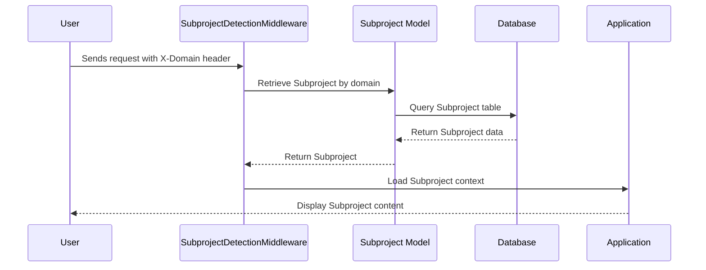

# Chapter 8: Subprojects

In the previous chapter, [Events and Listeners](07_events_and_listeners.md), we learned how different parts of our application can communicate with each other. Now, we'll explore **Subprojects**, a powerful feature that allows you to customize and brand the platform for different clients or initiatives.

## What are Subprojects and why do we need them?

Imagine you run a platform that offers online courses. You have several clients, each with their own branding and specific course offerings. Instead of creating a separate platform for each client, you can use Subprojects to create "mini-sites" within your main platform.  Each mini-site can have its own look and feel, custom domain, and specific set of [Programs](01_protocols_and_programs.md).

For example, let's say your main platform is `example.com`. You have two clients: "Fitness First" and "Yoga Zen." You can create two Subprojects:

* `fitness.example.com` for Fitness First
* `yoga.example.com` for Yoga Zen

Each Subproject will have its own branding, logo, and selection of fitness or yoga programs.

## Key Concepts

* **Subproject:** A customized instance of your platform with its own branding, settings, and content.
* **Domain:** The web address associated with a Subproject (e.g., `fitness.example.com`).
* **Branding:** The visual elements of a Subproject, including logo, colors, and fonts.
* **Content:** The [Programs](01_protocols_and_programs.md) and other resources available within a Subproject.

## Using Subprojects

Let's say you want to create a Subproject for "Fitness First." Here's a simplified example:

1. **Create a new Subproject:**  Provide a name ("Fitness First"), domain (`fitness.example.com`), logo, and branding colors.
2. **Select Programs:** Choose the fitness programs that should be available within this Subproject.
3. **Customize Settings:** Configure any specific settings for this Subproject, like requiring location information or allowing file uploads.

```php
// Http/Controllers/CodifySubprojects/SubprojectsController.php (simplified)
$subprojectData = [
    'name' => 'Fitness First',
    'domain' => 'fitness.example.com',
    // ... other subproject details
];

$subproject = Subproject::create($subprojectData);
```

This code snippet (simplified) creates a new `Subproject` record in the database.

## Internal Implementation

When a user visits a Subproject domain (e.g., `fitness.example.com`), the system identifies the Subproject and loads its specific settings and content.



The `SubprojectDetectionMiddleware` (in `Http/Middleware/SubprojectDetectionMiddleware.php`) is responsible for identifying the Subproject based on the `X-Domain` header.

```php
// Http/Middleware/SubprojectDetectionMiddleware.php (simplified)
$domain = $request->header('X-Domain');
$subproject = Subproject::where('domain', $domain)->first();

// ... set Subproject context ...
```

This code snippet (simplified) retrieves the Subproject from the database based on the requested domain.

The `Subproject` model (in `Models/CodifySubprojects/Subproject.php`) stores the Subproject information.

```php
// Models/CodifySubprojects/Subproject.php (simplified)
protected $fillable = [
    "name",
    "domain",
    // ... other fields
];
```

This code snippet shows some of the fields stored in the `Subproject` model.

## Conclusion

In this chapter, we learned about Subprojects and how they allow you to customize and brand the platform for different clients or initiatives. We saw how to create a Subproject and how the system identifies and loads the correct Subproject context based on the requested domain.  This modular approach provides flexibility and scalability for managing diverse user groups and content.


---

Generated by [AI Codebase Knowledge Builder](https://github.com/The-Pocket/Tutorial-Codebase-Knowledge)