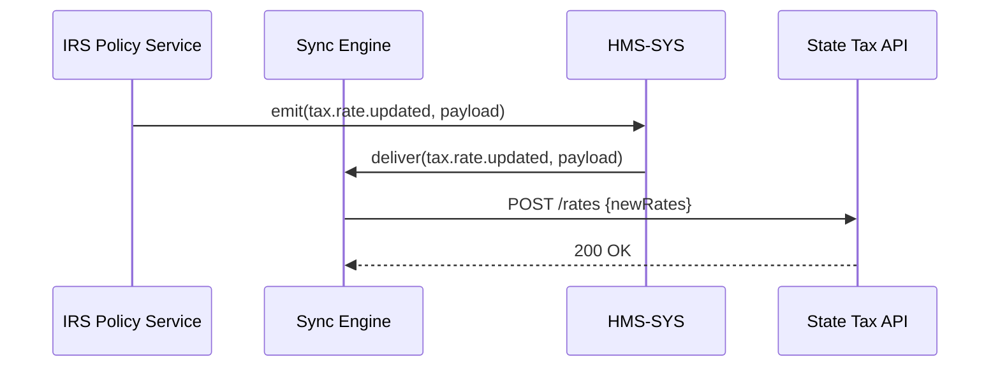

# Chapter 8: Synchronization Engine

In the previous chapter, we learned how to hook external systems into HMS via adapters and polling in [Chapter 7: Integrated External System](07_integrated_external_system_.md). Now we’ll introduce the **Synchronization Engine**, our “central dispatch” that propagates updates between HMS modules and external systems in real time.

---

## 1. Motivation & Central Use Case

Imagine the Internal Revenue Service (IRS) updates its annual tax rate tables. These changes must flow immediately:
- From the IRS policy database  
- To the citizen-facing filing portal  
- To partner state agencies’ systems

Without a **Synchronization Engine**, each system would independently pull or poll for updates—leading to delays, inconsistent rates, or manual interventions.

**Enter the Synchronization Engine**, which:
- Listens for change events (from HMS modules or external systems)  
- Dispatches those updates bi-directionally  
- Retries on failure and resolves simple conflicts  
- Ensures everyone's “department” sees the same policy at once

---

## 2. Key Concepts

1. **Event Listeners**  
   Hooks into HMS-SYS events (e.g., `policy.updated`) and external webhooks.

2. **Transformers**  
   Map payload fields between HMS conventions and external API formats.

3. **Bi‐directional Sync**  
   Two pipelines:  
   - **Inbound**: External → HMS  
   - **Outbound**: HMS → External

4. **Conflict Handling**  
   Simple last‐write‐wins or timestamp checks to avoid overwriting newer data.

5. **Retry & Backoff**  
   Automatic retries with increasing delays when an endpoint is down.

---

## 3. Using the Synchronization Engine

Below is a minimal example showing how to set up the engine to sync “tax-rate” updates.

```yaml
# config.yml
hmsEvents:
  - event: "tax.rate.updated"
    handler: "./handlers/outbound.js"
externalWebhooks:
  - path: "/webhook/tax-rate"
    handler: "./handlers/inbound.js"
```

```js
// index.js
const SyncEngine = require('sync-engine');
const config     = require('./config.yml');

const engine = new SyncEngine({
  coreUrl: 'http://localhost:4000',  // HMS-SYS
  config
});

engine.start();
```

Explanation:
- **config.yml** declares: when `tax.rate.updated` fires in HMS, run `outbound.js`.  
- It also mounts `inbound.js` at `/webhook/tax-rate` for external changes.  
- `engine.start()` wires up listeners, HTTP endpoints, and scheduler for retries.

### Example Flow

1. **HMS Module** emits `tax.rate.updated`.  
2. Engine picks it up, runs `outbound.js` to `POST` new rates to the state agency API.  
3. If the POST fails, the engine retries with backoff.  
4. State agency can also send a webhook to `/webhook/tax-rate`, where `inbound.js` updates HMS via HMS-SYS.

---

## 4. Under the Hood: Step-by-Step Flow



1. IRS Policy Service emits `tax.rate.updated`.  
2. HMS-SYS routes it to the Sync Engine.  
3. Sync Engine transforms and `POST`s to the state agency API.  
4. On success, Sync Engine logs and moves on; on failure, it retries.

---

## 5. Internal Implementation Details

### File Structure

```
sync-engine/
├─ index.js
├─ config.yml
└─ handlers/
   ├─ inbound.js
   └─ outbound.js
```

### 5.1 index.js

```js
const express = require('express');
const Core    = require('hms-sys/client');
const cfg     = require('./config.yml');

class SyncEngine {
  constructor({ coreUrl, config }) {
    this.core = new Core(coreUrl);
    this.config = config;
    this.app = express().use(express.json());
  }

  start() {
    this._setupWebhooks();
    this._setupEventListeners();
    this.app.listen(6000, () => console.log('Sync Engine on 6000'));
  }

  _setupWebhooks() {
    this.config.externalWebhooks.forEach(w => {
      const handler = require(w.handler)(this.core);
      this.app.post(w.path, handler);
    });
  }

  _setupEventListeners() {
    this.config.hmsEvents.forEach(e => {
      this.core.on(e.event, payload => {
        require(e.handler)(payload, this.core);
      });
    });
  }
}

module.exports = SyncEngine;
```

Explanation:
- We mount each webhook handler on its path.  
- We register callbacks for each HMS event via the HMS-SYS client’s `on` method.

### 5.2 handlers/outbound.js

```js
// handlers/outbound.js
const fetch = require('node-fetch');

module.exports = core => async payload => {
  try {
    await fetch('https://state.gov/api/tax/rates', {
      method: 'POST',
      headers: {'Content-Type':'application/json'},
      body: JSON.stringify(transformOutbound(payload))
    });
  } catch (err) {
    console.error('Outbound failed, will retry', err);
    // engine's retry logic would re-enqueue this call
  }
};

function transformOutbound({ rate, year }) {
  return { newRates: rate, effectiveYear: year };
}
```

Explanation:
- Transforms HMS payload into external API format.  
- On failure, logs for retry (Sync Engine handles backoff).

### 5.3 handlers/inbound.js

```js
// handlers/inbound.js
module.exports = core => async (req, res) => {
  const external = req.body;
  const hmsPayload = transformInbound(external);
  await core.emit('tax.rate.updated', {
    token: 'system-token',
    payload: hmsPayload
  });
  res.sendStatus(200);
};

function transformInbound(ext) {
  return { rate: ext.currentRate, year: ext.taxYear };
}
```

Explanation:
- Converts external webhook data into HMS’s `tax.rate.updated` event.  
- Uses the HMS-SYS client to emit the event on the bus.

---

## 6. Summary & Next Steps

In this chapter you learned:

- **What** the Synchronization Engine is: a real‐time dispatcher for HMS and external systems.  
- **Key concepts** like listeners, transformers, bidirectional sync, conflict handling, retries.  
- **How to use** it with a simple config, start call, and example flows.  
- **Under the hood** structure: `index.js`, webhook and event handlers with transformations.

Up next, we’ll see how to gather logs, metrics, and health checks in the [Monitoring & Metrics Module](09_monitoring___metrics_module_.md).

---

Generated by [AI Codebase Knowledge Builder](https://github.com/The-Pocket/Tutorial-Codebase-Knowledge)