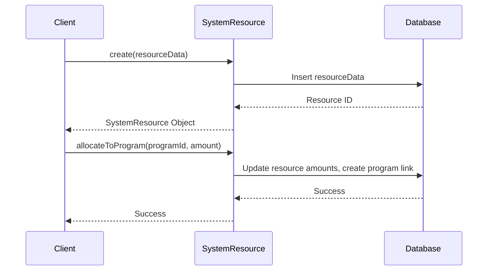

# Chapter 8: SystemResource

In the previous chapter, [GovernancePolicy](07_governancepolicy.md), we established rules for Sunnyside Elementary. Now, let's think about how the school manages its resources, like its budget, teachers, classrooms, and library books. This is where `SystemResource` comes in.

## What problem does SystemResource solve?

Imagine Sunnyside Elementary needs to track its annual budget. They need to know how much money they have, how much has been allocated to different departments (like the library or the after-school programs), and how much is still available.  `SystemResource` represents any asset or resource used by the system.  It helps track resource allocation, usage, and replenishment.

## Key Concepts

1. **Resource Types:** A `SystemResource` can represent various things, like money (budget), personnel (teachers), physical spaces (classrooms), or materials (library books).

2. **Allocation:** This refers to assigning resources to specific programs or activities. For example, allocating part of the budget to the Chess Club.

3. **Availability:** This is how much of the resource is currently unused and available for allocation.

4. **Replenishment:** Some resources, like the budget, can be replenished (e.g., annually).  Others, like classrooms, are not replenishable.

## Using SystemResource: Managing Sunnyside's Budget

Let's create a `SystemResource` to represent Sunnyside Elementary's annual budget.

```php
// Simplified example - see SystemResource.php for full implementation
use App\Models\SystemResource;

$budget = new SystemResource([
    'system_id' => 1, // Assuming Sunnyside Elementary's system ID is 1
    'name' => 'Annual Budget',
    'description' => 'School\'s annual budget',
    'resource_type' => 'monetary',
    'unit_of_measure' => 'USD',
    'total_amount' => 100000,
    'available_amount' => 100000, // Initially, all funds are available
    'replenishable' => true,
    'replenishment_frequency' => 'annually'
]);

$budget->save();
```

This code creates a new `SystemResource` representing the school's budget.  We set the `total_amount` and `available_amount` to $100,000.  Since the budget is replenished annually, we set `replenishable` to `true` and `replenishment_frequency` to `annually`.

Now, let's allocate $1,000 to the Chess Club (assuming it's a [ManagementProgram](05_managementprogram.md)):

```php
$chessClubId = 1; // Assuming the Chess Club program ID is 1
$budget->allocateToProgram($chessClubId, 1000);
```

This allocates $1,000 of the budget to the Chess Club.

## Internal Implementation

When you call `save` on the `SystemResource`, it creates a new entry in the database representing the resource.  The `allocateToProgram` function updates the `allocated_amount` and `available_amount` of the resource and creates a record linking the resource to the program.



The code for these functions can be found in `Gov/Entities/Base/SystemResource.php`. Here's a simplified snippet of the `allocateToProgram` function:

```php
// Gov/Entities/Base/SystemResource.php (simplified)
public function allocateToProgram(int $programId, float $amount): bool
{
    // ... (Check if enough resources are available) ...

    // ... (Update allocated and available amounts) ...

    // ... (Create link to program) ...

    return true;
}
```

## Conclusion

In this chapter, we learned about `SystemResource`, which represents and manages system resources. We saw how to create a `SystemResource` for Sunnyside Elementary's budget and allocate funds to a program. In the next chapter, [SystemWorkflow](09_systemworkflow.md), we'll explore how different parts of the system work together to achieve specific goals.


---

Generated by [AI Codebase Knowledge Builder](https://github.com/The-Pocket/Tutorial-Codebase-Knowledge)