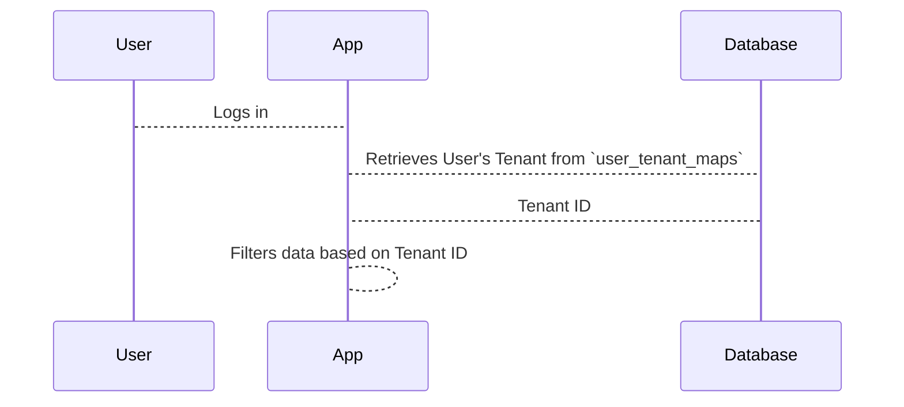

# Chapter 8: Tenants

In the previous chapter, [User Teams](07_user_teams.md), we learned how users can collaborate within the platform. Now, let's explore how we can separate different organizations or groups using the same platform. This is where *Tenants* come in.

Imagine our cooking school is expanding and now offers classes in different cities. Each city operates independently, managing its own chefs, recipes, and students.  However, they all use the same underlying platform for managing classes, scheduling, and payments.  Each city branch acts as a *Tenant*.

## What is a Tenant?

A Tenant represents a separate organization or group using the platform.  Think of it like separate kitchens in our cooking school. Each kitchen operates independently but uses the same building (the platform).  Each kitchen has its own set of chefs ([Users](01_users.md)), recipes ([Protocols](03_protocols.md)), and cooking classes ([Programs](02_programs.md)).

## Key Concepts in a Tenant

* **Isolation:** Each Tenant's data is separate from other Tenants.  Kitchen A's recipes don't mix with Kitchen B's recipes.
* **Shared Platform:** All Tenants use the same underlying platform.  All kitchens share the same building and utilities.
* **Identification:** Each Tenant has a unique identifier.  Each kitchen has a different name or number.

## Creating a Tenant

Let's create a Tenant for our cooking school's branch in New York City.

```php
// File: factories/Core/Tenants/TenantFactory.php

use App\Models\Tenant;
use Illuminate\Support\Str;

$tenant = Tenant::factory()->create([
    'id' => Str::uuid(), // Generate a unique ID
    'domain' => 'nyc.cookingschool.com', // Optional domain name
]);
```

This code creates a new entry in the `tenants` table. The `id` is a unique identifier, and the `domain` is an optional website address for this tenant.

## Associating a User with a Tenant

Now, let's associate Alice with the New York City tenant.

```php
// Simplified example - actual implementation uses a dedicated service

DB::table('user_tenant_maps')->insert([
    'tenant_id' => $tenant->id,
    'user_id' => 1, // Alice's User ID
]);
```

This code creates an entry in the `user_tenant_maps` table, linking Alice to the New York City tenant.

## Under the Hood

When a [User](01_users.md) logs in, the application identifies the user's [Tenant](08_tenants.md).  All subsequent operations are then scoped to that Tenant.



The `tenants` table stores the information about each tenant. The `CreateTenantsTable` migration file defines the structure of this table.

```php
// File: migrations/2019_09_15_000010_create_tenants_table.php
// ... code to create the tenants table ...
```

The `user_tenant_maps` table stores the relationships between [Users](01_users.md) and [Tenants](08_tenants.md).  The `CreateUserTenantMapsTable` migration file defines the structure of this table.

```php
// File: migrations/2023_07_12_102537_create_user_tenant_maps_table.php
// ... code to create the user_tenant_maps table ...
```

## Conclusion

In this chapter, we learned about Tenants, which allow us to separate different organizations or groups using the same platform. We saw how Tenants are created and how [Users](01_users.md) are associated with them. In the next chapter, we'll explore [Codify Requests](09_codify_requests.md).


---

Generated by [AI Codebase Knowledge Builder](https://github.com/The-Pocket/Tutorial-Codebase-Knowledge)