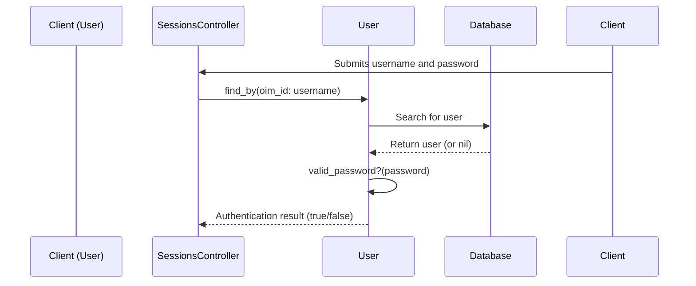

# Chapter 8: User/Authentication

In the previous chapter, [VerificationType/VlpDocument/RidpDocument](07_verificationtype_vlpdocument_ridpdocument_.md), we learned how the system verifies user information.  This chapter introduces the `User` model and how authentication works, which is essential for controlling access to the system.

## Why do we need Users and Authentication?

Imagine our healthcare application has different types of users: individuals shopping for plans, employers managing benefits, and system administrators.  We want to make sure only authorized users can access certain parts of the system.  For example, only administrators should be able to change system settings.  This is where `User` and authentication come in.

## Key Concepts

* **User:** The `User` model represents a user account in our system.  It stores information like their email address, username (OIM ID), and password.  It's like a digital keycard that grants access to the system.

* **Authentication:**  Authentication is the process of verifying a user's identity.  It's like checking someone's ID at the door.  We use Devise and SAML to handle authentication.  Devise manages local user accounts, while SAML allows users to log in using external identity providers (like their work account).

## Solving the Use Case: Logging in as an Administrator

1. **Enter Credentials:** The administrator enters their username and password on the login page.

2. **Authenticate:** The system checks if the entered credentials match a `User` record in the database.

3. **Grant Access:** If the credentials are valid, the system grants the administrator access to the administrative area.

```ruby
# Simplified example (Devise handles this behind the scenes)

user = User.find_by(oim_id: entered_username)

if user && user.valid_password?(entered_password)
  # Grant access
else
  # Deny access
end
```

This simplified code demonstrates the basic logic of authentication. Devise handles the complexities of password hashing and secure storage.

## Internal Implementation

When a user tries to log in, several things happen behind the scenes:



1. The `users/sessions_controller.rb` receives the login request.

2. The `User` model's `find_by` method searches for a matching user in the database.

3. If a user is found, the `valid_password?` method checks the entered password against the stored password hash.

4. The controller grants or denies access based on the authentication result.

The relevant code for handling logins can be found in `users/sessions_controller.rb` and the `User` model.  SAML logins are handled by `saml_controller.rb`.

```ruby
# users/sessions_controller.rb (simplified)
def create
  # ... Devise handles authentication ...
end

# User model (simplified)
class User
  # ... Devise methods for password handling ...
end
```

## Conclusion

This chapter introduced the `User` model and the concept of authentication, explaining how they control access to the system.  We used the example of an administrator logging in to illustrate how authentication works.  We also looked at the internal implementation to understand the process of verifying user credentials.

Next, we'll explore the messaging system with [Inbox/Message](09_inbox_message_.md).


---

Generated by [AI Codebase Knowledge Builder](https://github.com/The-Pocket/Tutorial-Codebase-Knowledge)